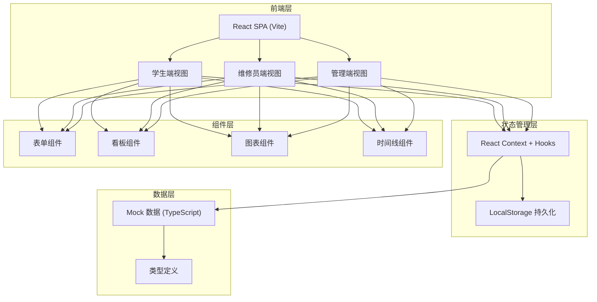
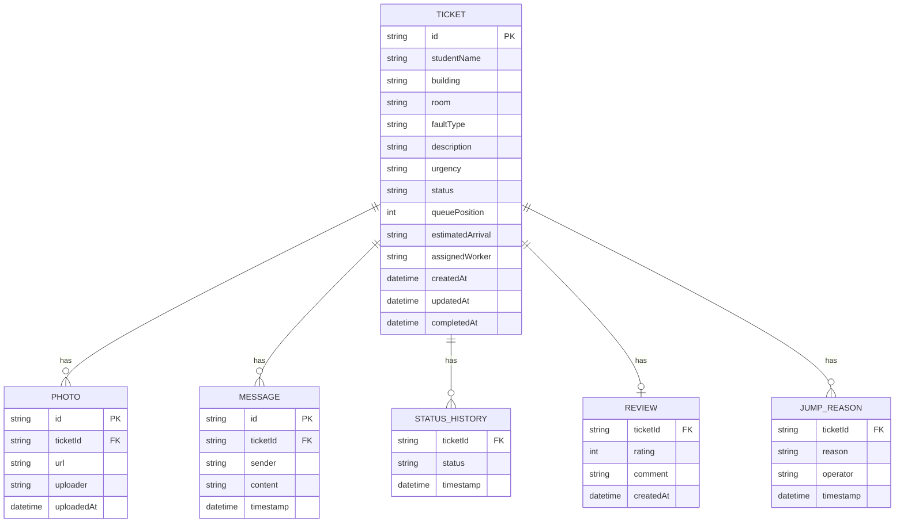

## 1. 架构设计



## 2. 技术说明

- 前端：React@18 + TypeScript + Vite@5
- 样式：TailwindCSS@3 + CSS Variables（主题系统）
- 路由：React Router@6
- 图表：纯 SVG/CSS 实现（轻量级柱状图、饼图）
- 图标：Lucide React
- 状态管理：React Context + useReducer
- 后端：无，使用 Mock 数据 + LocalStorage 模拟持久化
- 数据：内置 20+ 条模拟报修单数据覆盖各状态和场景

## 3. 路由定义

| 路由 | 用途 |
|------|------|
| / | 学生端首页 - 工单列表 |
| /submit | 报修提交表单 |
| /ticket/:id | 工单详情（学生/维修员根据角色渲染不同视图） |
| /workbench | 维修员工作台 - 四列看板 |
| /admin | 管理看板 - 数据统计 |

## 4. 类型定义

```typescript
type UrgencyLevel = 'normal' | 'urgent';
type TicketStatus = 'pending' | 'processing' | 'waiting_parts' | 'completed';

interface Photo {
  id: string;
  url: string;
  uploadedAt: string;
  uploader: 'student' | 'worker';
}

interface Message {
  id: string;
  sender: 'student' | 'worker' | 'system';
  content: string;
  timestamp: string;
}

interface Review {
  rating: number;
  comment: string;
  photos: Photo[];
  createdAt: string;
}

interface JumpReason {
  reason: string;
  operator: string;
  timestamp: string;
}

interface Ticket {
  id: string;
  studentName: string;
  building: string;
  room: string;
  faultType: string;
  description: string;
  photos: Photo[];
  urgency: UrgencyLevel;
  availableTimes: string[];
  status: TicketStatus;
  queuePosition?: number;
  estimatedArrival?: string;
  assignedWorker?: string;
  messages: Message[];
  review?: Review;
  jumpReasons: JumpReason[];
  createdAt: string;
  updatedAt: string;
  completedAt?: string;
  statusHistory: { status: TicketStatus; timestamp: string }[];
}

interface Stats {
  avgProcessingTime: number;
  pendingCount: number;
  processingCount: number;
  todayCompleted: number;
  faultTypeDistribution: { type: string; count: number }[];
  buildingDistribution: { building: string; count: number }[];
}
```

## 5. 数据模型

### 6.1 数据模型 ER 图



### 6.2 初始 Mock 数据

初始数据包含：
- 8 栋宿舍楼（1-8 号楼）
- 6 种故障类型（水管漏水、电路故障、门锁损坏、空调故障、灯具损坏、卫浴故障）
- 25 条覆盖各状态的模拟工单
- 3 名维修员（张师傅、李师傅、王师傅）
- 含紧急工单、已评价工单、带留言工单等典型场景

