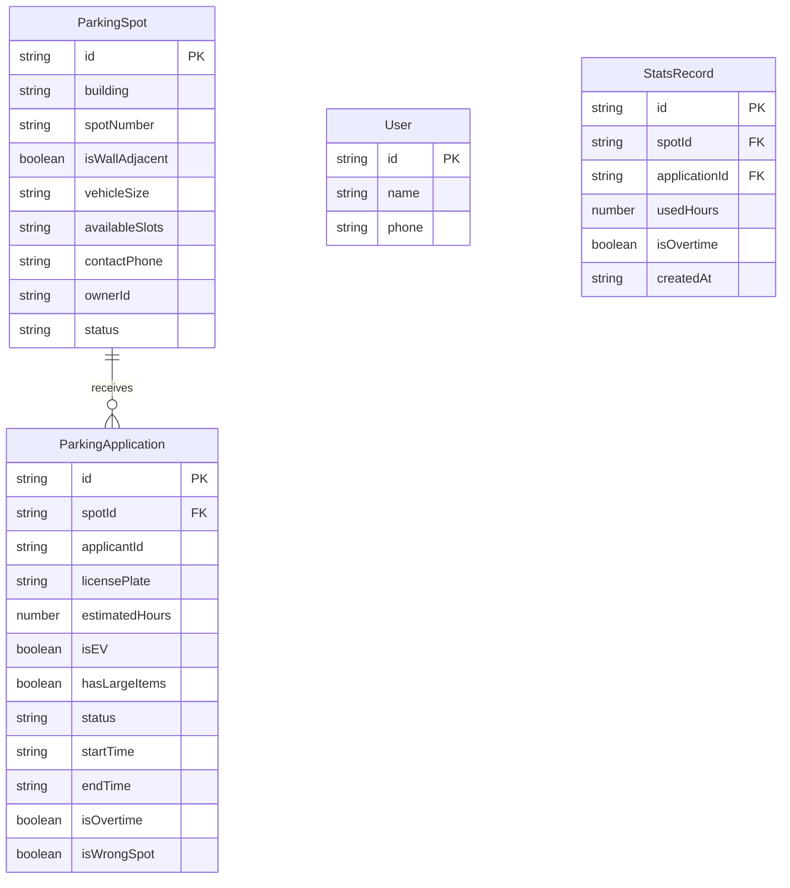

## 1. 架构设计

纯前端应用，使用 Mock 数据模拟后端逻辑，Zustand 管理全局状态。

```mermaid
flowchart TD
    "React 前端层" --> "Zustand 状态管理层"
    "Zustand 状态管理层" --> "Mock 数据层"
    "Mock 数据层" --> "localStorage 持久化"
```

## 2. 技术说明

- 前端框架：React@18 + TypeScript
- 构建工具：Vite
- 样式方案：Tailwind CSS@3
- 状态管理：Zustand（含 persist 中间件持久化到 localStorage）
- 路由：react-router-dom@6
- 图标：lucide-react
- 数据存储：localStorage（Mock 数据，无需后端）
- 初始化工具：vite-init

## 3. 路由定义

| 路由 | 用途 |
|------|------|
| / | 首页，车位列表分组展示 |
| /register | 车位登记页，业主发布车位 |
| /apply/:spotId | 临停申请页，需求方申请停车 |
| /my-spots | 我的车位管理页，审批/结束标记 |
| /stats | 统计页，利用率/排行/超时记录 |

## 4. 数据模型

### 4.1 数据模型定义



### 4.2 数据定义

#### ParkingSpot（车位）

| 字段 | 类型 | 说明 |
|------|------|------|
| id | string | 唯一标识 |
| building | string | 楼栋号 |
| spotNumber | string | 车位号 |
| isWallAdjacent | boolean | 是否靠墙 |
| vehicleSize | 'small' \| 'medium' \| 'suv' \| 'any' | 可停车型 |
| availableSlots | DaySlot[] | 可用时段列表 |
| contactPhone | string | 联系电话 |
| ownerId | string | 业主ID |
| status | 'available' \| 'in_use' \| 'pending' | 车位状态 |

#### ParkingApplication（临停申请）

| 字段 | 类型 | 说明 |
|------|------|------|
| id | string | 唯一标识 |
| spotId | string | 关联车位ID |
| applicantId | string | 申请人ID |
| applicantName | string | 申请人姓名 |
| licensePlate | string | 车牌号 |
| estimatedHours | number | 预计停车时长（小时） |
| isEV | boolean | 是否新能源车 |
| hasLargeItems | boolean | 是否有大件搬运 |
| status | 'pending' \| 'approved' \| 'rejected' \| 'active' \| 'completed' | 申请状态 |
| startTime | string | 开始时间 |
| endTime | string | 结束时间 |
| isOvertime | boolean | 是否超时 |
| isWrongSpot | boolean | 是否占错位 |

#### DaySlot（可用时段）

| 字段 | 类型 | 说明 |
|------|------|------|
| dayOfWeek | number | 星期几（0-6） |
| startTime | string | 开始时间（HH:mm） |
| endTime | string | 结束时间（HH:mm） |

#### StatsRecord（统计记录）

| 字段 | 类型 | 说明 |
|------|------|------|
| id | string | 唯一标识 |
| spotId | string | 车位ID |
| applicationId | string | 申请ID |
| usedHours | number | 实际使用小时数 |
| isOvertime | boolean | 是否超时 |
| createdAt | string | 创建时间 |

## 5. 状态管理设计

使用 Zustand 创建全局 store，包含以下切片：

- **spotsSlice**：车位列表 CRUD
- **applicationsSlice**：申请列表、审批、状态流转
- **statsSlice**：统计数据计算
- **uiSlice**：筛选条件、当前分组等UI状态

使用 `persist` 中间件自动持久化到 localStorage，刷新页面数据不丢失。
