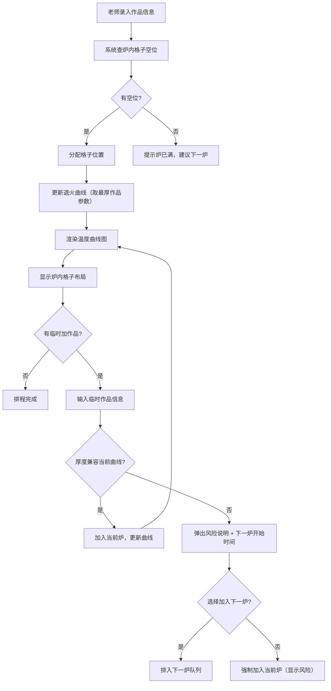

## 1. 产品概述
玻璃吹制课退火排程工具——帮助老师根据作品类型、厚度和尺寸，自动生成科学的退火温度曲线，并可视化炉内格子布局，避免高作品遮挡小作品，支持临时加作品的兼容性判断。

- 目标用户：玻璃吹制课老师及助教
- 核心价值：消除因退火温度排错导致作品开裂的风险，提高退火炉使用效率

## 2. 核心功能

### 2.1 用户角色
| 角色 | 使用方式 | 核心权限 |
|------|----------|----------|
| 老师 | 直接使用 | 录入作品、管理排程、查看曲线 |
| 助教 | 直接使用 | 录入作品、查看排程 |

### 2.2 功能模块
1. **排程主页**：作品录入表单、当前炉次作品列表、炉内格子可视化、温度曲线图
2. **临时加作品弹窗**：兼容性判断、风险说明、下一炉建议

### 2.3 页面详情
| 页面名称 | 模块名称 | 功能描述 |
|----------|----------|----------|
| 排程主页 | 作品录入表单 | 录入作品类型（下拉选择）、最大厚度（mm）、入炉时间、学生姓名；提交后自动加入当前炉次 |
| 排程主页 | 当前炉次作品列表 | 显示本炉所有已排入作品，含类型、厚度、学生、入炉时间，支持删除 |
| 排程主页 | 炉内格子可视化 | 以网格形式展示炉内空间，每个格子显示作品缩略信息，高作品排在后排、矮作品排前排，避免遮挡 |
| 排程主页 | 温度曲线图 | 基于当前炉次最厚作品生成升温→保温→降温三段曲线，标注关键温度和时间节点 |
| 排程主页 | 临时加作品 | 输入新作品信息后，判断厚度是否超出当前曲线保温范围：若兼容则加入，不兼容则弹出风险说明和下一炉开始时间 |

## 3. 核心流程

老师在下课后，逐个录入学生作品的类型、厚度和入炉时间。系统根据炉内最厚作品计算退火曲线。录入时系统自动安排炉内格子位置（矮前高后）。若有临时加作品，系统判断是否兼容当前曲线，不兼容时给出下一炉时间和风险提示。

## 4. 用户界面设计

### 4.1 设计风格
- 主色调：琥珀色/暖橙色（呼应玻璃窑炉火焰），辅以深灰和奶白色
- 强调色：警示红（风险提示）、安全绿（兼容通过）
- 按钮：圆角胶囊型，带微妙阴影
- 字体：标题用衬线字体（如 Playfair Display），正文用无衬线（如 DM Sans）
- 布局：左侧表单+列表，右侧上方格子可视化、右侧下方温度曲线图
- 图标：使用火焰、温度计、格子等玻璃工坊意象

### 4.2 页面设计概览
| 页面名称 | 模块名称 | UI元素 |
|----------|----------|--------|
| 排程主页 | 作品录入表单 | 卡片式表单，下拉菜单（作品类型）、数字输入（厚度）、时间选择器、文本输入（姓名），提交按钮 |
| 排程主页 | 炉内格子可视化 | 3D透视网格，前排矮作品、后排高作品，悬停显示详情，颜色按类型区分 |
| 排程主页 | 温度曲线图 | Canvas/SVG绘制的升温-保温-降温曲线，X轴时间、Y轴温度，关键节点标注 |
| 排程主页 | 临时加作品 | 模态弹窗，包含兼容性判断结果、风险说明、下一炉时间、确认/取消按钮 |
| 排程主页 | 作品列表 | 表格形式，支持删除操作，高亮当前最厚作品 |

### 4.3 响应式
- 桌面端优先，左右分栏布局
- 平板端上下堆叠
- 移动端单列滚动

### 4.4 3D场景指引
- 不适用
