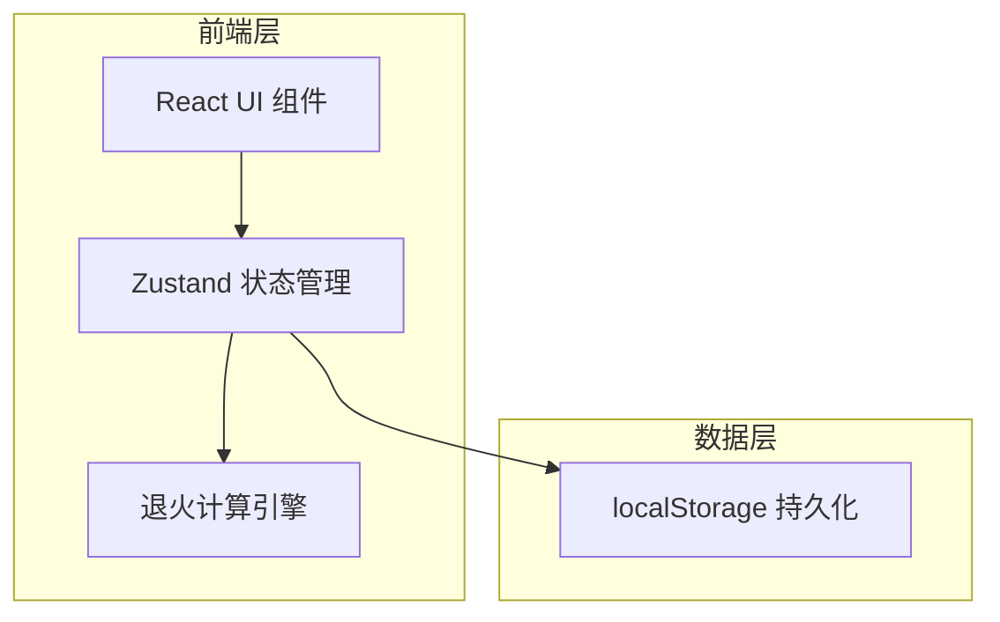
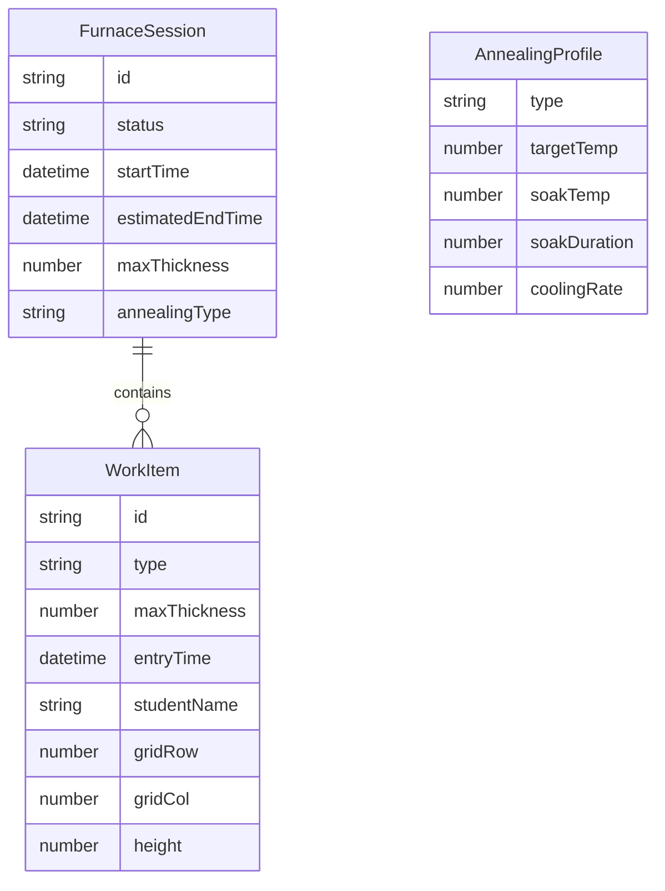

## 1. 架构设计



纯前端项目，所有退火计算逻辑在浏览器端完成，数据通过 localStorage 持久化。

## 2. 技术说明
- 前端：React@18 + TypeScript + Tailwind CSS@3 + Vite
- 初始化工具：vite-init (react-ts 模板)
- 后端：无
- 数据库：无，使用 localStorage + 内存状态
- 图表：Canvas API 手绘温度曲线（避免引入重型图表库）
- 状态管理：Zustand

## 3. 路由定义
| 路由 | 用途 |
|------|------|
| / | 排程主页（唯一页面，所有功能集成） |

## 4. API定义
无后端API，所有逻辑前端完成。

## 5. 服务器架构图
不适用

## 6. 数据模型

### 6.1 数据模型定义



### 6.2 数据定义语言（TypeScript接口）

```typescript
interface WorkItem {
  id: string;
  type: GlassType;
  maxThickness: number; // mm
  entryTime: string;    // ISO datetime
  studentName: string;
  gridRow: number;
  gridCol: number;
  height: number;       // cm, 用于格子排列
}

type GlassType = 'soda-lime' | 'borosilicate' | 'lead' | 'fused-silica';

interface FurnaceSession {
  id: string;
  status: 'planning' | 'running' | 'completed';
  startTime: string;
  estimatedEndTime: string;
  maxThickness: number;
  annealingType: GlassType;
  works: WorkItem[];
}

interface AnnealingProfile {
  type: GlassType;
  targetTemp: number;     // 升温目标温度 °C
  soakTemp: number;       // 保温温度 °C
  soakDurationPerMm: number; // 每mm保温分钟数
  coolingRate: number;    // 降温速率 °C/h
  strainPoint: number;    // 应变点 °C
}

// 炉内格子配置
interface FurnaceGrid {
  rows: number;  // 前后排数
  cols: number;  // 左右列数
  maxCapacity: number;
}
```

### 6.3 退火参数参考数据

| 玻璃类型 | 升温目标(°C) | 保温温度(°C) | 保温时长(min/mm) | 降温速率(°C/h) | 应变点(°C) |
|----------|-------------|-------------|-----------------|---------------|-----------|
| 钠钙玻璃 | 510 | 480 | 4 | 12 | 470 |
| 硼硅玻璃 | 560 | 530 | 3 | 15 | 520 |
| 铅玻璃 | 430 | 400 | 5 | 10 | 390 |
| 石英玻璃 | 1050 | 1000 | 6 | 20 | 990 |

### 6.4 炉内格子配置
- 默认 3行 × 4列 = 12个格子
- 排列规则：按作品高度升序，矮的排前排（row=0），高的排后排（row=2）
- 同排内按录入顺序从左到右填充
