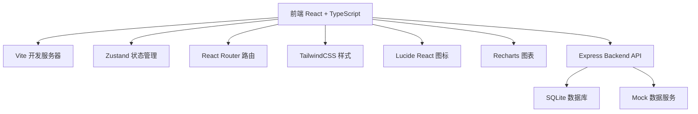
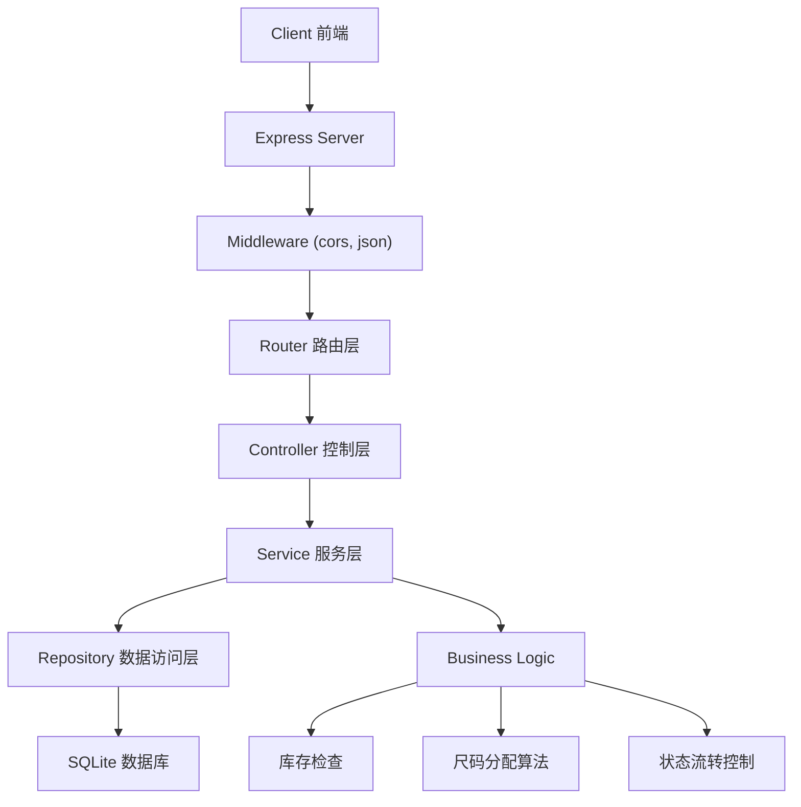
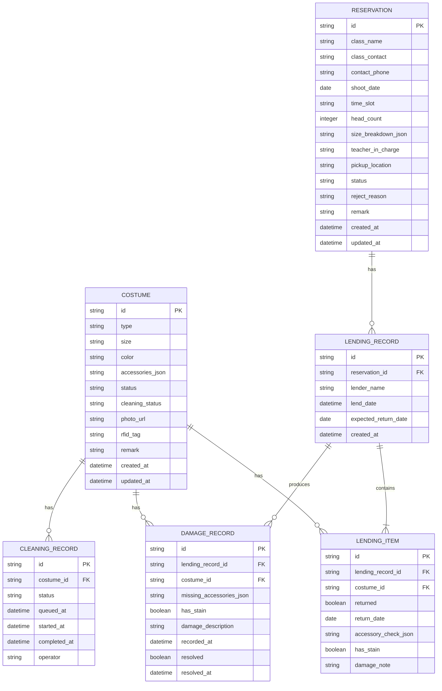

## 1. 架构设计



## 2. 技术描述

- **前端框架**: React@18 + TypeScript + Vite@5
- **样式方案**: TailwindCSS@3.4 + CSS Variables
- **状态管理**: Zustand@4
- **路由管理**: React Router DOM@6
- **UI组件**: Lucide React 图标库 + 自定义组件
- **数据可视化**: Recharts@2
- **后端框架**: Express@4 + TypeScript
- **数据库**: SQLite3 + better-sqlite3
- **初始化工具**: vite-init
- **包管理器**: pnpm

## 3. 路由定义

| 路由路径 | 页面名称 | 功能说明 |
|---------|---------|---------|
| / | 仪表盘 | 数据概览和快捷操作 |
| /costumes | 服装档案列表 | 服装档案管理页面 |
| /costumes/new | 新增服装 | 服装信息录入表单 |
| /costumes/:id | 服装详情 | 查看和编辑服装详情 |
| /reservations | 预约管理 | 预约列表和日历视图 |
| /reservations/new | 新建预约 | 预约申请表单 |
| /lendings | 借出管理 | 借出记录和借出操作 |
| /returns | 归还管理 | 归还记录和归还检查 |
| /cleaning | 清洗管理 | 清洗队列和状态管理 |
| /statistics | 统计报表 | 数据统计和可视化 |

## 4. API 定义

### 4.1 TypeScript 类型定义

```typescript
// 服装类型
type CostumeType = '学士服' | '硕士服' | '博士服' | '领结' | '披肩';
type CostumeSize = 'XS' | 'S' | 'M' | 'L' | 'XL' | 'XXL' | '均码';
type CostumeStatus = '在库' | '已预约' | '借出中' | '待清洗' | '清洗中' | '已报废';
type CleaningStatus = '干净' | '待清洗' | '清洗中' | '已清洗';

interface Accessory {
  hat: boolean;      // 帽子
  tassel: boolean;   // 流苏
  bowtie: boolean;   // 领结
  shawl: boolean;    // 披肩
}

interface Costume {
  id: string;
  type: CostumeType;
  size: CostumeSize;
  color: string;
  accessories: Accessory;
  status: CostumeStatus;
  cleaningStatus: CleaningStatus;
  photoUrl: string;
  rfidTag?: string;
  remark?: string;
  createdAt: string;
  updatedAt: string;
}

// 预约类型
type ReservationStatus = '待审核' | '已通过' | '已驳回' | '已取消' | '已完成';
type TimeSlot = '08:00-10:00' | '10:00-12:00' | '14:00-16:00' | '16:00-18:00';

interface Reservation {
  id: string;
  className: string;
  classContact: string;
  contactPhone: string;
  shootDate: string;
  timeSlot: TimeSlot;
  headCount: number;
  sizeBreakdown: Record<CostumeSize, number>;
  teacherInCharge: string;
  pickupLocation: string;
  status: ReservationStatus;
  rejectReason?: string;
  remark?: string;
  createdAt: string;
  updatedAt: string;
}

// 借出记录
interface LendingItem {
  costumeId: string;
  costume: Costume;
  returned: boolean;
  returnDate?: string;
  accessoryCheck?: Accessory;
  hasStain?: boolean;
  damageNote?: string;
}

interface LendingRecord {
  id: string;
  reservationId: string;
  reservation: Reservation;
  items: LendingItem[];
  lenderName: string;
  lendDate: string;
  expectedReturnDate: string;
  isOverdue: boolean;
  createdAt: string;
}

// 缺损记录
interface DamageRecord {
  id: string;
  lendingRecordId: string;
  costumeId: string;
  missingAccessories: Partial<Accessory>;
  hasStain: boolean;
  damageDescription: string;
  recordedAt: string;
  resolved: boolean;
  resolvedAt?: string;
}

// 清洗记录
interface CleaningRecord {
  id: string;
  costumeId: string;
  costume: Costume;
  status: '排队中' | '清洗中' | '已完成';
  queuedAt: string;
  startedAt?: string;
  completedAt?: string;
  operator?: string;
}

// 统计数据
interface Statistics {
  sizeDemand: Record<CostumeSize, number>;
  overdueCount: number;
  missingAccessoryCount: number;
  cleaningQueueCount: number;
  statusDistribution: Record<CostumeStatus, number>;
}
```

### 4.2 API 接口定义

| 方法 | 路径 | 功能 | 请求体 | 响应 |
|------|-----|-----|-------|-----|
| GET | /api/costumes | 获取服装列表 | - | Costume[] |
| GET | /api/costumes/:id | 获取服装详情 | - | Costume |
| POST | /api/costumes | 新增服装 | Omit<Costume, 'id' \| 'createdAt' \| 'updatedAt'> | Costume |
| PUT | /api/costumes/:id | 更新服装 | Partial<Costume> | Costume |
| DELETE | /api/costumes/:id | 删除服装 | - | { success: boolean } |
| GET | /api/costumes/availability | 查询库存可用性 | { date: string; timeSlot: TimeSlot } | { available: Record<CostumeSize, number> } |
| GET | /api/reservations | 获取预约列表 | - | Reservation[] |
| GET | /api/reservations/:id | 获取预约详情 | - | Reservation |
| POST | /api/reservations | 创建预约 | Omit<Reservation, 'id' \| 'status' \| 'createdAt' \| 'updatedAt'> | Reservation |
| PUT | /api/reservations/:id | 更新预约 | Partial<Reservation> | Reservation |
| PUT | /api/reservations/:id/approve | 审核通过 | - | Reservation |
| PUT | /api/reservations/:id/reject | 审核驳回 | { reason: string } | Reservation |
| PUT | /api/reservations/:id/cancel | 取消预约 | - | Reservation |
| GET | /api/lendings | 获取借出记录 | - | LendingRecord[] |
| POST | /api/lendings | 创建借出记录 | { reservationId: string; costumeIds: string[]; lenderName: string } | LendingRecord |
| GET | /api/returns | 获取待归还列表 | - | LendingRecord[] |
| PUT | /api/returns/:id/return | 归还服装 | { items: Array<{ costumeId: string; accessoryCheck: Accessory; hasStain: boolean; damageNote?: string }> } | LendingRecord |
| GET | /api/cleaning | 获取清洗队列 | - | CleaningRecord[] |
| POST | /api/cleaning | 添加清洗队列 | { costumeIds: string[] } | CleaningRecord[] |
| PUT | /api/cleaning/:id/start | 开始清洗 | { operator: string } | CleaningRecord |
| PUT | /api/cleaning/:id/complete | 完成清洗 | - | CleaningRecord |
| GET | /api/statistics | 获取统计数据 | - | Statistics |
| GET | /api/statistics/damages | 获取缺损记录 | - | DamageRecord[] |
| GET | /api/statistics/overdue | 获取逾期未还列表 | - | LendingRecord[] |

## 5. 服务器架构图



## 6. 数据模型

### 6.1 ER 图



### 6.2 DDL 语句

```sql
-- 服装表
CREATE TABLE costumes (
    id TEXT PRIMARY KEY,
    type TEXT NOT NULL,
    size TEXT NOT NULL,
    color TEXT NOT NULL,
    accessories_json TEXT NOT NULL,
    status TEXT NOT NULL DEFAULT '在库',
    cleaning_status TEXT NOT NULL DEFAULT '干净',
    photo_url TEXT,
    rfid_tag TEXT,
    remark TEXT,
    created_at TEXT NOT NULL DEFAULT CURRENT_TIMESTAMP,
    updated_at TEXT NOT NULL DEFAULT CURRENT_TIMESTAMP
);

CREATE INDEX idx_costumes_type ON costumes(type);
CREATE INDEX idx_costumes_size ON costumes(size);
CREATE INDEX idx_costumes_status ON costumes(status);
CREATE INDEX idx_costumes_cleaning_status ON costumes(cleaning_status);

-- 预约表
CREATE TABLE reservations (
    id TEXT PRIMARY KEY,
    class_name TEXT NOT NULL,
    class_contact TEXT NOT NULL,
    contact_phone TEXT NOT NULL,
    shoot_date TEXT NOT NULL,
    time_slot TEXT NOT NULL,
    head_count INTEGER NOT NULL,
    size_breakdown_json TEXT NOT NULL,
    teacher_in_charge TEXT NOT NULL,
    pickup_location TEXT NOT NULL,
    status TEXT NOT NULL DEFAULT '待审核',
    reject_reason TEXT,
    remark TEXT,
    created_at TEXT NOT NULL DEFAULT CURRENT_TIMESTAMP,
    updated_at TEXT NOT NULL DEFAULT CURRENT_TIMESTAMP
);

CREATE INDEX idx_reservations_date ON reservations(shoot_date);
CREATE INDEX idx_reservations_status ON reservations(status);
CREATE INDEX idx_reservations_class ON reservations(class_name);

-- 借出记录表
CREATE TABLE lending_records (
    id TEXT PRIMARY KEY,
    reservation_id TEXT NOT NULL REFERENCES reservations(id),
    lender_name TEXT NOT NULL,
    lend_date TEXT NOT NULL,
    expected_return_date TEXT NOT NULL,
    created_at TEXT NOT NULL DEFAULT CURRENT_TIMESTAMP
);

CREATE INDEX idx_lending_records_reservation ON lending_records(reservation_id);
CREATE INDEX idx_lending_records_date ON lending_records(lend_date);

-- 借出明细表
CREATE TABLE lending_items (
    id TEXT PRIMARY KEY,
    lending_record_id TEXT NOT NULL REFERENCES lending_records(id),
    costume_id TEXT NOT NULL REFERENCES costumes(id),
    returned BOOLEAN NOT NULL DEFAULT FALSE,
    return_date TEXT,
    accessory_check_json TEXT,
    has_stain BOOLEAN,
    damage_note TEXT
);

CREATE INDEX idx_lending_items_record ON lending_items(lending_record_id);
CREATE INDEX idx_lending_items_costume ON lending_items(costume_id);
CREATE INDEX idx_lending_items_returned ON lending_items(returned);

-- 缺损记录表
CREATE TABLE damage_records (
    id TEXT PRIMARY KEY,
    lending_record_id TEXT NOT NULL REFERENCES lending_records(id),
    costume_id TEXT NOT NULL REFERENCES costumes(id),
    missing_accessories_json TEXT NOT NULL,
    has_stain BOOLEAN NOT NULL,
    damage_description TEXT NOT NULL,
    recorded_at TEXT NOT NULL DEFAULT CURRENT_TIMESTAMP,
    resolved BOOLEAN NOT NULL DEFAULT FALSE,
    resolved_at TEXT
);

CREATE INDEX idx_damage_records_costume ON damage_records(costume_id);
CREATE INDEX idx_damage_records_resolved ON damage_records(resolved);

-- 清洗记录表
CREATE TABLE cleaning_records (
    id TEXT PRIMARY KEY,
    costume_id TEXT NOT NULL REFERENCES costumes(id),
    status TEXT NOT NULL DEFAULT '排队中',
    queued_at TEXT NOT NULL DEFAULT CURRENT_TIMESTAMP,
    started_at TEXT,
    completed_at TEXT,
    operator TEXT
);

CREATE INDEX idx_cleaning_records_status ON cleaning_records(status);
CREATE INDEX idx_cleaning_records_costume ON cleaning_records(costume_id);
```

### 6.3 初始化数据

```sql
-- 插入初始服装数据（各尺码各10套）
INSERT INTO costumes (id, type, size, color, accessories_json, photo_url) VALUES
-- XS 码 10套
('c-xs-001', '学士服', 'XS', '黑色', '{"hat":true,"tassel":true,"bowtie":true,"shawl":true}', 'https://trae-api-cn.mchost.guru/api/ide/v1/text_to_image?prompt=black%20graduation%20gown%20on%20hanger%20size%20XS&image_size=square'),
('c-xs-002', '学士服', 'XS', '黑色', '{"hat":true,"tassel":true,"bowtie":true,"shawl":true}', 'https://trae-api-cn.mchost.guru/api/ide/v1/text_to_image?prompt=black%20graduation%20gown%20on%20hanger%20size%20XS&image_size=square'),
-- ... 更多数据将在 seed 脚本中生成

-- 插入预约数据
INSERT INTO reservations (id, class_name, class_contact, contact_phone, shoot_date, time_slot, head_count, size_breakdown_json, teacher_in_charge, pickup_location, status) VALUES
('r-001', '计算机科学2022级1班', '张三', '13800138001', '2026-06-20', '08:00-10:00', 45, '{"XS":5,"S":10,"M":15,"L":10,"XL":5}', '李老师', '行政楼101室', '已通过'),
('r-002', '软件工程2022级2班', '李四', '13800138002', '2026-06-20', '10:00-12:00', 40, '{"XS":3,"S":8,"M":14,"L":10,"XL":5}', '王老师', '行政楼101室', '待审核');
```
