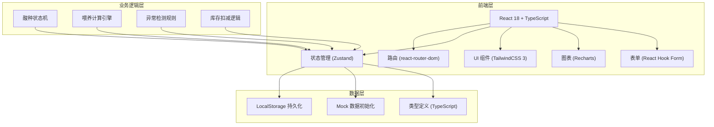
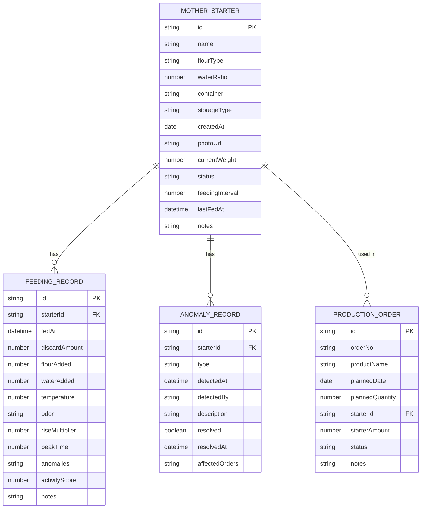
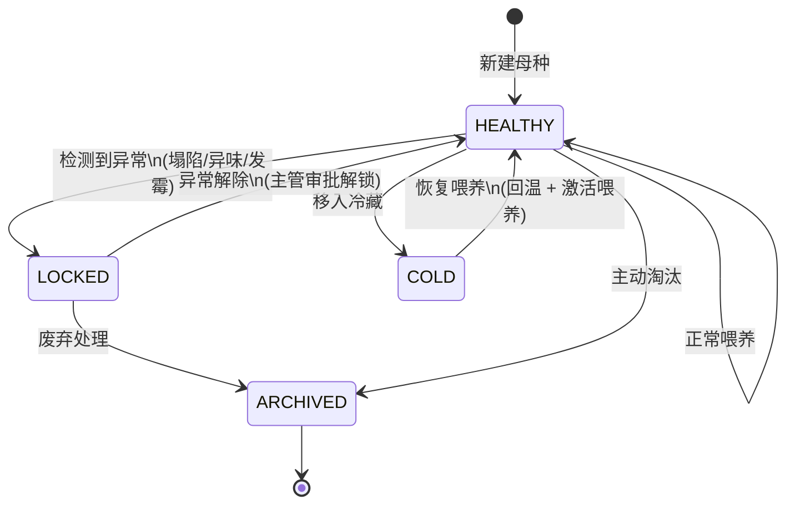

## 1. 架构设计



## 2. 技术描述

- **前端框架**：React@18 + TypeScript@5
- **构建工具**：Vite@5
- **样式方案**：TailwindCSS@3.4 + CSS Variables
- **路由管理**：react-router-dom@6
- **状态管理**：Zustand@4（轻量级，适合本地数据）
- **表单处理**：react-hook-form@7 + zod@3（验证）
- **图表组件**：Recharts@2（活性趋势图）
- **图标库**：Lucide React（线性图标）
- **数据持久化**：LocalStorage（无需后端，本地存储）
- **日期处理**：date-fns@3

## 3. 路由定义

| 路由 | 页面 | 说明 |
|------|------|------|
| `/` | 看板总览 | 默认首页，展示今日待喂、活性趋势、异常批次 |
| `/mother-starters` | 母种档案列表 | 展示所有酸种卡片 |
| `/mother-starters/new` | 新建母种档案 | 创建新酸种 |
| `/mother-starters/:id` | 母种详情页 | 查看档案信息、历史喂养记录 |
| `/feeding` | 喂养记录 | 快速记录喂养，可从看板跳转 |
| `/feeding/:starterId` | 指定酸种喂养 | 带预填信息的喂养表单 |
| `/production` | 配方排产 | 生产计划和酸种分配 |
| `/anomalies` | 异常管理 | 异常批次列表和锁定管理 |

## 4. 类型定义

```typescript
// 酸种状态枚举
enum StarterStatus {
  HEALTHY = 'healthy',     // 合格
  LOCKED = 'locked',       // 锁定（异常）
  COLD = 'cold',           // 冷藏中
  ARCHIVED = 'archived'    // 已归档
}

// 储存方式
enum StorageType {
  ROOM_TEMP = 'room_temp', // 常温
  REFRIGERATED = 'refrigerated' // 冷藏
}

// 异常类型
enum AnomalyType {
  COLLAPSE = 'collapse',   // 塌陷
  ODOR = 'odor',           // 异味
  MOLD = 'mold'            // 发霉
}

// 气味描述
type OdorDescription = 
  | 'fruity'      // 果香
  | 'vinegar'     // 醋酸
  | 'alcohol'     // 酒精
  | 'bready'      // 面包香
  | 'putrid'      // 腐臭
  | 'cheesy';     // 奶酪

// 母种档案
interface MotherStarter {
  id: string;
  name: string;
  flourType: string;           // 面粉类型
  waterRatio: number;          // 水粉比（水:粉，如 1.0 表示 1:1）
  container: string;           // 容器类型
  storageType: StorageType;    // 储存方式
  createdAt: string;           // 建立日期
  photoUrl?: string;           // 照片URL
  currentWeight: number;       // 当前重量(g)
  status: StarterStatus;
  feedingInterval: number;     // 喂养间隔(小时)
  lastFedAt?: string;          // 上次喂养时间
  notes?: string;
}

// 喂养记录
interface FeedingRecord {
  id: string;
  starterId: string;
  fedAt: string;               // 喂养时间
  discardAmount: number;       // 丢弃量(g)
  flourAdded: number;          // 加粉量(g)
  waterAdded: number;          // 加水量(g)
  temperature: number;         // 环境温度(℃)
  odor: OdorDescription;       // 气味
  riseMultiplier: number;      // 膨胀倍数
  peakTime: number;            // 峰值时间(小时)
  anomalies: AnomalyType[];    // 异常标记
  notes?: string;
  activityScore: number;       // 活性评分(系统计算)
}

// 生产订单
interface ProductionOrder {
  id: string;
  orderNo: string;
  productName: string;
  plannedDate: string;
  plannedQuantity: number;     // 计划数量
  starterId?: string;          // 使用的酸种
  starterAmount?: number;      // 酸种用量(g)
  status: 'pending' | 'in_progress' | 'completed' | 'cancelled';
  notes?: string;
}

// 异常记录
interface AnomalyRecord {
  id: string;
  starterId: string;
  type: AnomalyType;
  detectedAt: string;
  detectedBy: string;
  description: string;
  resolved: boolean;
  resolvedAt?: string;
  affectedOrders: string[];    // 受影响的订单ID
}

// 看板数据
interface DashboardData {
  totalStarters: number;
  healthyStarters: number;
  lockedStarters: number;
  pendingFeedings: Array<{
    starterId: string;
    starterName: string;
    dueAt: string;
    overdue: boolean;
  }>;
  recentAnomalies: AnomalyRecord[];
  affectedOrders: ProductionOrder[];
  activityTrend: Array<{
    date: string;
    starterId: string;
    starterName: string;
    score: number;
  }>;
}
```

## 5. 数据模型 ER 图



## 6. 状态机设计



## 7. 核心计算逻辑

### 7.1 活性评分计算
```typescript
function calculateActivityScore(
  riseMultiplier: number,      // 膨胀倍数 (理想 2-3x)
  peakTime: number,            // 峰值时间 (理想 4-6h)
  odor: OdorDescription,       // 气味
  temperature: number          // 温度 (理想 24-26℃)
): number {
  let score = 100;
  
  // 膨胀倍数评分 (权重40%)
  const riseScore = riseMultiplier >= 2 && riseMultiplier <= 3 
    ? 40 
    : Math.max(0, 40 - Math.abs(riseMultiplier - 2.5) * 20);
  
  // 峰值时间评分 (权重30%)
  const peakScore = peakTime >= 4 && peakTime <= 6
    ? 30
    : Math.max(0, 30 - Math.abs(peakTime - 5) * 10);
  
  // 气味评分 (权重20%)
  const odorScores: Record<OdorDescription, number> = {
    fruity: 20, bready: 18, vinegar: 15, 
    cheesy: 10, alcohol: 8, putrid: 0
  };
  const odorScore = odorScores[odor] || 10;
  
  // 温度评分 (权重10%)
  const tempScore = temperature >= 24 && temperature <= 26
    ? 10
    : Math.max(0, 10 - Math.abs(temperature - 25) * 2);
  
  return Math.round(riseScore + peakScore + odorScore + tempScore);
}
```

### 7.2 库存扣减逻辑
```typescript
function deductStarterWeight(
  starter: MotherStarter,
  feedingRecord: FeedingRecord,
  usageAmount: number
): number {
  // 喂养后重量 = 原重 - 丢弃量 + 新粉 + 新水
  const afterFeedingWeight = starter.currentWeight 
    - feedingRecord.discardAmount 
    + feedingRecord.flourAdded 
    + feedingRecord.waterAdded;
  
  // 扣减生产用量
  return afterFeedingWeight - usageAmount;
}
```

### 7.3 喂养提醒计算
```typescript
function getNextFeedingTime(
  lastFedAt: string,
  feedingInterval: number,
  storageType: StorageType
): Date {
  const lastFed = new Date(lastFedAt);
  const interval = storageType === StorageType.REFRIGERATED 
    ? feedingInterval * 24  // 冷藏按天计算
    : feedingInterval;      // 常温按小时计算
  return new Date(lastFed.getTime() + interval * 60 * 60 * 1000);
}
```
