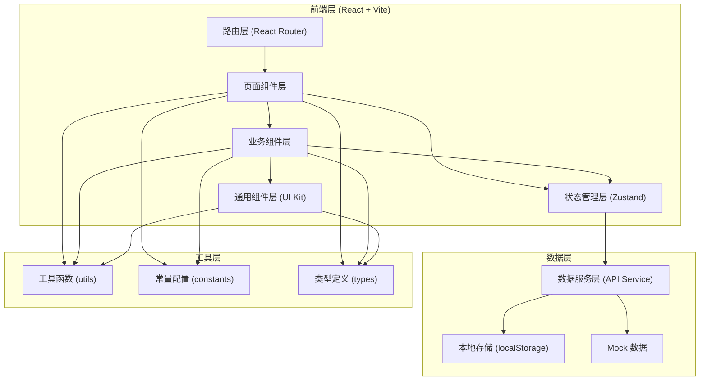
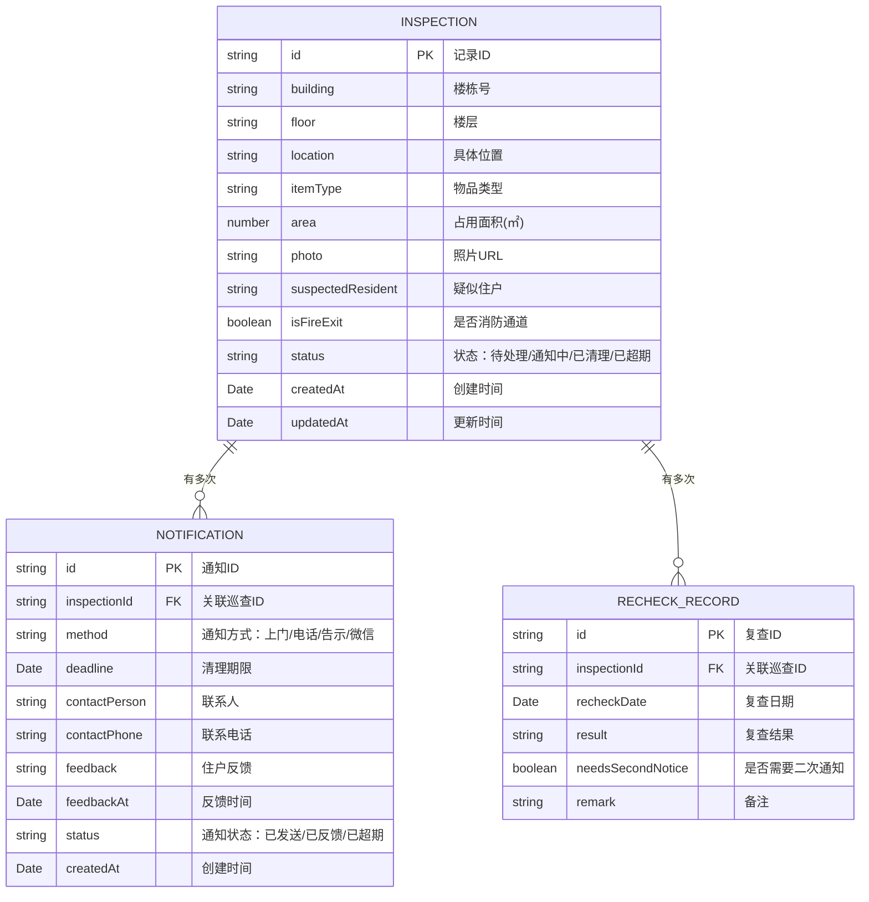

## 1. 架构设计



## 2. 技术栈说明

- **前端框架**：React@18 + TypeScript
- **构建工具**：Vite@5
- **样式方案**：TailwindCSS@3
- **路由管理**：react-router-dom@6
- **状态管理**：Zustand@4（轻量，适合中小项目）
- **图表库**：Recharts@2（React 生态常用图表库）
- **图标库**：Lucide React（轻量线性图标）
- **日期处理**：date-fns（轻量函数式日期库）
- **数据持久化**：localStorage + 自定义封装
- **表单处理**：React 原生 state + 自定义校验

## 3. 目录结构

```
src/
├── assets/              # 静态资源（图片、字体等）
├── components/          # 通用组件
│   ├── layout/          # 布局组件（Sidebar、Header等）
│   ├── ui/              # 基础UI组件（Button、Modal、Card等）
│   └── charts/          # 图表组件
├── pages/               # 页面级组件
│   ├── Dashboard/       # 总览看板
│   ├── Inspections/     # 巡查记录
│   ├── Notifications/   # 通知管理
│   ├── Recheck/         # 复查列表
│   └── Statistics/      # 统计分析
├── store/               # Zustand状态管理
│   ├── inspectionStore.ts
│   └── notificationStore.ts
├── services/            # 数据服务层
│   ├── inspectionService.ts
│   └── storageService.ts
├── types/               # TypeScript 类型定义
│   └── index.ts
├── utils/               # 工具函数
│   ├── date.ts
│   └── helpers.ts
├── constants/           # 常量配置
│   └── index.ts
├── data/                # Mock数据
│   └── mockData.ts
├── App.tsx
├── main.tsx
└── index.css
```

## 4. 路由定义

| 路由路径 | 页面名称 | 说明 |
|----------|----------|------|
| `/` | 总览看板 | 首页，数据概览和高风险提醒 |
| `/inspections` | 巡查记录 | 巡查记录列表和管理 |
| `/inspections/new` | 新增巡查 | 新增巡查记录表单 |
| `/inspections/:id` | 巡查详情 | 单条巡查记录详情 |
| `/notifications` | 通知管理 | 通知记录和状态跟踪 |
| `/recheck` | 复查列表 | 超期未清理的复查清单 |
| `/statistics` | 统计分析 | 各类统计图表和分析 |

## 5. 数据模型

### 5.1 数据模型定义



### 5.2 核心数据类型

```typescript
// 巡查记录
interface Inspection {
  id: string;
  building: string;
  floor: string;
  location: string;
  itemType: ItemType;
  area: number;
  photo: string;
  suspectedResident: string;
  isFireExit: boolean;
  status: InspectionStatus;
  createdAt: string;
  updatedAt: string;
  cleanedAt?: string;
  cleanedPhoto?: string;
}

// 通知记录
interface Notification {
  id: string;
  inspectionId: string;
  method: NotificationMethod;
  deadline: string;
  contactPerson: string;
  contactPhone: string;
  feedback?: string;
  feedbackAt?: string;
  status: NotificationStatus;
  createdAt: string;
  noticeCount: number;
}

// 物品类型
type ItemType = '纸箱' | '旧家具' | '花盆' | '儿童车' | '自行车' | '杂物' | '其他';

// 巡查状态
type InspectionStatus = 'pending' | 'notified' | 'cleaned' | 'overdue' | 'recheck';

// 通知方式
type NotificationMethod = '上门' | '电话' | '告示' | '微信' | '其他';

// 通知状态
type NotificationStatus = 'sent' | 'feedback_received' | 'overdue' | 'completed';
```

### 5.3 统计数据模型

```typescript
// 楼栋统计
interface BuildingStats {
  building: string;
  totalCount: number;
  pendingCount: number;
  cleanedCount: number;
  overdueCount: number;
}

// 重复住户统计
interface ResidentStats {
  resident: string;
  count: number;
  building: string;
}

// 清理时效统计
interface CleanupStats {
  avgDays: number;
  within3Days: number;
  within7Days: number;
  over7Days: number;
}

// 高风险点位
interface RiskPoint {
  location: string;
  building: string;
  floor: string;
  count: number;
  riskLevel: 'high' | 'medium' | 'low';
  isFireExit: boolean;
}
```
