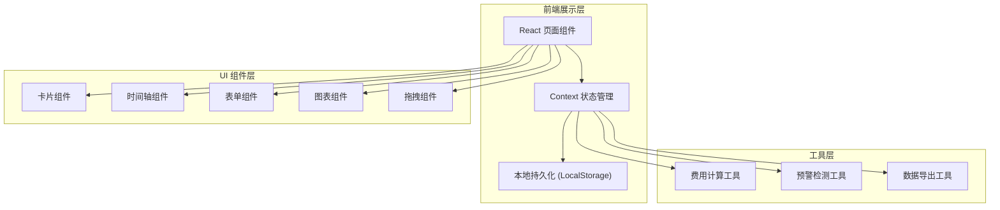
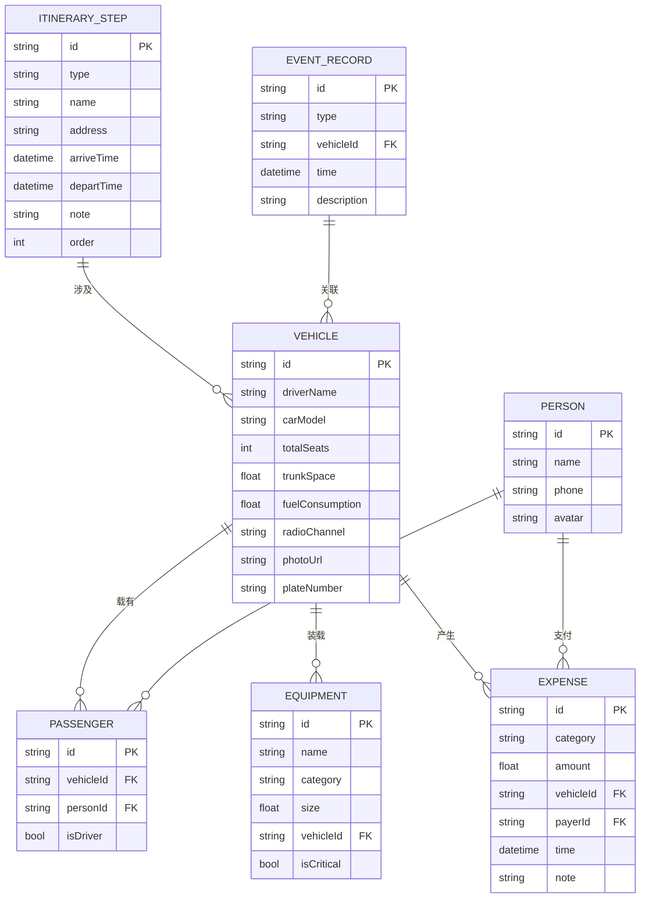

## 1. 架构设计



## 2. 技术描述

- **前端框架**：React@18 + TypeScript
- **构建工具**：Vite@5
- **样式方案**：TailwindCSS@3 + CSS Variables
- **状态管理**：React Context + useReducer
- **图标库**：Lucide React（户外风格线性图标）
- **拖拽交互**：@dnd-kit/core + @dnd-kit/sortable
- **图表可视化**：Recharts
- **数据持久化**：LocalStorage（纯前端，无需后端）
- **动画**：Framer Motion（微交互动效）

## 3. 路由定义

| 路由 | 页面 | 用途 |
|------|------|------|
| / | 仪表盘 | 行程总览、预警提示、快速操作 |
| /vehicles | 车辆档案 | 车辆列表管理 |
| /vehicles/:id | 车辆编辑 | 新增/编辑车辆信息 |
| /itinerary | 行程规划 | 时间轴行程节点管理 |
| /allocation | 人员装备分配 | 乘客与装备拖拽分配 |
| /records | 路上记录 | 事件与费用记录 |
| /settlement | 费用结算 | 费用统计与人均分摊 |

## 4. 数据模型

### 4.1 数据模型定义 (ER 图)



### 4.2 TypeScript 类型定义

```typescript
interface Vehicle {
  id: string;
  driverName: string;
  carModel: string;
  plateNumber: string;
  totalSeats: number;
  trunkSpace: number;
  fuelConsumption: number;
  radioChannel: string;
  photoUrl: string;
}

interface Person {
  id: string;
  name: string;
  phone: string;
  avatar?: string;
}

interface Passenger {
  id: string;
  vehicleId: string;
  personId: string;
  isDriver: boolean;
}

interface Equipment {
  id: string;
  name: string;
  category: 'cooking' | 'sleeping' | 'safety' | 'entertainment' | 'other';
  size: number;
  vehicleId: string | null;
  isCritical: boolean;
}

type ItineraryType = 'meetup' | 'supply' | 'fuel' | 'camp' | 'scenic';

interface ItineraryStep {
  id: string;
  type: ItineraryType;
  name: string;
  address: string;
  arriveTime: string;
  departTime?: string;
  note?: string;
  order: number;
}

type EventType = 'delay' | 'detour' | 'breakdown' | 'accident' | 'other';

interface EventRecord {
  id: string;
  type: EventType;
  vehicleId: string | null;
  time: string;
  description: string;
}

type ExpenseCategory = 'fuel' | 'toll' | 'parking' | 'food' | 'supply' | 'other';

interface Expense {
  id: string;
  category: ExpenseCategory;
  amount: number;
  vehicleId: string | null;
  payerId: string;
  time: string;
  note?: string;
}

interface FleetState {
  vehicles: Vehicle[];
  people: Person[];
  passengers: Passenger[];
  equipment: Equipment[];
  itinerary: ItineraryStep[];
  events: EventRecord[];
  expenses: Expense[];
}
```

## 5. 目录结构

```
src/
├── components/
│   ├── layout/
│   │   ├── Sidebar.tsx
│   │   ├── Topbar.tsx
│   │   └── PageLayout.tsx
│   ├── common/
│   │   ├── Card.tsx
│   │   ├── Button.tsx
│   │   ├── Modal.tsx
│   │   ├── FormField.tsx
│   │   └── Alert.tsx
│   ├── vehicles/
│   │   ├── VehicleCard.tsx
│   │   ├── VehicleForm.tsx
│   │   └── VehicleList.tsx
│   ├── itinerary/
│   │   ├── Timeline.tsx
│   │   ├── TimelineItem.tsx
│   │   └── StepForm.tsx
│   ├── allocation/
│   │   ├── PassengerPanel.tsx
│   │   ├── EquipmentPanel.tsx
│   │   ├── VehicleAllocation.tsx
│   │   └── WarningBanner.tsx
│   ├── records/
│   │   ├── EventTimeline.tsx
│   │   ├── EventForm.tsx
│   │   ├── ExpenseList.tsx
│   │   └── ExpenseForm.tsx
│   └── settlement/
│       ├── VehicleExpenseChart.tsx
│       ├── SettlementTable.tsx
│       └── PersonSettlement.tsx
├── context/
│   └── FleetContext.tsx
├── hooks/
│   ├── useFleet.ts
│   └── useWarnings.ts
├── utils/
│   ├── calculations.ts
│   ├── storage.ts
│   └── mockData.ts
├── types/
│   └── index.ts
├── pages/
│   ├── Dashboard.tsx
│   ├── Vehicles.tsx
│   ├── Itinerary.tsx
│   ├── Allocation.tsx
│   ├── Records.tsx
│   └── Settlement.tsx
├── App.tsx
├── main.tsx
└── index.css
```
