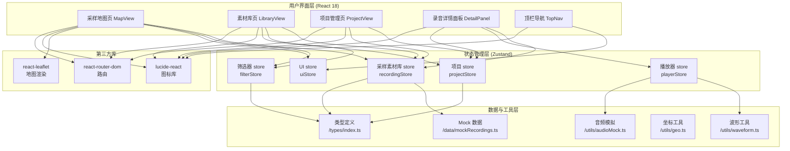
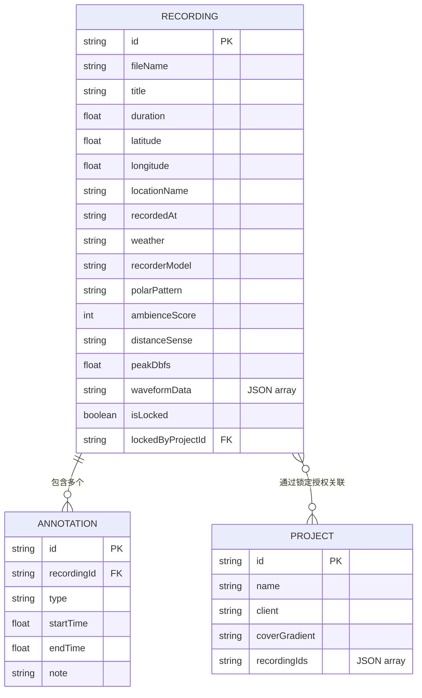

## 1. 架构设计



## 2. 技术选型说明

- **前端框架**：React 18 + TypeScript + Vite（构建速度快，类型安全）
- **样式方案**：Tailwind CSS 3 + 自定义 CSS 变量主题（深夜工作室配色）
- **状态管理**：Zustand（轻量、无需 Provider、与 React 18 完美契合）
- **地图渲染**：react-leaflet + Leaflet（开源免费，支持自定义深色底图样式）
- **路由**：react-router-dom v6（三个主视图：/map、/library、/projects）
- **图标**：lucide-react（线性图标风格，与产品气质匹配）
- **后端**：无后端，纯前端 Demo，使用 localStorage 模拟持久化 + 预置 Mock 数据
- **波形绘制**：原生 Canvas API 手写（无需引入 wavesurfer.js，减轻依赖）

## 3. 路由定义

| 路由路径 | 页面组件 | 用途 |
|---------|---------|-----|
| `/` | 重定向到 `/map` | 默认入口 |
| `/map` | `MapView.tsx` | 采样地图主视图（含左侧筛选、中央地图、右侧详情面板） |
| `/library` | `LibraryView.tsx` | 素材库多维筛选 + 列表/卡片视图 |
| `/projects` | `ProjectView.tsx` | 项目管理 + 锁定授权追踪 |

## 4. 类型定义（核心数据模型）

```typescript
// 麦克风指向方式
export type MicPolarPattern = 'cardioid' | 'omnidirectional' | 'figure8' | 'shotgun' | 'xy';

// 天气类型
export type WeatherCondition = 'sunny' | 'cloudy' | 'rainy' | 'foggy' | 'windy' | 'snowy' | 'stormy';

// 环境标签
export type EnvironmentTag = 'forest' | 'mountain' | 'ocean' | 'river' | 'city' | 'indoor' | 'desert' | 'wetland' | 'village' | 'cave';

// 距离感
export type DistanceSense = 'close' | 'medium' | 'far' | 'distant';

// 标注类型
export type AnnotationType = 'loop' | 'wind_noise' | 'traffic' | 'voice' | 'needs_editing';

// 授权类型
export type LicenseType = 'exclusive' | 'non_exclusive';

// 标注段
export interface Annotation {
  id: string;
  type: AnnotationType;
  startTime: number;  // 秒
  endTime: number;    // 秒
  note?: string;
}

// 单条录音素材
export interface Recording {
  id: string;
  fileName: string;           // 原始文件名: 20240518_143217.wav
  title: string;              // 用户可读标题: 云南-香格里拉-纳帕海湿地清晨
  duration: number;           // 时长（秒）
  sampleRate: number;         // 采样率
  bitDepth: number;           // 位深度
  channels: number;           // 声道数
  fileSize: number;           // 文件大小（MB）
  
  // 地理信息
  latitude: number;
  longitude: number;
  altitude?: number;          // 海拔（米）
  locationName: string;       // 地点名称
  
  // 时间信息
  recordedAt: string;         // ISO 时间戳
  timezone?: string;
  
  // 环境信息
  weather: WeatherCondition;
  temperature?: number;       // 摄氏度
  humidity?: number;          // %
  windSpeed?: number;         // km/h
  environmentTags: EnvironmentTag[];
  
  // 设备信息
  recorderModel: string;      // 录音笔型号
  microphoneModel: string;    // 麦克风型号
  polarPattern: MicPolarPattern;
  gainDb: number;             // 增益 dB
  sampleFormat: string;       // WAV 24bit / BWF 等
  
  // 主观评估（由用户填写或 AI 生成）
  ambienceScore: number;      // 氛围值 1-10
  distanceSense: DistanceSense;
  peakDbfs: number;           // 峰值 dBFS（负数，如 -3.2）
  rmsDbfs?: number;           // RMS 均值
  dynamicRange?: number;      // 动态范围 dB
  hasIssues?: boolean;        // 是否含有问题标注
  
  // 波形数据（预计算的采样点，用于绘制）
  waveformData: number[];     // 归一化到 [-1, 1] 的波形采样点，约 800-1000 点
  
  // 标注
  annotations: Annotation[];
  
  // 项目锁定信息
  isLocked: boolean;
  lockedByProjectId?: string;
  licenseInfo?: LicenseInfo;
  
  // 备注
  notes?: string;
  createdAt: string;
  updatedAt: string;
}

// 授权信息
export interface LicenseInfo {
  projectId: string;
  projectName: string;
  licenseType: LicenseType;
  licensedAt: string;
  expiresAt?: string;
  notes?: string;
}

// 项目
export interface Project {
  id: string;
  name: string;
  client?: string;
  description?: string;
  coverGradient: string;      // tailwind 渐变色类名
  recordingIds: string[];
  createdAt: string;
  updatedAt: string;
}

// 筛选条件
export interface FilterCriteria {
  searchQuery?: string;
  dateRange?: { start: string; end: string };
  environmentTags?: EnvironmentTag[];
  weather?: WeatherCondition[];
  recorderModels?: string[];
  polarPatterns?: MicPolarPattern[];
  ambienceRange?: [number, number];
  distanceSense?: DistanceSense[];
  peakDbfsRange?: [number, number];   // 如 [-6, 0]
  hasIssues?: boolean | null;         // true=仅含问题, false=仅无问题, null=全部
  isLocked?: boolean | null;
}
```

## 5. 数据模型 ER 图



## 6. 项目目录结构

```
src/
├── main.tsx                  # 入口文件
├── App.tsx                   # 路由根组件，三栏布局外壳
├── index.css                 # Tailwind + 自定义主题变量 + 全局样式
│
├── types/
│   └── index.ts              # 全部 TypeScript 类型定义
│
├── data/
│   └── mockRecordings.ts     # 20+ 条预置 mock 数据，覆盖不同场景
│
├── store/
│   ├── recordingStore.ts     # 录音素材 CRUD、筛选结果
│   ├── filterStore.ts        # 多维筛选器状态
│   ├── playerStore.ts        # 播放状态、播放头位置
│   ├── projectStore.ts       # 项目与锁定管理
│   └── uiStore.ts            # 面板展开/折叠、当前视图、选中ID
│
├── pages/
│   ├── MapView.tsx           # /map 采样地图页
│   ├── LibraryView.tsx       # /library 素材库页
│   └── ProjectView.tsx       # /projects 项目管理页
│
├── components/
│   ├── layout/
│   │   ├── TopNav.tsx        # 顶部导航栏
│   │   ├── Sidebar.tsx       # 左侧导航（小图标）
│   │   └── DetailDrawer.tsx  # 右侧详情抽屉容器
│   │
│   ├── map/
│   │   ├── MapCanvas.tsx     # Leaflet 地图容器
│   │   ├── MapMarker.tsx     # 自定义发光点位
│   │   ├── MarkerPopup.tsx   # 点位弹层内容
│   │   └── MapFilterBar.tsx  # 地图筛选工具条
│   │
│   ├── waveform/
│   │   ├── WaveformPlayer.tsx    # 波形播放器主组件
│   │   ├── WaveformCanvas.tsx    # Canvas 绘制波形
│   │   ├── PlaybackControls.tsx  # 播放/暂停/进度/音量
│   │   └── AnnotationToolbar.tsx # 标注工具栏
│   │
│   ├── recording/
│   │   ├── RecordingDetail.tsx   # 录音详情面板
│   │   ├── MetadataCard.tsx      # 元数据卡片网格
│   │   ├── AnnotationList.tsx    # 标注列表
│   │   └── AmbienceMeter.tsx     # 氛围评分可视化
│   │
│   ├── library/
│   │   ├── FilterPanel.tsx       # 左侧多维筛选器
│   │   ├── RecordingTable.tsx    # 列表视图
│   │   ├── RecordingCard.tsx     # 卡片视图
│   │   └── BatchActionBar.tsx    # 批量操作条
│   │
│   └── project/
│       ├── ProjectCard.tsx       # 项目卡片
│       ├── LicenseTimeline.tsx   # 授权时间线
│       └── LockModal.tsx         # 锁定/授权弹窗
│
├── utils/
│   ├── waveform.ts           # 波形生成、采样、归一化工具
│   ├── geo.ts                # 坐标距离计算、格式化
│   ├── audio.ts              # dBFS 换算、音频模拟工具
│   ├── format.ts             # 日期、时长、文件大小格式化
│   └── colors.ts             # 环境标签→颜色映射
│
└── hooks/
    ├── useWaveform.ts        # 波形绘制与交互 hook
    ├── useKeyboardPlayer.ts  # 空格键播放等键盘快捷键
    └── useDebounce.ts        # 通用防抖 hook
```
