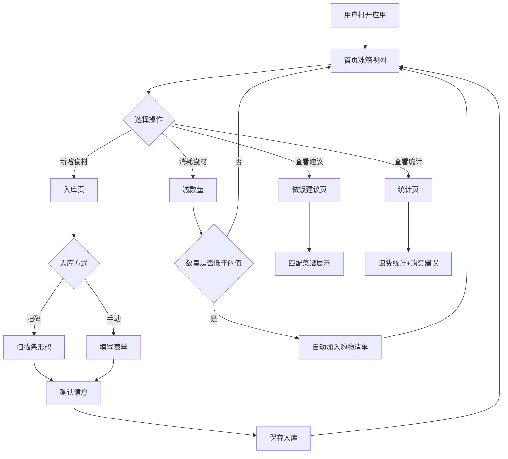

## 1. 产品概述

家庭冰箱库存管家——一款帮助家庭用户管理冰箱食材、减少浪费的智能工具。打开页面即可直观看到冰箱内有什么、什么快过期了，支持快速入库、消耗记录、自动购物清单、做饭建议和浪费统计。

- 目标用户：注重食材管理、希望减少浪费的家庭用户
- 核心价值：让冰箱透明化，从"不知道有什么"到"一目了然"，从"经常过期"到"智能提醒少买多存"

## 2. 核心功能

### 2.1 用户角色

| 角色 | 注册方式 | 核心权限 |
|------|----------|----------|
| 家庭用户 | 无需注册 | 管理冰箱食材、查看建议和统计 |

### 2.2 功能模块

1. **首页（冰箱视图）**：冰箱分层展示、快过期提醒、快捷操作入口
2. **入库页**：新增食材、扫码/手动入库、拍照/图标选择
3. **购物清单页**：自动生成购物清单、手动添加、勾选购买
4. **做饭建议页**：基于现有食材推荐菜谱
5. **统计页**：本月浪费食材、购买建议、消费趋势

### 2.3 页面详情

| 页面名称 | 模块名称 | 功能描述 |
|----------|----------|----------|
| 首页 | 冰箱分层视图 | 上层冷藏区、下层冷冻区、门架区、抽屉区分开展示食材，快过期食材边框变醒目红色/橙色 |
| 首页 | 快过期提醒横幅 | 顶部横幅滚动展示3天内即将过期的食材列表 |
| 首页 | 快捷操作栏 | 一键入库、扫码入库、查看购物清单等快捷入口 |
| 入库页 | 基本信息表单 | 填写名称、类别（蔬菜/水果/肉类/乳制品/调味品/饮品/其他）、数量、单位（个/斤/袋/瓶/盒）、买入日期、保质期天数、存放位置（冷藏/冷冻/门架/抽屉） |
| 入库页 | 图标/拍照选择 | 选择预设食材图标或拍照上传食材图片 |
| 入库页 | 扫码入库 | 调用摄像头扫描条形码，自动填充食材信息（模拟数据） |
| 首页/食材详情 | 消耗减数量 | 点击食材可减少数量，数量归零自动标记为已消耗 |
| 购物清单页 | 自动生成清单 | 食材数量低于阈值时自动添加到购物清单 |
| 购物清单页 | 手动添加/勾选 | 手动添加购物项，勾选已购买后自动入库 |
| 做饭建议页 | 食材匹配菜谱 | 根据现有食材匹配可做菜谱，显示匹配度和缺少食材 |
| 做饭建议页 | 菜谱卡片 | 展示菜名、所需食材、匹配度、做法简述 |
| 统计页 | 浪费统计 | 本月过期/丢弃的食材统计，按类别分组展示 |
| 统计页 | 购买建议 | 根据浪费数据提示"下次少买XX"，根据消耗频率提示"常备XX" |
| 统计页 | 趋势图表 | 本月食材消耗趋势、浪费率变化 |

## 3. 核心流程

### 3.1 食材入库流程

用户打开入库页 → 选择扫码或手动输入 → 填写/确认食材信息（名称、类别、数量、单位、日期、保质期、位置、图标） → 保存入库 → 首页冰箱视图实时更新

### 3.2 食材消耗流程

用户在首页点击食材 → 选择"吃掉了"减少数量 → 数量低于阈值自动进入购物清单 → 数量归零标记为已消耗

### 3.3 做饭建议流程

系统扫描现有食材 → 匹配预设菜谱库 → 按匹配度排序展示 → 用户查看菜谱详情

### 3.4 核心流程图

## 4. 用户界面设计

### 4.1 设计风格

- **主色调**：冰蓝渐变（#E0F7FA → #80DEEA）作为背景氛围色，搭配清新白色卡片
- **辅助色**：珊瑚橙（#FF6B6B）用于快过期警告，薄荷绿（#4ECDC4）用于新鲜/安全状态
- **按钮风格**：圆角胶囊按钮，带微阴影，hover 时轻微上浮
- **字体**：标题使用 Noto Sans SC Bold，正文使用 Noto Sans SC Regular
- **布局风格**：卡片式布局，冰箱视图采用拟物化分层展示
- **图标风格**：线性+微渐变图标，食材图标使用扁平化插画风格

### 4.2 页面设计概览

| 页面名称 | 模块名称 | UI 元素 |
|----------|----------|---------|
| 首页 | 快过期横幅 | 顶部橙色渐变横幅，滚动展示快过期食材名称和天数，左侧警告图标 |
| 首页 | 冰箱分层视图 | 大卡片模拟冰箱外观，内部按层分区：冷藏区（蓝调）、冷冻区（深蓝调）、门架（窄条）、抽屉（底部抽拉式），每个食材为小卡片显示图标+名称+数量+过期进度条 |
| 首页 | 快捷操作栏 | 底部固定浮动按钮组：扫码入库（相机图标）、手动入库（加号图标）、购物清单（购物车图标） |
| 入库页 | 表单区域 | 白色卡片表单，各字段使用下拉选择或日期选择器，底部大号"保存"按钮 |
| 入库页 | 图标选择区 | 横向滚动的图标网格，点击选中带高亮边框，右侧拍照按钮 |
| 购物清单页 | 清单列表 | 简洁列表项，左侧勾选框，右侧数量，底部输入框快速添加 |
| 做饭建议页 | 菜谱卡片 | 瀑布流卡片，顶部菜谱图片/图标，中部菜名+匹配度标签，底部所需食材标签组 |
| 统计页 | 浪费图表 | 横向条形图按类别展示浪费量，红色渐变条，旁边显示浪费金额/数量 |
| 统计页 | 购买建议 | 气泡式提示卡片，"↓ 少买"和"↑ 常备"两种标签 |

### 4.3 响应式设计

- 桌面优先设计，最大宽度 1280px 居中
- 平板端：冰箱视图从纵向分层切换为横向标签页
- 移动端：底部导航栏切换页面，冰箱视图简化为列表+标签筛选

### 4.4 动效设计

- 冰箱视图打开时有轻微"开门"动画
- 食材卡片 hover 时微上浮+阴影加深
- 快过期食材边框有脉冲式呼吸动画（红→橙→红）
- 消耗食材时有"飞出"退场动画
- 购物清单新增项有滑入动画
