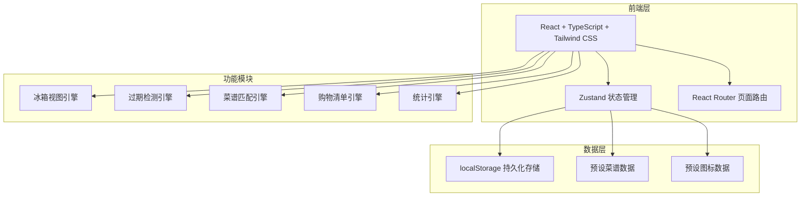
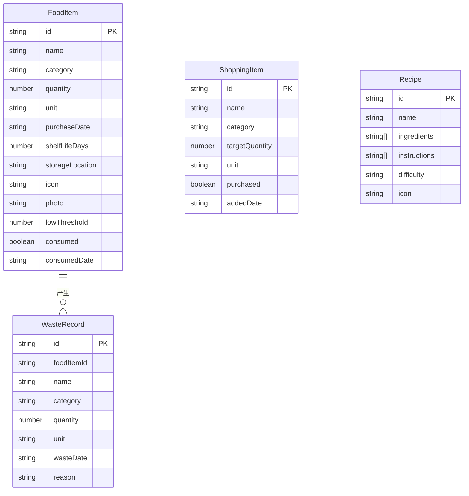

## 1. 架构设计



## 2. 技术说明

- **前端**：React@18 + TypeScript + Tailwind CSS@3 + Vite
- **初始化工具**：vite-init (react-ts 模板)
- **后端**：无（纯前端应用，数据存储在 localStorage）
- **数据库**：localStorage（模拟持久化），内置预设数据
- **状态管理**：Zustand（管理食材列表、购物清单、统计数据等全局状态）

## 3. 路由定义

| 路由 | 用途 |
|------|------|
| `/` | 首页 - 冰箱分层视图，快过期提醒 |
| `/add` | 入库页 - 新增食材，扫码/手动入库 |
| `/shopping` | 购物清单页 - 自动+手动购物清单 |
| `/recipes` | 做饭建议页 - 基于现有食材推荐菜谱 |
| `/stats` | 统计页 - 浪费统计、购买建议、趋势图表 |

## 4. 数据模型

### 4.1 数据模型定义



### 4.2 数据定义

#### FoodItem 食材表

```typescript
interface FoodItem {
  id: string;
  name: string;
  category: "vegetable" | "fruit" | "meat" | "dairy" | "condiment" | "drink" | "grain" | "other";
  quantity: number;
  unit: "个" | "斤" | "袋" | "瓶" | "盒" | "包" | "根" | "块";
  purchaseDate: string;
  shelfLifeDays: number;
  storageLocation: "fridge" | "freezer" | "door" | "drawer";
  icon: string;
  photo?: string;
  lowThreshold: number;
  consumed: boolean;
  consumedDate?: string;
}
```

#### ShoppingItem 购物清单项

```typescript
interface ShoppingItem {
  id: string;
  name: string;
  category: FoodItem["category"];
  targetQuantity: number;
  unit: string;
  purchased: boolean;
  addedDate: string;
}
```

#### Recipe 菜谱

```typescript
interface Recipe {
  id: string;
  name: string;
  ingredients: { name: string; category: string; quantity: number; unit: string }[];
  instructions: string[];
  difficulty: "easy" | "medium" | "hard";
  icon: string;
}
```

#### WasteRecord 浪费记录

```typescript
interface WasteRecord {
  id: string;
  foodItemId: string;
  name: string;
  category: string;
  quantity: number;
  unit: string;
  wasteDate: string;
  reason: "expired" | "spoiled" | "other";
}
```

## 5. 核心算法

### 5.1 过期检测算法

- 计算过期日期 = 买入日期 + 保质期天数
- 剩余天数 = 过期日期 - 当前日期
- 状态判断：剩余 ≤ 0 已过期（红色），≤ 3 天即将过期（橙色），≤ 7 天临近过期（黄色），> 7 天新鲜（绿色）

### 5.2 菜谱匹配算法

- 遍历菜谱库，计算每个菜谱与现有食材的匹配度
- 匹配度 = 已有食材数 / 所需食材总数
- 按匹配度降序排列，过滤匹配度 > 0 的菜谱
- 标记缺少的食材

### 5.3 购物清单自动生成

- 每次食材数量变化时检测：当前数量 ≤ lowThreshold
- 满足条件且购物清单中不存在该食材时，自动添加
- 购物清单中建议数量 = lowThreshold × 2 - 当前数量

### 5.4 浪费统计算法

- 汇总本月的 WasteRecord 记录
- 按 category 分组统计数量
- 计算浪费率 = 浪费数量 / 总购买数量
- 生成"少买"建议：浪费率 > 30% 的类别
- 生成"常备"建议：消耗频率高且从不浪费的类别
