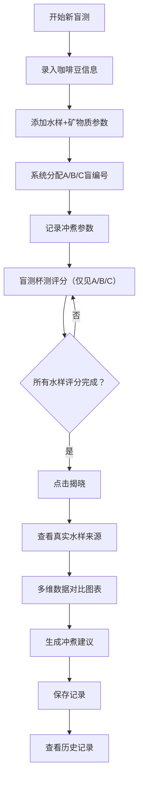

## 1. 产品概述

手冲咖啡盲测记录工具，帮助咖啡爱好者在无心理预期的情况下，客观比较不同水质对同一支咖啡豆风味表现的影响。通过盲测编号隐藏水样来源，系统记录冲煮参数与杯测结果，最终揭晓并生成专业冲煮建议。

- 目标用户：手冲咖啡爱好者、咖啡从业者、杯测师
- 核心价值：消除心理预期偏差，科学对比水质影响，优化冲煮方案

## 2. 核心功能

### 2.1 用户角色

| 角色 | 注册方式 | 核心权限 |
|------|----------|----------|
| 普通用户 | 无需注册，本地存储 | 创建盲测记录、录入冲煮参数、杯测评分、揭晓对比、查看建议 |

### 2.2 功能模块

1. **盲测创建页**：咖啡豆信息录入、水样盲编号设置（A/B/C）、矿物质参数记录
2. **冲煮记录页**：研磨度、水温、萃取时间等冲煮参数录入
3. **杯测评分页**：酸、甜、苦、余韵、干净度评分，喜好排序，风味感受记录
4. **揭晓对比页**：揭示水样真实来源，多维度对比图表，生成冲煮建议
5. **历史记录页**：查看所有盲测记录，支持筛选和删除

### 2.3 页面详情

| 页面名称 | 模块名称 | 功能描述 |
|----------|----------|----------|
| 盲测创建页 | 咖啡豆信息 | 录入豆名、产地、处理法、烘焙度、烘焙日期 |
| 盲测创建页 | 水样管理 | 添加水样真实名称，自动分配A/B/C盲编号，记录TDS、硬度、pH等矿物质参数 |
| 冲煮记录页 | 参数表单 | 记录每个水样的研磨度、水温、粉水比、萃取时间、注水手法 |
| 杯测评分页 | 评分面板 | 10分制滑块评分（酸、甜、苦、余韵、干净度），喜好排序拖拽，风味标签选择 |
| 杯测评分页 | 感受记录 | 自由文本记录杯测感受和发现 |
| 揭晓对比页 | 数据可视化 | 雷达图对比各水样评分维度，柱状图显示喜好排序 |
| 揭晓对比页 | 建议生成 | 基于数据自动生成下次冲煮优化建议 |
| 历史记录页 | 记录列表 | 卡片式展示历史盲测，支持搜索、筛选、删除操作 |

## 3. 核心流程

用户创建新盲测 → 录入咖啡豆信息 → 添加多个水样并记录矿物质参数 → 系统自动分配A/B/C盲编号 → 依次记录每个水样的冲煮参数 → 盲测状态下进行杯测评分（仅显示A/B/C）→ 完成所有评分后点击揭晓 → 查看水样真实来源与多维对比 → 系统生成冲煮建议 → 保存记录到本地

## 4. 用户界面设计

### 4.1 设计风格

- **主色调**：深咖啡色 (#3E2723) 作为主色，温暖琥珀色 (#FF8F00) 作为强调色，米色 (#FFF8E1) 为背景
- **辅色调**：森林绿 (#2E7D32) 代表酸质，蜜糖色 (#F57F17) 代表甜感，炭灰色 (#424242) 代表苦感
- **按钮风格**：圆角8px，微妙阴影，悬停时有轻微上浮效果
- **字体**：标题使用 "Noto Serif SC" 衬线体，正文使用 "Noto Sans SC" 无衬线体，营造专业咖啡品鉴的氛围
- **布局风格**：卡片式布局，柔和阴影，充足留白，步骤指示器引导流程
- **图标**：使用 lucide-react 图标，咖啡杯、水滴、温度计、计时器等与主题相关的图标

### 4.2 页面设计概述

| 页面名称 | 模块名称 | UI 元素 |
|----------|----------|---------|
| 盲测创建页 | 步骤导航 | 顶部4步进度条，当前步骤高亮，已完成步骤打勾 |
| 盲测创建页 | 咖啡豆表单 | 分组输入框，自动对焦，下拉选择烘焙度 |
| 盲测创建页 | 水样列表 | 可添加/删除水样卡片，盲编号徽章醒目显示 |
| 冲煮记录页 | 参数卡片 | 每个水样一张卡片，数字输入框带单位，滑块调节数值 |
| 杯测评分页 | 评分面板 | 大滑块带数值显示，彩色进度条可视化分数 |
| 杯测评分页 | 风味标签 | 可点击标签（花香、果香、焦糖、坚果等），多选高亮 |
| 杯测评分页 | 排序组件 | 拖拽排序卡片，松手时有平滑动画 |
| 揭晓对比页 | 揭晓动效 | 点击揭晓按钮后，卡片翻转动画显示真实名称 |
| 揭晓对比页 | 雷达图 | 交互式雷达图，hover显示具体数值 |
| 揭晓对比页 | 建议卡片 | 带图标的建议列表，重点内容加粗强调 |
| 历史记录页 | 记录卡片 | 咖啡豆名称、日期、水样数量、平均评分概览 |

### 4.3 响应式设计

- **桌面优先**：1280px 以上为最佳体验，采用双列或三列网格布局
- **平板适配**：768px-1279px，调整为单列或双列，字号适当缩小
- **手机适配**：375px-767px，单列布局，步骤导航改为顶部横向滚动条，大按钮便于触控，表单输入框高度增加至48px
- **触摸优化**：所有可点击元素最小尺寸 44x44px，重要操作按钮使用强调色突出显示

### 4.4 动效设计

- **页面切换**：渐入渐出 + 轻微位移动画，时长 300ms
- **表单提交**：按钮点击缩放反馈 0.95 → 1.0
- **揭晓动画**：卡片 3D 翻转效果，先模糊后清晰显示真实名称
- **评分滑块**：拖动时数值实时更新，释放时进度条有弹性动画
- **错误提示**：轻微抖动 + 红色边框高亮，错误文字淡入
