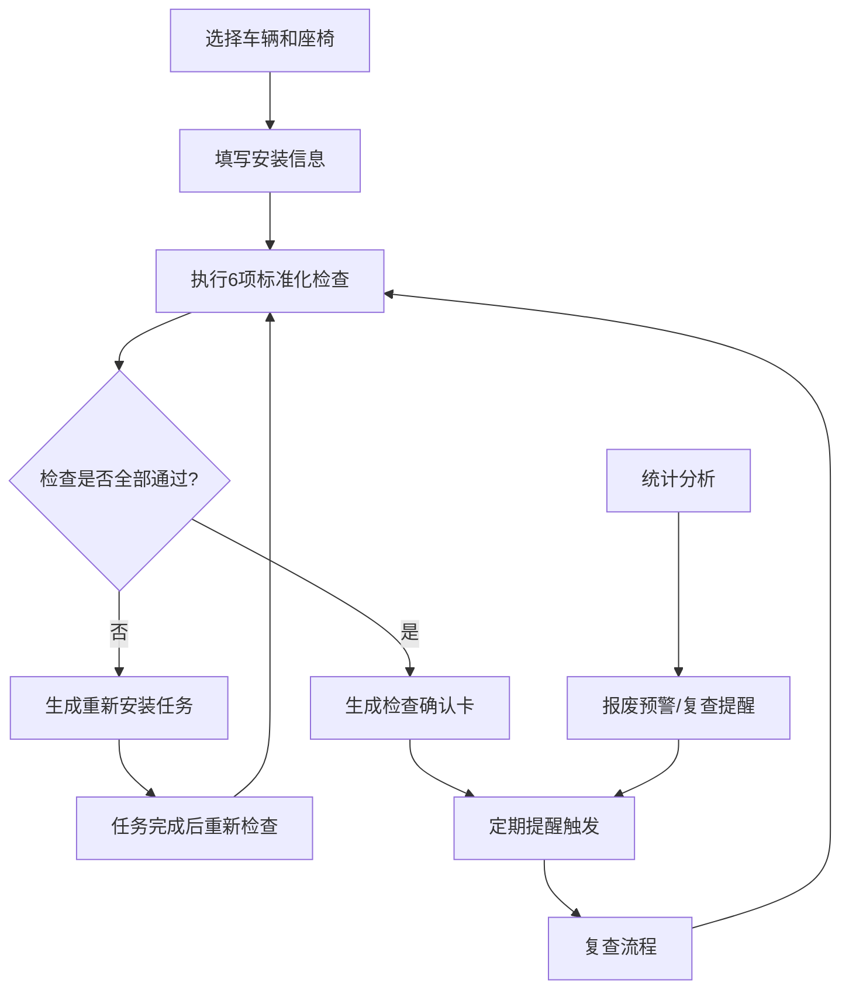

## 1. 产品概述
儿童安全座椅管理系统，帮助家长建立车辆和座椅档案，规范安装检查流程，确保每次出行儿童乘车安全。
- 解决问题：座椅安装不规范、忘记定期检查、座椅超期服役等安全隐患
- 目标用户：有车有孩的家庭用户
- 产品价值：通过标准化检查流程和智能提醒，降低儿童乘车安全风险

## 2. 核心功能

### 2.1 用户角色
| 角色 | 注册方式 | 核心权限 |
|------|----------|----------|
| 家长用户 | 无需注册，本地存储 | 完整的档案管理、检查、提醒、统计功能 |

### 2.2 功能模块
1. **首页仪表盘**：提醒概览、快速检查入口、统计摘要
2. **档案管理**：车辆档案、座椅档案的增删改查
3. **安装检查**：标准化检查清单、检查记录
4. **快速检查卡**：出行前一键生成检查清单
5. **任务管理**：异常时生成重新安装任务
6. **统计分析**：复查周期、报废预警统计
7. **提醒中心**：孩子长高、冬季厚衣、座椅到期提醒

### 2.3 页面详情
| 页面名称 | 模块名称 | 功能描述 |
|----------|----------|----------|
| 首页仪表盘 | 提醒卡片 | 显示待办提醒数量和详情 |
| 首页仪表盘 | 快速操作区 | 快速检查、新增档案、查看统计入口 |
| 首页仪表盘 | 最近检查记录 | 展示最近5次检查记录 |
| 档案管理页 | 车辆列表 | 展示所有车辆档案，支持搜索筛选 |
| 档案管理页 | 座椅列表 | 展示所有座椅档案，支持搜索筛选 |
| 档案管理页 | 档案表单 | 新增/编辑车辆和座椅信息，含图片上传 |
| 安装检查页 | 检查清单 | 6项标准化检查项，支持勾选和备注 |
| 安装检查页 | 检查历史 | 按时间线展示历史检查记录 |
| 快速检查卡页 | 检查卡片 | 生成可打印/截图的出行前检查确认卡 |
| 任务管理页 | 任务列表 | 展示重新安装任务，支持标记完成 |
| 统计分析页 | 复查统计 | 展示各车辆距上次检查天数，标记异常 |
| 统计分析页 | 报废预警 | 展示座椅报废倒计时，临近过期高亮 |
| 提醒中心页 | 提醒列表 | 三类提醒的管理和配置 |

## 3. 核心流程

用户选择车辆和座椅组合 → 填写/更新安装信息 → 执行标准化安装检查 → 检查通过生成确认卡/不通过生成重装任务 → 定期收到提醒 → 统计分析使用情况

## 4. 用户界面设计

### 4.1 设计风格
- 主色调：温暖安全的橙红色系 (#FF6B35)，搭配沉稳的深蓝 (#1A365D)
- 辅助色：安全绿 (#10B981) 表示通过，警告黄 (#F59E0B) 表示提醒，危险红 (#EF4444) 表示异常
- 按钮风格：圆角 12px，微立体阴影，悬停时轻微上浮效果
- 字体：标题使用 Lora 衬线字体，正文使用 Inter 无衬线字体
- 布局风格：卡片式布局，留白充足，信息层次清晰
- 图标风格：使用 Lucide 线性图标，保持简约统一

### 4.2 页面设计概述
| 页面名称 | 模块名称 | UI 元素 |
|----------|----------|----------|
| 首页仪表盘 | 提醒卡片 | 渐变色背景，图标+数字+描述，悬停微动效 |
| 档案管理页 | 档案卡片 | 图片预览 + 关键信息网格，支持点击展开详情 |
| 安装检查页 | 检查清单项 | 大号复选框 + 描述 + 备注输入区，通过/未通过状态切换动画 |
| 快速检查卡页 | 检查卡片 | 仿实体卡片设计，阴影、圆角、可打印样式 |
| 统计分析页 | 数据可视化 | 横向进度条展示复查间隔，环形进度展示座椅使用寿命 |
| 提醒中心页 | 提醒项 | 左图标 + 标题描述 + 右开关/日期配置 |

### 4.3 响应性
- 桌面端优先设计，断点 768px 适配平板，480px 适配手机
- 移动端采用单列布局，导航改为底部 Tab 栏
- 触控区域最小 44x44px，确保移动端操作友好
- 表单在移动端改为全屏模态框呈现

### 4.4 动效设计
- 页面加载：内容区域从下往上淡入，错落 100ms 延迟
- 卡片悬停：轻微上浮 + 阴影加深 + 边框高亮
- 状态切换：复选框勾选时有缩放动画，状态颜色渐变过渡
- 数据更新：数字变化时有滚动计数动画
- 提醒出现：从右侧滑入，伴随轻微震动反馈
