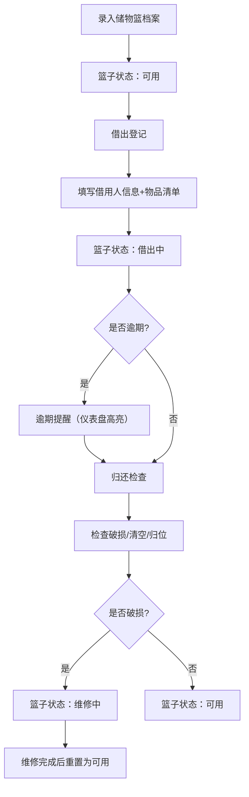

## 1. 产品概述

储物篮归还管理系统是一套面向企业行政/后勤部门的物资流转管理工具，解决活动物料储物篮借出后散落各会议室、无人登记、难以追踪归还的痛点。系统提供完整的篮子档案、借出登记、归还检查、逾期提醒和统计分析全流程管理。

- 目标用户：企业行政人员、后勤管理员、会议室管理员
- 核心价值：让每只储物篮可追溯、可定位、可统计，提升物资管理效率

## 2. 核心功能

### 2.1 用户角色

| 角色 | 说明 | 核心权限 |
|------|------|----------|
| 系统管理员 | 行政/后勤负责人 | 全功能访问：档案管理、借出登记、归还检查、统计配置 |
| 普通操作员 | 前台/会议室管理员 | 借出登记、归还检查、查看档案和统计 |

### 2.2 功能模块

1. **仪表盘首页**：概览统计卡片、逾期提醒面板、快捷操作入口、近期活动流水
2. **储物篮档案**：篮子列表（筛选/搜索）、新增/编辑档案、详情查看、照片上传
3. **借出登记**：选择篮子+填写借用人信息+贵重物品标记、提交借出
4. **归还检查**：扫描/搜索借出中的篮子、三项检查（破损/清空/归位）、提交归还
5. **统计分析**：可用/借出/维修/报废数量统计、逾期清单、常借部门排行、破损率趋势

### 2.3 页面详情

| 页面名称 | 模块名称 | 功能描述 |
|----------|----------|----------|
| 仪表盘首页 | 统计卡片区 | 可用数、借出中、逾期数、破损率四大KPI卡片 |
| 仪表盘首页 | 逾期提醒面板 | 高亮红色卡片展示逾期借出记录，一键提醒按钮 |
| 仪表盘首页 | 快捷操作 | 快速借出、快速归还、新增篮子三个快捷入口 |
| 仪表盘首页 | 近期流水 | 最近10条借出/归还操作时间线 |
| 储物篮档案 | 筛选工具栏 | 按状态/尺寸/颜色/存放点多条件筛选，关键词搜索 |
| 储物篮档案 | 篮子列表 | 卡片式展示，含照片、编号、状态徽章、存放点 |
| 储物篮档案 | 档案表单 | 新增/编辑篮子：编号、尺寸、颜色、默认存放点、可承重、状态、照片 |
| 借出登记 | 篮子选择 | 勾选多个可用篮子，显示选中汇总 |
| 借出登记 | 借用信息 | 借用人姓名、部门（下拉）、用途、目的地、预计归还时间 |
| 借出登记 | 物品清单 | 动态添加物品行，含"贵重物品"勾选框，整单标记贵重 |
| 归还检查 | 借出列表 | 展示所有借出中记录，支持搜索借用人/篮子编号 |
| 归还检查 | 检查表单 | 破损检查（是/否+备注）、物品清空（是/否）、放回原位（是/否+实际位置） |
| 统计分析 | 库存概览饼图 | 可用/借出/维修/报废占比 |
| 统计分析 | 逾期清单表格 | 借用人、部门、篮子编号、逾期天数、操作（发送提醒） |
| 统计分析 | 常借部门柱状图 | Top10部门借用次数排行 |
| 统计分析 | 破损率趋势 | 近6个月破损率折线图 |

## 3. 核心流程

主要用户流程描述：
1. **档案录入**：管理员录入储物篮基础信息（编号/尺寸/颜色/存放点/承重/照片），状态设为"可用"
2. **借出流程**：操作员选择可用篮子 → 填写借用人/部门/用途 → 录入物品清单（勾选贵重）→ 选择预计归还时间和目的地 → 提交，篮子状态变为"借出中"
3. **归还流程**：操作员搜索借出记录 → 依次检查破损情况、物品是否清空、是否放回原位 → 填写检查备注 → 提交，篮子状态变回"可用"（若破损则标记"维修中"）
4. **逾期处理**：系统自动判断超过预计归还时间的记录 → 仪表盘高亮展示 → 管理员点击"发送提醒"触发模拟通知
5. **统计查询**：查看库存分布、逾期清单、部门借用排行、破损率趋势，辅助管理决策

## 4. 用户界面设计

### 4.1 设计风格
- **整体定位**：工业仓储管理风 + 现代企业级后台，功能优先，信息密度高但层次清晰
- **主色**：深钢蓝 `#1e3a5f`（专业沉稳）
- **辅助色**：琥珀黄 `#f59e0b`（警示/贵重物品标记）、信号红 `#dc2626`（逾期/破损）、翠绿 `#059669`（正常/可用）
- **中性色**：石板灰渐变 `#f8fafc → #e2e8f0`（背景）、`#334155`（正文）
- **按钮风格**：矩形微圆角（4px），实心按钮带2px下边框增加立体感，hover时轻微上浮
- **字体**：标题用 "Space Grotesk"（工业感几何无衬线），正文用 "JetBrains Mono" + system-ui（数字清晰易读）
- **布局**：左侧固定导航栏 + 顶部面包屑状态栏 + 主内容卡片栅格
- **视觉元素**：储物篮采用拟物化CSS插画或高质量图片；卡片带细微颗粒噪点背景；数据展示搭配迷你图标
- **图标风格**：Lucide 线性图标，统一 20px 尺寸

### 4.2 页面设计概要

| 页面名称 | 模块名称 | UI元素 |
|----------|----------|--------|
| 仪表盘首页 | 统计卡片区 | 4张2×2栅格卡片，左上大号数字+趋势箭头+迷你条形图 |
| 仪表盘首页 | 逾期提醒面板 | 红边框卡片，闪烁红点图标，每行借用人+逾期天数+电话图标按钮 |
| 仪表盘首页 | 快捷操作 | 3张大按钮卡片，配大号图标+渐变hover效果 |
| 仪表盘首页 | 近期流水 | 时间线样式，左侧圆点区分借出（蓝）/归还（绿），右侧操作详情 |
| 储物篮档案 | 筛选工具栏 | 胶囊形筛选标签，搜索框带放大镜图标 |
| 储物篮档案 | 篮子列表 | 响应式卡片栅格（桌面4列），图片占位符带CSS网格纹理，右下角状态徽章 |
| 借出登记 | 物品清单 | 表格行动态增删，贵重物品行背景淡琥珀色，左侧⭐图标 |
| 归还检查 | 检查表单 | 三项检查用大号开关组件，配"Yes/No"文字，破损时展开备注输入框 |
| 统计分析 | 图表区 | 纯CSS/SVG图表，饼图用环形进度风格，柱状图动画加载 |

### 4.3 响应式
- 桌面优先（≥1280px）：左侧导航240px固定宽，主区自适应
- 平板（768–1279px）：导航折叠为图标栏（64px），卡片栅格降为2列
- 移动端（<768px）：顶部汉堡菜单抽屉，卡片单列堆叠，表格横向滚动
- 触控优化：按钮最小高度44px，关键操作增大触控热区
