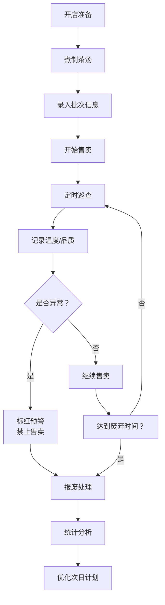

## 1. 产品概述

煮茶桶保温巡查系统是一款面向奶茶门店的茶汤品质管理工具，帮助店员实时监控煮茶桶的保温状态，确保茶汤口感稳定，减少因温度不足或超时售卖导致的品质问题和原料浪费。

- 核心功能：茶桶档案管理、茶汤批次记录、保温巡查记录、异常预警、统计分析
- 目标用户：奶茶店店长、调茶师、值班经理
- 产品价值：提升茶汤品质一致性，降低原料损耗，标准化门店操作流程

## 2. 核心功能

### 2.1 功能模块

1. **茶桶档案页**：茶桶列表、新增/编辑茶桶、茶桶详情
2. **批次记录页**：茶汤批次列表、新增批次、批次详情
3. **巡查记录页**：巡查打卡、温度记录、品质评估、异常标红
4. **统计分析页**：报废量统计、温度异常统计、时段消耗分析、煮制建议

### 2.2 页面详情

| 页面名称 | 模块名称 | 功能描述 |
|-----------|-------------|---------------------|
| 茶桶档案页 | 茶桶列表 | 卡片式展示所有茶桶，显示编号、茶底类型、当前状态、负责人 |
| 茶桶档案页 | 新增/编辑茶桶 | 录入编号、容量、茶底类型、保温目标温度范围、负责人、照片 |
| 茶桶档案页 | 茶桶详情 | 查看茶桶完整信息，关联批次记录和巡查记录 |
| 批次记录页 | 批次列表 | 按时间倒序展示所有茶汤批次，显示煮制时间、茶底类型、出汤量、售卖状态 |
| 批次记录页 | 新增批次 | 记录煮制时间、投茶量、出汤量、目标售卖时段、废弃时间 |
| 批次记录页 | 批次详情 | 查看批次完整信息和巡查历史 |
| 巡查记录页 | 巡查打卡 | 选择茶桶和批次，记录当前温度、香气、颜色、沉淀、是否补水、剩余量 |
| 巡查记录页 | 异常预警 | 温度低于保温目标或超过售卖时限自动标红，禁止继续售卖 |
| 巡查记录页 | 巡查历史 | 查看所有巡查记录，支持按茶桶、日期筛选 |
| 统计分析页 | 报废量统计 | 按茶底类型统计报废量和报废率 |
| 统计分析页 | 温度异常统计 | 统计各茶桶温度异常次数和时长 |
| 统计分析页 | 时段消耗分析 | 按时段统计茶汤消耗量 |
| 统计分析页 | 煮制建议 | 根据历史消耗数据给出各时段建议煮制量 |

## 3. 核心流程

### 3.1 日常运营流程

店长或调茶师早上开店后，为每个茶桶煮制新一批茶汤，录入批次信息；营业期间按固定时间间隔巡查，记录温度和品质状态；系统自动判断是否异常，异常时标红提醒；打烊后查看当日统计数据，优化次日煮制计划。

## 4. 用户界面设计

### 4.1 设计风格

- **主色调**：暖棕色系 (#8B5A2B)，传递茶饮温暖、自然的品牌感
- **辅助色**：抹茶绿 (#7CB342) 表示正常，警示红 (#E53935) 表示异常，琥珀橙 (#FFB300) 表示提醒
- **背景色**：米白色系 (#FFF8E1)，营造干净舒适的视觉感受
- **按钮风格**：圆角矩形，轻微阴影，悬停时有微妙的上浮效果
- **字体**：标题使用有衬线字体增添品质感，正文使用清晰易读的无衬线字体
- **布局风格**：卡片式布局，顶部导航 + 侧边标签切换
- **图标风格**：线性图标，与茶饮主题契合的简约风格

### 4.2 页面设计概述

| 页面名称 | 模块名称 | UI 元素 |
|-----------|-------------|-------------|
| 茶桶档案页 | 茶桶卡片 | 圆角卡片、茶桶照片、状态标签、编号、茶底类型 |
| 批次记录页 | 批次列表 | 时间轴式布局，批次信息卡片，状态色标 |
| 巡查记录页 | 巡查表单 | 大号温度显示，品质评分项，滑动式提交按钮 |
| 统计分析页 | 数据看板 | 数据卡片、柱状图、折线图、环形进度图 |

### 4.3 响应式

- 以桌面端为主要设计目标，兼顾平板横屏使用
- 支持触摸操作，按钮和点击区域足够大
- 数据表格在小屏幕上转为卡片式展示

### 4.4 动效与交互

- 页面切换使用淡入淡出过渡
- 异常状态有呼吸灯闪烁效果
- 数据统计图表有入场动画
- 卡片悬停时有轻微放大和阴影加深效果
