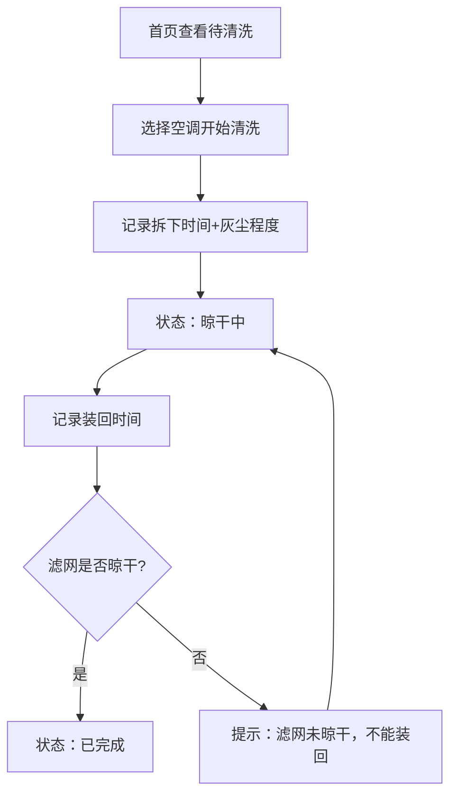
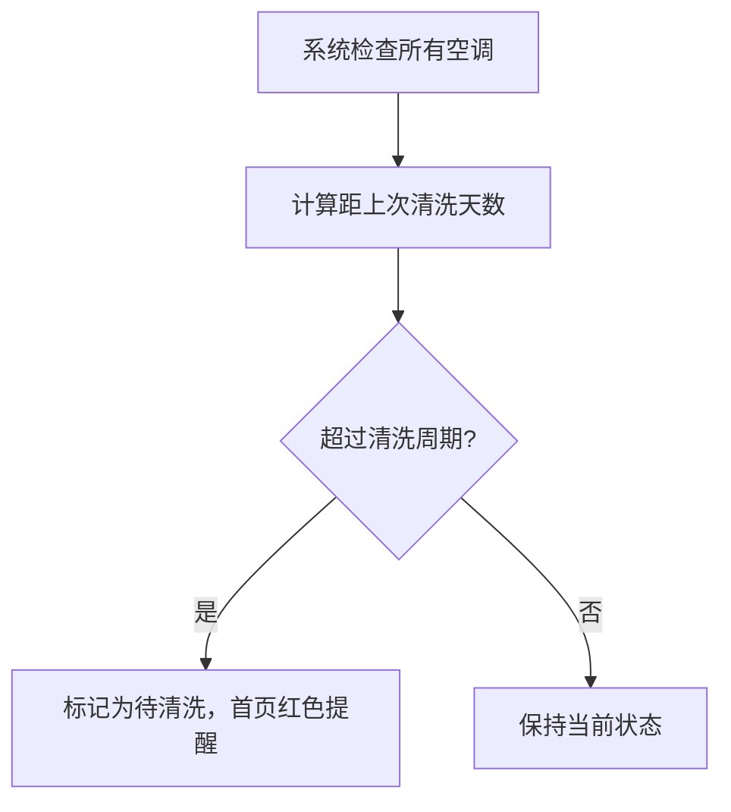

## 1. 产品概述
空调滤网清洗管理应用，帮助家庭记录每台空调的滤网清洗情况，解决"谁洗了哪台空调"的记忆难题，通过周期提醒和状态追踪，确保室内空气清新。

- **核心问题**：夏天开空调有异味，但家庭成员记不清哪台空调上次清洗过滤网
- **目标用户**：家庭用户，需要管理多台空调的清洗维护
- **产品价值**：系统化记录空调清洗历史，自动提醒清洗周期，规范清洗流程

## 2. 核心功能

### 2.1 用户角色
| 角色 | 注册方式 | 核心权限 |
|------|----------|----------|
| 家庭用户 | 无需注册，本地使用 | 管理空调档案、记录清洗、查看统计 |

### 2.2 功能模块
1. **首页仪表盘**：状态概览（待清洗/晾干中/已完成）、月度统计、智能提醒
2. **空调档案管理**：空调信息增删改查、照片上传
3. **清洗记录管理**：记录清洗全流程、状态流转校验
4. **统计分析**：清洗次数统计、最脏房间排名、优先级推荐

### 2.3 页面详情
| 页面名称 | 模块名称 | 功能描述 |
|---------|----------|----------|
| 首页 | 状态卡片 | 按房间显示空调状态：待清洗（红色提醒）、晾干中（黄色）、已完成（绿色） |
| 首页 | 统计面板 | 本月清洗次数、最脏房间、下次优先处理推荐 |
| 空调档案 | 列表页 | 展示所有空调的基本信息，支持搜索和筛选 |
| 空调档案 | 详情/表单 | 房间、品牌、型号、匹数、滤网类型、清洗周期、照片上传 |
| 清洗记录 | 列表页 | 按时间倒序展示所有清洗记录 |
| 清洗记录 | 新建表单 | 拆洗人、拆下时间、灰尘程度、晾干状态、装回时间、出风口擦拭 |

## 3. 核心流程

### 3.1 清洗流程
用户从首页看到待清洗提醒 → 选择空调开始清洗 → 记录拆下时间和灰尘程度 → 等待晾干（状态自动变为"晾干中"）→ 晾干后记录装回时间 → 系统校验滤网是否晾干 → 标记为已完成

### 3.2 周期提醒流程

## 4. 用户界面设计

### 4.1 设计风格
- **主色调**：清爽的蓝色系（#1677ff）代表制冷和清新
- **辅助色**：红色（#ff4d4f）用于待清洗提醒、黄色（#faad14）用于晾干中、绿色（#52c41a）用于已完成
- **按钮风格**：圆角8px，柔和阴影，悬停微上浮效果
- **字体**：标题使用"Noto Sans SC"粗体，正文使用系统无衬线字体
- **布局风格**：卡片式布局，顶部导航，左右分栏（左侧导航+右侧内容）
- **图标风格**：使用线性图标，搭配emoji增强亲和力（❄️💨🧹）

### 4.2 页面设计概述
| 页面名称 | 模块名称 | UI元素 |
|---------|----------|--------|
| 首页 | 状态概览 | 三色状态卡片网格，每个卡片显示房间名、空调品牌、状态标签、下次清洗日期 |
| 首页 | 统计面板 | 大数字展示本月清洗次数，最脏房间卡片带灰尘程度标签，优先级推荐卡片带行动按钮 |
| 空调档案 | 列表 | 卡片列表，每张卡片显示空调照片缩略图和核心信息，悬停显示操作按钮 |
| 空调档案 | 表单 | 两列布局表单，照片上传区域支持拖拽，底部保存/取消按钮 |
| 清洗记录 | 表单 | 时间轴式表单，步骤清晰，晾干状态字段有特殊提示说明 |

### 4.3 响应式
- **桌面优先**：1200px以上采用左右分栏布局
- **平板适配**：768-1200px导航折叠为顶部图标栏
- **手机适配**：768px以下全流式布局，卡片垂直排列，底部Tab导航
- **触摸优化**：按钮最小44x44px，表单字段间距加大

### 4.4 交互细节
- 页面加载时数字统计有滚动动画
- 状态切换有平滑过渡效果
- 超过周期的空调卡片有轻微脉冲动画吸引注意
- 表单字段聚焦时有蓝色光晕效果
- 未晾干尝试装回时，弹出抖动提示动画
