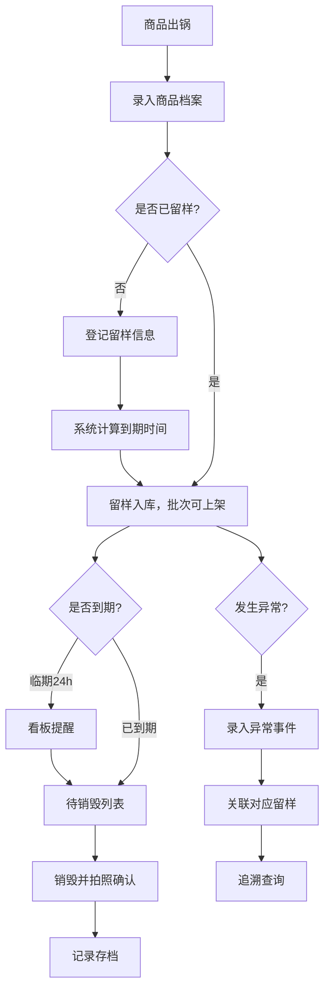

## 1. 产品概述

卤味留样管理系统专为熟食小店设计，解决每日卤制品（鸡爪、鸭脖、豆干等）留样混乱、追溯困难的问题。通过系统化管理商品档案、留样记录、异常事件和销毁流程，确保食品安全合规。

- 解决冰箱留样混杂难追溯、临期样品遗漏销毁、异常事件无法关联留样的痛点
- 目标用户为熟食店店长、后厨加工人员、质量管理人员

## 2. 核心功能

### 2.1 用户角色
| 角色 | 核心权限 |
|------|----------|
| 店长/管理员 | 全部功能：看板、商品档案、留样记录、异常处理、销毁确认、系统配置 |
| 加工人员 | 商品档案录入、留样登记、销毁确认拍照 |
| 质量人员 | 异常事件登记、留样追溯查询、销毁审核 |

### 2.2 功能模块
1. **看板Dashboard**：今日应留样、临期销毁提醒、投诉关联、冰箱占用率、各品类留样完成率
2. **商品档案管理**：品名、配方批次、加工人、出锅时间、售卖窗口、照片
3. **留样记录管理**：重量、容器编号、冷藏格、留样开始/到期时间、关联商品批次
4. **异常事件管理**：售卖投诉、异味、温度异常，关联当天留样记录
5. **销毁确认管理**：到期提醒、销毁拍照确认、销毁记录追溯

### 2.3 页面详情
| 页面名称 | 模块名称 | 功能描述 |
|---------|---------|---------|
| 看板 | 数据概览卡片 | 展示今日应留样数、临期待销毁数、未处理异常数、冰箱占用率 |
| 看板 | 品类完成率图表 | 饼图/柱状图显示各品类留样完成率 |
| 看板 | 临期销毁列表 | 展示24小时内到期的留样 |
| 看板 | 异常事件关联 | 展示近期异常事件及关联留样状态 |
| 商品档案 | 档案列表 | 分页展示所有商品批次档案，支持筛选搜索 |
| 商品档案 | 新增/编辑档案 | 录入品名、配方批次、加工人、出锅时间、售卖窗口、上传照片 |
| 商品档案 | 批次上架校验 | 未留样批次禁止上架，显示红色提示 |
| 留样记录 | 留样列表 | 按时间/商品/状态筛选留样记录 |
| 留样记录 | 新增留样 | 录入重量、容器编号、冷藏格、自动计算到期时间 |
| 留样记录 | 留样详情 | 展示留样完整信息、状态变更历史、关联异常 |
| 异常事件 | 事件列表 | 投诉/异味/温度异常事件列表 |
| 异常事件 | 新增事件 | 选择事件类型、描述、关联当天留样记录 |
| 销毁确认 | 待销毁列表 | 到期和临期留样列表，按时间排序 |
| 销毁确认 | 销毁确认 | 上传销毁照片、录入销毁人、销毁时间 |

## 3. 核心流程

### 3.1 日常留样流程
加工人员出锅后录入商品档案 → 系统提示需要留样 → 登记留样信息（重量/容器/冷藏格）→ 系统自动计算48小时到期时间 → 留样入库，批次可上架

### 3.2 销毁流程
到期前24小时系统在看板提醒 → 到期后进入待销毁列表 → 操作人员销毁样品并拍照 → 录入销毁确认信息 → 留样状态更新为已销毁

### 3.3 异常追溯流程
发生投诉/异味/温度异常 → 录入异常事件 → 选择关联当天对应品类留样 → 可查看留样详情和照片 → 支持追溯加工人、配方批次

## 4. 用户界面设计

### 4.1 设计风格
- **主色调**：暖橙色 #E85D04（代表食品安全警示和熟食行业属性）
- **辅助色**：深绿色 #2D6A4F（代表合格/安全状态）、深红色 #D00000（代表警示/销毁/异常）
- **中性色**：暖白色背景 #FFFBF5、深灰色文字 #1F2937、中灰色边框 #D1D5DB
- **按钮风格**：圆角8px，主色填充按钮带轻微阴影，悬停上浮效果
- **字体**：标题使用"Noto Serif SC"宋体风格增强信任感，正文使用"Noto Sans SC"无衬线确保可读性
- **布局风格**：卡片式布局，顶部导航+侧边栏，各模块使用阴影卡片区分
- **图标风格**：使用Lucide图标库，线性风格，保持简洁一致

### 4.2 页面设计概览
| 页面名称 | 模块名称 | UI元素 |
|---------|---------|---------|
| 看板 | 顶部统计卡片 | 4列网格，彩色图标+数字+趋势箭头，悬停微动效 |
| 看板 | 品类完成率 | 环形进度条，各品类独立卡片，颜色区分完成状态 |
| 看板 | 列表区域 | 双列布局：左侧临期销毁（红色基调），右侧异常事件（橙色基调） |
| 商品档案 | 列表 | 表格+卡片混合，照片缩略图，状态标签彩色区分 |
| 商品档案 | 表单 | 两列表单布局，照片上传区域支持拖拽 |
| 留样记录 | 列表 | 时间线样式展示，状态色条左侧标识 |
| 销毁确认 | 列表 | 红色警示边框，倒计时显示，拍照上传按钮突出 |

### 4.3 响应式
- 桌面端优先设计（最小支持1280px）
- 平板端（768px-1279px）：侧边栏折叠为图标，统计卡片改为2列
- 移动端（<768px）：顶部导航，卡片单列展示，表格改为卡片列表
