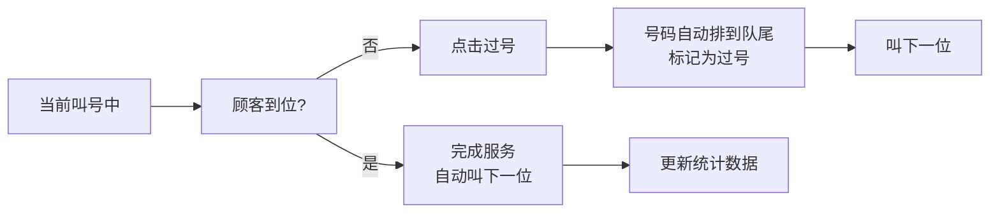

## 1. 产品概述

小店排队取号墙系统，为理发店、奶茶店、修手机等中小型服务店铺提供数字化排队管理解决方案，替代传统人工喊号方式，提升顾客体验和店铺运营效率。

- 解决问题：避免店员反复喊号、顾客错过叫号、排队秩序混乱
- 目标用户：店铺店员（管理端）、到店顾客（取号端）
- 市场价值：低成本数字化升级，适用于各类服务型小店

## 2. 核心功能

### 2.1 用户角色

| 角色 | 登录方式 | 核心权限 |
|------|----------|----------|
| 店员 | 密码/免登录 | 创建队列、叫号、过号、暂停接单、查看统计 |
| 顾客 | 无需登录 | 取号、查看排队状态、等待时间预估 |

### 2.2 功能模块

1. **首页（排队大屏）**：正在服务、等待中、已过号、快轮到号码展示
2. **店员控制面板**：创建队列、设置参数、叫号操作、暂停接单
3. **顾客取号页**：填写信息取号、查看个人排队详情
4. **统计页面**：今日接待、平均等待、时段分布

### 2.3 页面详情

| 页面名称 | 模块名称 | 功能描述 |
|-----------|-------------|---------------------|
| 排队大屏 | 当前叫号卡片 | 大号字体显示当前服务号码，动画提示叫号 |
| 排队大屏 | 等待列表 | 显示等待中号码、预计等待时间 |
| 排队大屏 | 过号列表 | 显示已过号号码，可重新叫号 |
| 排队大屏 | 快轮到提示 | 高亮显示即将叫到的前3位 |
| 店员面板 | 队列设置 | 业务类型、单人耗时、暂停接单开关 |
| 店员面板 | 叫号控制 | 叫号、过号、连续叫下一位 |
| 顾客取号 | 取号表单 | 昵称、手机后四位、人数、备注、是否愿意过号 |
| 顾客取号 | 取号成功 | 显示号码、前方人数、预计等待时间 |
| 统计页 | 今日概览 | 接待人数、平均等待、当前排队 |
| 统计页 | 时段分布 | 柱状图显示各时段人流量 |

## 3. 核心流程

### 3.1 顾客取号流程

### 3.2 店员叫号流程

## 4. 用户界面设计

### 4.1 设计风格
- **主色调**：活力橙（#FF6B35）- 传递热情、高效的品牌感
- **辅助色**：深空蓝（#1A365D）- 专业稳重，用于标题和重要信息
- **成功色**：翡翠绿（#10B981）- 叫号中、完成状态
- **警告色**：琥珀黄（#F59E0B）- 快轮到、过号提醒
- **背景**：渐变深色背景 + 微妙噪点纹理，营造科技感
- **字体**：Space Grotesk（标题）+ Noto Sans SC（正文）
- **按钮**：圆角 12px，hover 时有微缩放和发光效果
- **卡片**：玻璃拟态风格，毛玻璃背景 + 边框发光

### 4.2 页面设计概述

| 页面名称 | 模块名称 | UI 元素 |
|-----------|-------------|----------|
| 排队大屏 | 当前叫号 | 超大号数字（8rem）、脉冲动画、玻璃拟态卡片 |
| 排队大屏 | 等待列表 | 网格布局、号码卡片、倒计时显示 |
| 排队大屏 | 快轮到 | 黄色渐变边框、闪烁动画、"快轮到你了"文案 |
| 店员面板 | 控制面板 | 深色侧边栏、大号操作按钮、状态切换 |
| 顾客取号 | 表单 | 大输入框、友好图标、分步引导 |
| 统计页 | 数据卡片 | 数据可视化、渐变色块、动画数字 |

### 4.3 响应式
- 桌面优先设计，适配大屏展示（排队大屏模式）
- 移动端适配店员手机操作和顾客取号
- 触摸优化：按钮最小高度 48px，适合触屏操作

### 4.4 动画与交互
- 叫号时：数字放大动画 + 声音提示（可选）
- 新号码加入：从右侧滑入动画
- 过号：卡片轻微抖动后移动到过号区
- 等待时间：实时倒计时更新
- 快轮到：呼吸灯动画效果
