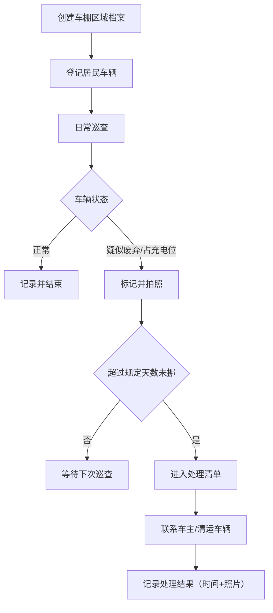

## 1. 产品概述

社区公共车棚管理系统，用于解决车棚长期被旧车/废弃车辆占用、新车无处停放的问题。管理员可以建立车棚区域档案、登记居民车辆、执行巡查标记异常车辆、处理长期未挪动的废弃车辆，并通过看板实时掌握各区域的使用情况。

- 核心目标：提升车棚资源利用率，清理废弃占位车辆，保障居民正常停车需求
- 目标用户：社区物业管理员、车棚巡查人员

## 2. 核心功能

### 2.1 用户角色

| 角色 | 说明 | 核心权限 |
|------|------|----------|
| 管理员 | 社区物业管理人员 | 全部功能：区域管理、车辆管理、巡查、处理、看板 |

### 2.2 功能模块

1. **数据看板**：各车棚区域概览，展示剩余位置、疑似废弃车辆数、充电位占用情况
2. **车棚区域管理**：区域建档、编辑、删除，包含区域名、容量、充电位、管理员、现场照片
3. **车辆登记管理**：居民车辆录入、编辑、删除，包含车牌/编号、车型、车主电话、停放区域、车辆照片
4. **巡查记录**：巡查时标记车辆状态（正常/疑似废弃/占充电位/已联系），支持照片记录
5. **处理清单**：自动筛选超期未挪车辆，记录处理结果（处理时间、处理照片）

### 2.3 页面详情

| 页面名称 | 模块名称 | 功能描述 |
|----------|----------|----------|
| 数据看板 | 区域概览卡片 | 按区域展示容量、已用、剩余位置、疑似废弃数量、充电位占用率 |
| 数据看板 | 快捷入口 | 快速跳转到巡查、处理清单等功能 |
| 区域管理 | 区域列表 | 表格展示所有车棚区域，支持搜索、筛选、分页 |
| 区域管理 | 新增/编辑区域 | 表单：区域名、总容量、充电位数、是否带充电、管理员、现场照片上传 |
| 车辆管理 | 车辆列表 | 表格展示所有登记车辆，按区域/状态筛选 |
| 车辆管理 | 新增/编辑车辆 | 表单：车牌/编号、车型、车主电话、停放区域、车辆照片 |
| 巡查记录 | 巡查列表 | 展示历史巡查记录，支持按区域、状态、时间筛选 |
| 巡查记录 | 新建巡查 | 选择车辆标记状态（正常/疑似废弃/占充电位/已联系），上传现场照片 |
| 处理清单 | 待处理列表 | 自动显示超过规定天数（默认 15 天）未挪动的车辆 |
| 处理清单 | 记录处理结果 | 填写处理时间、上传处理照片，标记为已处理 |

## 3. 核心流程

### 3.1 车棚建档与车辆登记流程

管理员在系统中创建车棚区域档案（录入名称、容量、充电位、管理员、照片）→ 居民申请停车 → 管理员登记车辆信息（车牌/编号、车型、电话、停放区域、照片）→ 车辆入库。

### 3.2 巡查与废弃车辆处理流程

巡查人员现场巡检 → 对可疑车辆标记状态（疑似废弃/占充电位）并拍照 → 系统记录巡查时间 → 超过规定天数未挪动的车辆自动进入处理清单 → 管理员联系车主或清运 → 记录处理结果（时间、照片）→ 流程结束。

## 4. 用户界面设计

### 4.1 设计风格

- 主色调：深蓝色（#1e3a5f）作为品牌主色，搭配青绿色（#10b981）表示正常状态，橙红色（#f59e0b）表示预警
- 辅助色：灰色系作为中性背景和边框
- 按钮风格：圆角 6px，主按钮实心填充，次要按钮描边
- 字体：中文使用 Noto Sans SC，英文使用 JetBrains Mono 等宽字体显示编号
- 布局：左侧导航栏 + 顶部面包屑 + 主内容区，卡片式布局
- 图标风格：Lucide 线性图标

### 4.2 页面设计概览

| 页面名称 | 模块名称 | UI 元素 |
|----------|----------|---------|
| 数据看板 | 区域概览卡片 | 卡片网格布局，每个卡片包含区域名、进度条（已用/总容量）、状态徽章（正常/预警）、关键指标数字 |
| 区域管理 | 列表 + 表单 | 顶部筛选栏 + 数据表格 + 右侧抽屉式表单 |
| 车辆管理 | 列表 + 表单 | 顶部筛选栏 + 数据表格（含缩略图）+ 抽屉式表单 |
| 巡查记录 | 时间线列表 | 时间线样式展示巡查历史，状态标签颜色区分 |
| 处理清单 | 任务列表 | 带优先级标记的任务卡片列表，处理按钮醒目 |

### 4.3 响应式

桌面端优先（1280px 以上），平板端（768px~1280px）导航栏可收起，移动端（768px 以下）底部 Tab 导航，表格横向滚动。
