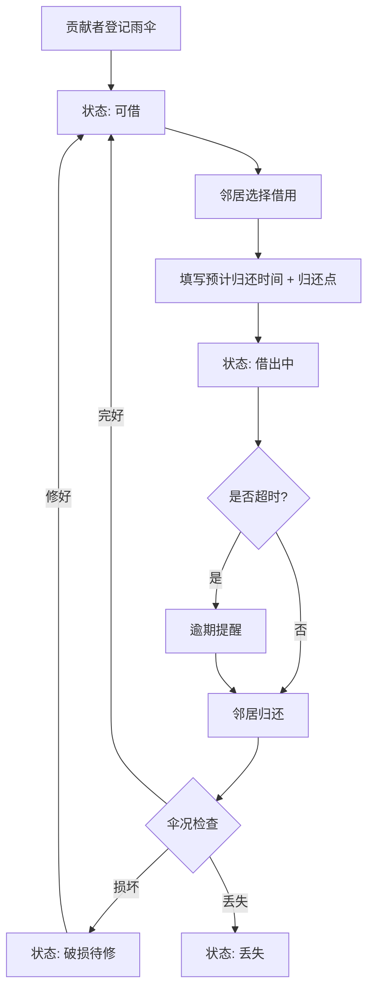

## 1. 产品概述

社区雨伞共享架——解决下雨天门口有伞却不知道能不能借的困扰。邻居可以登记共享雨伞，社区成员按需借用、按时归还，损坏有记录、丢失有追踪。
- 目标用户：社区/小区居民，尤其是步行通勤的邻居
- 核心价值：零门槛共享、信任社区、雨天无忧

## 2. 核心功能

### 2.1 用户角色

| 角色 | 注册方式 | 核心权限 |
|------|----------|----------|
| 社区居民 | 手机号/昵称注册 | 登记、借用、归还雨伞，查看统计 |
| 雨伞贡献者 | 同上 | 额外可查看自己贡献雨伞的完整生命周期 |

### 2.2 功能模块

1. **首页**：天气提醒横幅、雨伞状态分类（可借/借出中/破损待修/丢失）、快捷借伞入口
2. **登记页**：登记共享雨伞，填写编号、颜色、大小、放置点、押金规则、上传照片
3. **借伞页**：选择雨伞、填写预计归还时间和归还点
4. **还伞页**：扫码/选择归还伞、拍照确认伞况、记录损坏类型
5. **统计页**：放置点缺伞排行、丢失率、平均借用时长、贡献排行榜

### 2.3 页面详情

| 页面名称 | 模块名称 | 功能描述 |
|----------|----------|----------|
| 首页 | 天气横幅 | 调用天气API，今日下雨时显示提醒，并将可借伞排序靠前 |
| 首页 | 状态标签页 | 四个Tab切换：可借、借出中、破损待修、丢失，每类显示伞卡列表 |
| 首页 | 伞卡片 | 显示伞编号、颜色标记、大小、当前位置、押金；雨天可借伞有雨滴图标高亮 |
| 首页 | 逾期提醒 | 顶部红点/通知条，提示有雨伞超时未还 |
| 登记页 | 伞信息表单 | 伞编号（自动生成可选）、颜色（色块选择）、大小（S/M/L）、放置点（下拉）、押金规则（金额输入）、照片上传 |
| 借伞页 | 选择伞 | 从可借列表点「借用」，确认伞信息 |
| 借伞页 | 借用表单 | 预计归还时间（日期时间）、归还点（下拉） |
| 还伞页 | 归还确认 | 选择归还伞，确认归还点 |
| 还伞页 | 伞况检查 | 拍照上传、勾选损坏类型：伞骨断/伞面破/按钮失灵/其他，可备注 |
| 统计页 | 缺伞排行 | 按放置点显示可借伞数量，红色标记缺伞点 |
| 统计页 | 丢失率 | 总伞数 vs 丢失数，百分比展示 |
| 统计页 | 平均借时 | 计算所有已完成借用平均时长 |
| 统计页 | 贡献排行 | 展示贡献雨伞最多的邻居Top榜 |

## 3. 核心流程

用户登记雨伞 → 雨伞进入「可借」状态 → 邻居选择借用，填写归还时间和点 → 状态变为「借出中」 → 到期未还触发逾期提醒 → 邻居归还时拍照确认伞况 → 如完好回到「可借」/ 如损坏进入「破损待修」/ 如丢失标记「丢失」

## 4. 用户界面设计

### 4.1 设计风格

- 主色：深海蓝 `#1B3A5C`（信任、可靠），辅助色：暖琥珀 `#F5A623`（温暖、社区感）
- 状态色：可借绿 `#22C55E`、借出中蓝 `#3B82F6`、破损橙 `#F97316`、丢失红 `#EF4444`
- 按钮：圆角胶囊形，主按钮实色填充，次按钮描边
- 字体：Outfit（标题）+ DM Sans（正文）
- 布局：卡片式流式布局，顶部Tab导航
- 图标：lucide-react 图标库，搭配雨滴/伞形自定义SVG
- 背景：柔和渐变，深蓝到浅灰，搭配微妙雨纹纹理

### 4.2 页面设计概览

| 页面名称 | 模块名称 | UI元素 |
|----------|----------|--------|
| 首页 | 天气横幅 | 全宽渐变条，雨云图标+文字，动态雨滴CSS动画 |
| 首页 | 状态标签页 | 水平Tab栏，带颜色指示点，切换有滑动动画 |
| 首页 | 伞卡片 | 白色圆角卡片，左侧色块标识颜色，右上状态标签，底部操作按钮 |
| 登记页 | 表单 | 分组卡片式表单，色块选择器，照片上传区域带虚线框 |
| 借伞页 | 借用确认 | 居中模态/卡片，伞信息概览+时间选择器+地图式归还点 |
| 还伞页 | 伞况检查 | 照片上传区+损坏类型勾选卡片（每类型一个可点卡片） |
| 统计页 | 数据卡片 | 环形图+柱状图+排行榜列表，数据用动画数字递增 |

### 4.3 响应式

- 桌面优先设计，最大宽度1280px居中
- 平板：双栏变单栏，卡片等比缩小
- 手机：底部导航Tab，卡片全宽，表单纵向排列

### 4.4 3D场景

不适用
