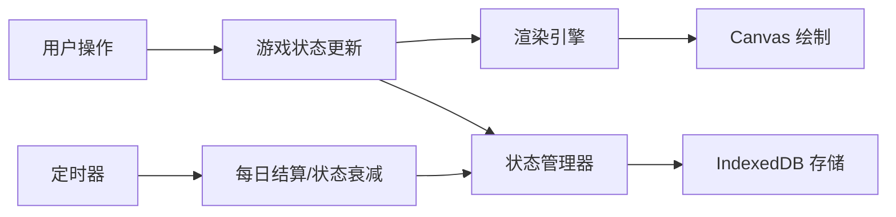

## 1. 产品概述

电子鱼缸是一款桌面摆件级别的休闲网页应用，用户可以在虚拟鱼缸中养鱼、装饰、互动，体验轻松治愈的养鱼乐趣。所有游戏状态自动持久化存储，关闭网页后鱼类仍会持续生长。

- **核心价值**：提供治愈系桌面互动体验，低门槛轻度养鱼模拟
- **目标用户**：喜欢桌面装饰、休闲养成类游戏的用户

## 2. 核心功能

### 2.1 功能模块

1. **鱼缸主视图**：16:9 鱼缸画布，水波动效果，底部装饰层
2. **鱼类系统**：6种鱼类购买、拖拽投放、AI自动游动、状态管理
3. **喂食系统**：投放食物、鱼类觅食、饥饿值恢复
4. **装饰系统**：10+种装饰物、拖拽摆放、位置保存
5. **经济系统**：每日结算、鱼类产蛋赚钱、商店消费
6. **存储系统**：IndexedDB 全状态持久化，离线生长计算

### 2.2 页面详情

| 页面名称 | 模块名称 | 功能描述 |
|---------|---------|---------|
| 主页面 | 鱼缸画布 | 16:9 蓝色背景，水波纹动画，底部沙子水草石头 |
| 主页面 | 鱼类渲染 | 6种不同颜色尺寸的鱼，AI寻路游动，状态变化动画 |
| 主页面 | 商店面板 | 鱼类商店（6种鱼）、装饰商店（10+装饰），拖拽购买 |
| 主页面 | 控制面板 | 喂食按钮、金币显示、扩缸按钮 |
| 主页面 | 状态面板 | 点击鱼类显示详细状态（饥饿值、心情值、健康值） |

## 3. 核心流程

### 3.1 用户操作流程

用户打开页面 → 加载存档（或新游戏）→ 查看鱼缸 → 从商店拖拽鱼/装饰到鱼缸 → 点击喂食 → 观察鱼类游动进食 → 每日自动结算 → 赚取金币 → 购买更多鱼/装饰/扩缸

### 3.2 核心数据流图

## 4. 用户界面设计

### 4.1 设计风格

- **主色调**：深海蓝 (#0a1628)、水蓝 (#1e3a5f)、浅蓝 (#3b82f6)、沙黄 (#f5deb3)
- **按钮风格**：圆润玻璃质感，半透明背景，hover 时有微光效果
- **字体**：使用 Google Fonts - "Outfit" 现代无衬线字体，清新自然
- **布局风格**：中间鱼缸主体，左右两侧可折叠商店面板，底部控制栏
- **图标风格**：Emoji + 简单 SVG 图标，卡通可爱风格

### 4.2 页面设计概述

| 页面名称 | 模块名称 | UI 元素 |
|---------|---------|---------|
| 主页面 | 鱼缸画布 | 渐变蓝色背景、水波纹 shader、底部沙地、水草摇曳动画 |
| 主页面 | 鱼类精灵 | 每种鱼独特配色、游动时身体摆动、鱼鳍动画、气泡效果 |
| 主页面 | 商店面板 | 卡片式布局，拖拽时半透明跟随，价格标签 |
| 主页面 | 控制面板 | 金币计数器、喂食按钮（面包屑图标）、扩缸按钮 |
| 主页面 | 状态弹窗 | 点击鱼类弹出状态条，饥饿/心情/健康三色进度条 |

### 4.3 响应式

- **桌面优先**：16:9 鱼缸居中显示，两侧面板可展开收起
- **移动端适配**：垂直布局，商店面板移至底部，鱼缸自适应屏幕宽度

## 5. 鱼类定义

### 5.1 鱼类属性

| 鱼类名称 | 价格 | 尺寸 | 颜色 | 游动速度 | 饥饿速率 | 产蛋价值 |
|---------|-----|------|------|---------|---------|---------|
| 金鱼 | 50 | 小 | 橙红 | 中 | 慢 | 5/天 |
| 孔雀鱼 | 80 | 小 | 多彩 | 快 | 中 | 8/天 |
| 斗鱼 | 150 | 中 | 蓝红 | 中 | 中 | 15/天 |
| 小丑鱼 | 200 | 中 | 橙白 | 快 | 中 | 20/天 |
| 蝴蝶鲤 | 500 | 大 | 白色 | 慢 | 慢 | 50/天 |
| 章鱼 | 800 | 大 | 紫色 | 中 | 快 | 80/天 |

## 6. 装饰物列表

1. 绿色水草 × 3 种（不同高度）
2. 珊瑚 × 2 种（不同颜色）
3. 石头 × 3 种（不同大小）
4. 沉船模型
5. 潜艇模型
6. 宝箱模型
7. 贝壳 × 2 种
8. 水管装饰
