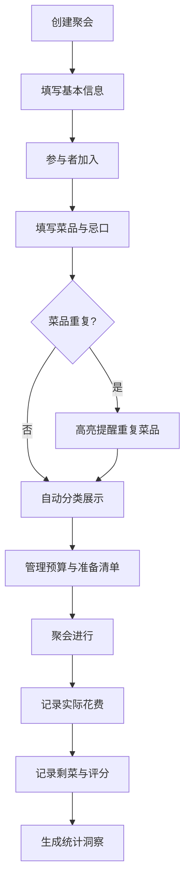

# 朋友聚会菜单协调器 - 产品需求文档

## 1. 产品概述
一个帮助朋友聚会时协调菜单、忌口、预算和准备事项的工具应用。解决聚会前沟通不畅导致的菜品重复、忌口遗漏、预算超支等问题，让每次聚会都有条不紊。
- 目标用户：经常组织家庭聚会、朋友聚餐的普通用户
- 核心价值：让聚会准备从混乱变为有序，从经验驱动变为数据驱动

## 2. 核心功能

### 2.1 用户角色
| 角色 | 说明 |
|------|------|
| 组织者 | 创建聚会、设定预算、指定主厨、管理准备清单 |
| 参与者 | 填写能带的菜、忌口信息、记录垫付金额 |

### 2.2 功能模块
1. **首页**：聚会列表、创建聚会入口、历史聚会回顾
2. **聚会详情页**：菜品看板、忌口汇总、预算面板、准备清单
3. **聚会总结页**：实际花费、剩菜记录、菜品评分、数据统计

### 2.3 页面详情
| 页面名称 | 模块名称 | 功能描述 |
|----------|----------|----------|
| 首页 | 聚会列表 | 展示即将到来的聚会和已完成聚会，支持创建新聚会 |
| 首页 | 快速统计 | 展示累计聚会次数、最受欢迎菜品Top3 |
| 聚会创建 | 基本信息表单 | 填写日期、人数、地点、预算、主厨 |
| 聚会详情 | 菜品看板 | 按主食/热菜/凉菜/甜品/饮料分类展示，重复菜品高亮提醒 |
| 聚会详情 | 添加菜品 | 参与者选择分类、填写菜名、标注自带或主厨做 |
| 聚会详情 | 忌口面板 | 汇总所有参与者忌口：辣度、素食、过敏原 |
| 聚会详情 | 预算面板 | 按人头显示预算、记录每人垫付金额、总计与差额 |
| 聚会详情 | 准备清单 | 按时间排序的任务：买菜、解冻、腌制、摆盘等 |
| 聚会总结 | 花费记录 | 记录实际花费、对比预算 |
| 聚会总结 | 剩菜记录 | 记录哪些菜剩余较多，下次注意 |
| 聚会总结 | 菜品评分 | 对每道菜评分，统计最受欢迎菜品 |
| 聚会总结 | 数据洞察 | 最受欢迎菜品、建议减少的菜品、平均花费趋势 |

## 3. 核心流程

### 聚会组织流程
1. 组织者创建聚会，填写日期、人数、地点、预算、主厨
2. 生成聚会链接/页面，参与者进入填写信息
3. 参与者添加自己能带的菜（选择分类+菜名）
4. 参与者填写忌口：辣度偏好、是否素食、过敏原
5. 系统自动分类菜品、检测重复、汇总忌口
6. 组织者查看预算面板，管理准备清单
7. 聚会进行中记录花费
8. 聚会结束后记录剩菜、评分、生成统计

## 4. 用户界面设计

### 4.1 设计风格
- **主色调**：温暖的橙红色系（#E85D3A）搭配奶油白底（#FFF8F0），营造温馨的聚餐氛围
- **辅助色**：深棕（#3D2C2E）用于文字、浅绿（#5B9A6F）用于成功状态、柔黄（#F5C542）用于提醒
- **按钮风格**：圆角大按钮，带轻微阴影，hover时有上浮效果
- **字体**：标题使用 Noto Serif SC 衬线字体，正文使用 Noto Sans SC
- **布局风格**：卡片式布局，左侧导航栏，主内容区域宽大舒适
- **图标风格**：使用 Lucide 图标，线条风格，略圆润
- **装饰元素**：微妙的餐具/食材线条插画作为装饰

### 4.2 页面设计概览
| 页面名称 | 模块名称 | UI元素 |
|----------|----------|--------|
| 首页 | 聚会列表 | 卡片列表，每张卡片含日期/地点/人数标签，状态色标 |
| 首页 | 快速统计 | 右侧小面板，数字大字号+图标 |
| 聚会详情 | 菜品看板 | 五列看板布局（主食/热菜/凉菜/甜品/饮料），重复菜品用黄色边框+数字角标 |
| 聚会详情 | 忌口面板 | 侧边栏，头像+标签组合（🌶️🌶️🌶️辣度、🥬素食、⚠️过敏） |
| 聚会详情 | 预算面板 | 进度条+饼图，垫付列表 |
| 聚会详情 | 准备清单 | 时间轴布局，可勾选完成 |
| 聚会总结 | 数据洞察 | 柱状图+列表，星标评分 |

### 4.3 响应式设计
- 桌面优先设计，平板和手机端自适应
- 看板在移动端转为纵向堆叠
- 表单在移动端全宽展示

### 4.4 数据持久化
- 使用 localStorage 存储所有聚会数据
- 支持导出/导入 JSON 备份
