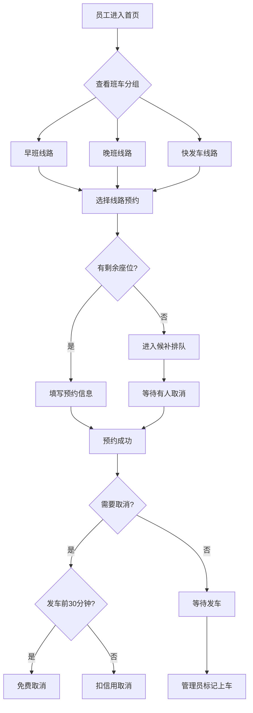

## 1. 产品概述

通勤班车占座协调系统——解决公司早晚班车座位紧张、怕白跑的痛点。员工在线预约座位、候补排队，管理员实时调度车辆和标记上车状态，让每一趟班车都不浪费、不缺席。

- 目标用户：有通勤班车需求的公司员工和行政管理人员
- 核心价值：座位透明化、预约零白跑、爽约有记录、调度有依据

## 2. 核心功能

### 2.1 用户角色

| 角色 | 进入方式 | 核心权限 |
|------|----------|----------|
| 员工 | 默认身份 | 浏览班车、预约座位、取消预约、查看个人记录 |
| 管理员 | 切换身份 | 添加/编辑线路、标记上车状态、临时加车、查看统计 |

### 2.2 功能模块

1. **首页**：今日早班、晚班、快发车分组展示，剩余座位与候补人数一目了然
2. **线路管理页**：添加/编辑班车线路（出发地、到达地、发车时间、座位数、司机电话、途经站点）
3. **预约详情页**：选上车站、是否带行李、同事同行、候补排队
4. **管理操作页**：标记已上车、迟到未上车、车辆晚点、临时加车
5. **统计页**：线路拥挤度、站点候补热力、月度爽约统计

### 2.3 页面详情

| 页面名称 | 模块名称 | 功能描述 |
|----------|----------|----------|
| 首页 | 早班分组 | 展示今日所有早班线路卡片，含剩余座位和候补人数 |
| 首页 | 晚班分组 | 展示今日所有晚班线路卡片，含剩余座位和候补人数 |
| 首页 | 快发车分组 | 30分钟内即将发车的线路，高亮提醒 |
| 首页 | 角色切换 | 顶部切换员工/管理员身份 |
| 线路管理页 | 线路表单 | 填写出发地、到达地、发车时间、座位数、司机电话、途经站点列表 |
| 线路管理页 | 线路列表 | 已有线路一览，支持编辑和删除 |
| 预约详情页 | 座位预约 | 选择上车站点、是否带行李、同事同行备注 |
| 预约详情页 | 候补排队 | 座位满时自动进入候补，显示排队位置 |
| 预约详情页 | 取消预约 | 按取消规则执行，显示信用扣减提示 |
| 管理操作页 | 乘客状态 | 批量标记已上车、迟到未上车 |
| 管理操作页 | 车辆状态 | 标记车辆晚点 |
| 管理操作页 | 临时加车 | 快速添加临时线路 |
| 统计页 | 线路拥挤度 | 各线路上座率排名 |
| 统计页 | 站点候补热力 | 哪些站点经常有人候补 |
| 统计页 | 月度爽约 | 本月爽约次数统计和排行 |

## 3. 核心流程

**员工预约流程**：员工打开首页 → 选择班线 → 查看剩余座位 → 选择上车站 → 填写行李/同行信息 → 确认预约（座位满则进入候补）→ 发车前可取消（按规则扣信用）

**管理员调度流程**：管理员切换身份 → 查看今日线路 → 标记乘客上车状态 → 处理车辆晚点 → 如需临时加车 → 添加临时线路

## 4. 用户界面设计

### 4.1 设计风格

- 主色调：深靛蓝 (#1e3a5f) 搭配活力橙 (#ff6b35) 作为强调色，传达通勤的专业感和效率感
- 辅助色：浅灰底 (#f5f7fa)、候补黄 (#fbbf24)、成功绿 (#10b981)、警告红 (#ef4444)
- 按钮风格：圆角按钮 (rounded-xl)，主操作用实心橙色，次操作用描边
- 字体：Noto Sans SC（中文）+ DM Sans（数字/英文），层级清晰
- 布局：卡片式布局，顶部导航栏，分组用横向标签切换
- 图标：lucide-react 图标库，简洁线性风格

### 4.2 页面设计概览

| 页面名称 | 模块名称 | UI 元素 |
|----------|----------|---------|
| 首页 | 顶部导航 | 品牌Logo、角色切换开关、日期选择器 |
| 首页 | 分组标签 | 早班/晚班/快发车 三栏切换，带数量角标 |
| 首页 | 线路卡片 | 出发→到达、时间、剩余座位进度条、候补人数角标 |
| 线路管理页 | 表单区域 | 多行表单，站点列表可动态增删 |
| 线路管理页 | 线路列表 | 左右滑动卡片，编辑/删除操作 |
| 预约详情页 | 站点选择 | 纵向站点时间轴，点击选站 |
| 预约详情页 | 附加选项 | 行李开关、同行人数输入 |
| 预约详情页 | 候补提示 | 黄色警告条，显示排队位置 |
| 管理操作页 | 乘客列表 | 勾选列表，批量操作按钮 |
| 管理操作页 | 状态标签 | 已上车(绿)、迟到(黄)、爽约(红) 彩色标签 |
| 统计页 | 拥挤度图表 | 横向条形图，上座率百分比 |
| 统计页 | 候补热力 | 站点列表 + 热力色块 |
| 统计页 | 爽约统计 | 数字大卡片 + 月度趋势 |

### 4.3 响应式设计

- 桌面优先设计，支持 1280px+ 宽屏
- 移动端适配：卡片单列、底部导航
- 触控优化：按钮最小 44px 点击区域

### 4.4 取消规则设计

- 发车前 30 分钟以上取消：不扣信用
- 发车前 30 分钟内取消：扣 1 次信用
- 未取消且未上车（爽约）：扣 3 次信用
- 信用扣分满 5 次：禁止预约 7 天
