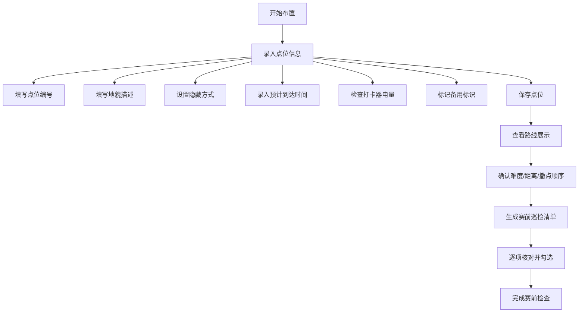

## 1. 产品概述

定向越野检查点布置管理系统，用于赛前策划、录入和核对检查点信息，展示路线难度与相邻点距离，赛前自动生成巡检清单，确保比赛顺利进行。

- 主要用户：定向越野赛事策划人员、技术裁判员
- 核心价值：实现检查点信息数字化管理，减少人工核对失误，提升赛事筹备效率

## 2. 核心功能

### 2.1 功能模块

1. **检查点录入页**：点位编号、地貌描述、隐藏方式、预计到达时间、打卡器电量、备用标识
2. **路线展示区**：路线难度分级、相邻点距离计算、撤点顺序可视化
3. **巡检清单生成**：赛前巡检项目清单、核对状态标记、导出与打印

### 2.2 页面详情

| 页面名称 | 模块名称 | 功能描述 |
|-----------|-------------|---------------------|
| 检查点布置页 | 点位录入表单 | 录入并编辑检查点基础信息，支持新增、删除、修改 |
| 检查点布置页 | 路线信息卡 | 展示当前路线难度、各相邻点距离、撤点先后顺序 |
| 检查点布置页 | 巡检清单面板 | 赛前一键生成巡检清单，支持勾选确认状态 |
| 检查点布置页 | 点位列表 | 以表格形式展示所有检查点完整信息 |

## 3. 核心流程

## 4. 界面设计

### 4.1 设计风格
- 主色调：森林绿(#0F5132)搭配地图棕(#8B6914)，契合户外越野主题
- 辅助色：警示橙(#E67E22)用于电量低提示，安全绿(#27AE60)用于正常状态
- 字体：标题使用粗衬线字体增强户外探险感，正文使用清晰易读的无衬线字体
- 布局：卡片式布局，左侧表单录入，右侧信息展示，底部巡检清单
- 图标风格：使用线性户外风格图标，如指南针、地图、打卡器等

### 4.2 页面设计概览

| 页面名称 | 模块名称 | UI元素 |
|-----------|-------------|-------------|
| 检查点布置页 | 页面头部 | 标题、赛事名称、日期选择器、操作按钮组 |
| 检查点布置页 | 录入表单 | 表单输入框、下拉选择、时间选择、电量滑块、复选框 |
| 检查点布置页 | 路线展示卡 | 难度进度条、距离数据卡片、撤点顺序时间轴 |
| 检查点布置页 | 点位列表 | 数据表格、行操作按钮、状态标签 |
| 检查点布置页 | 巡检清单 | 折叠面板、勾选框、进度条、生成按钮 |

### 4.3 响应式设计
- 桌面端：左右两栏布局，表单与信息展示并排
- 平板端：上下堆叠布局，保持完整功能
- 移动端：压缩布局，优先展示核心信息，支持手势操作

### 4.4 动画交互
- 表单字段聚焦时轻微放大效果
- 点位保存成功时绿色确认动画
- 巡检清单项目勾选时打钩动画
- 路线难度指示器平滑过渡效果
