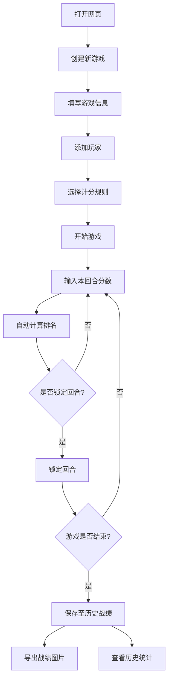

## 1. 产品概述
桌游计分裁判台 —— 朋友聚会时直接用网页记分的工具。解决传统纸笔记分的不便，提供实时排名、动画反馈和战绩归档功能。
- 目标用户：桌游爱好者、聚会玩家，需要在手机/平板上快速记分和查看排名
- 核心价值：让计分过程本身变成聚会的一部分，排名动画增加仪式感，历史战绩让每次聚会都有迹可循

## 2. 核心功能

### 2.1 用户角色
无角色区分，所有使用者均为同等级别。

### 2.2 功能模块
1. **创建游戏页**：填写游戏名、添加玩家（名字+颜色+头像）、选择队伍模式、设置回合数、选择计分规则
2. **裁判计分页**：核心页，裁判桌风格表格，每玩家一列每回合一行，实时算分/排名/差距
3. **历史战绩页**：所有已完成游戏的存档，统计谁赢最多、谁最常逆转

### 2.3 页面详情
| 页面名称 | 模块名称 | 功能描述 |
|----------|----------|----------|
| 创建游戏页 | 游戏信息表单 | 输入游戏名、回合数，选择计分规则（分高赢/分低赢/每回合奖励分/淘汰制） |
| 创建游戏页 | 玩家管理 | 添加/删除玩家，为每个玩家选颜色和头像，开启队伍模式并分配队伍 |
| 裁判计分页 | 计分表格 | 每玩家一列，每回合一行，输入分数后自动计算总分、排名、领先差距 |
| 裁判计分页 | 排名面板 | 左侧或顶部实时排名，排名变化时有动画效果（上升/下降箭头+滑动） |
| 裁判计分页 | 操作栏 | 撤销、重做、锁定本回合、结束游戏、导出战绩图片 |
| 历史战绩页 | 战绩列表 | 按时间倒序展示所有已完成游戏，卡片式布局 |
| 历史战绩页 | 统计面板 | 最近N局谁赢得最多、谁最常逆转（从落后到夺冠） |

## 3. 核心流程

用户打开网页 → 创建新游戏（填写名称、玩家、规则） → 进入裁判计分页 → 逐回合输入分数 → 系统实时计算排名并展示动画 → 锁定/解锁回合 → 游戏结束 → 保存至历史 → 可导出战绩图片

## 4. 用户界面设计

### 4.1 设计风格
- **主色调**：深色木质裁判桌风格，暖棕色为主(#3B2415)，金色点缀(#D4A537)
- **辅助色**：墨绿(#1A3C34)用于胜利高亮，暗红(#8B2500)用于淘汰/警告
- **按钮风格**：圆角微3D效果，主按钮金色边框，次按钮木质纹理
- **字体**：标题使用衬线体(Serif)增加庄重感，正文使用无衬线体确保可读性
- **布局**：顶部导航栏 + 中间主内容区 + 底部操作栏
- **图标风格**：lucide-react 图标，线条风格

### 4.2 页面设计概览
| 页面名称 | 模块名称 | UI元素 |
|----------|----------|--------|
| 创建游戏页 | 游戏信息表单 | 木质卡片容器，金色标题，表单输入框带木质边框 |
| 创建游戏页 | 玩家管理 | 玩家卡片列表，每张带颜色选择器和头像选择，队伍标签 |
| 裁判计分页 | 计分表格 | 深色木质表格，金色表头，玩家列带各自颜色标识 |
| 裁判计分页 | 排名面板 | 侧边排名栏，奖牌图标（金银铜），排名变化箭头动画 |
| 裁判计分页 | 操作栏 | 底部固定工具栏，图标按钮，撤销/重做/锁定/导出 |
| 历史战绩页 | 战绩列表 | 时间线布局，游戏卡片带缩略排名，木质边框 |
| 历史战绩页 | 统计面板 | 顶部统计卡片，王冠图标标最多胜者，火焰图标标逆转王 |

### 4.3 响应式设计
- 桌面优先设计，确保在平板和手机上也可正常使用
- 表格在小屏上可横向滚动
- 触摸优化：输入框足够大，按钮间距足够

### 4.4 动画效果
- 排名变化：玩家行上下滑动到新位置，带缓动曲线
- 分数输入：数字跳动效果
- 回合锁定：锁头动画 + 表格行变暗
- 页面切换：淡入淡出过渡
