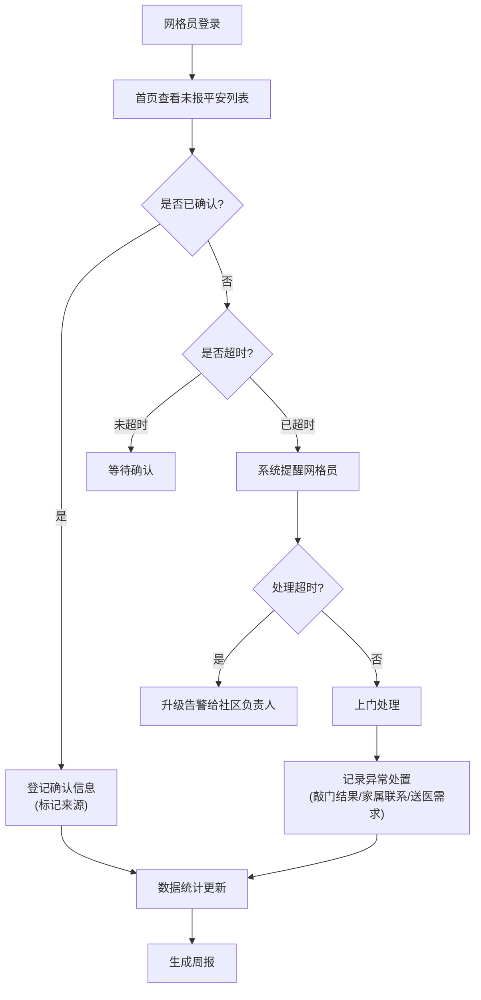

## 1. 产品概述
本系统为社区网格员提供老年人日常平安确认管理平台，解决独居老人每日健康状态追踪、异常情况及时处置的痛点。
- **目标用户**：社区网格员、社区负责人
- **核心价值**：提升老人安全保障效率，确保异常情况快速响应，实现管理数字化、流程化

## 2. 核心功能

### 2.1 用户角色
| 角色 | 登录方式 | 核心权限 |
|------|----------|----------|
| 网格员 | 账号登录 | 查看未报平安列表、登记确认信息、处理异常、查看周报 |
| 社区负责人 | 账号登录 | 接收升级告警、查看所有网格数据、查看周报 |

### 2.2 功能模块
1. **首页仪表盘**：今日未报平安老人列表、实时统计、快捷操作入口
2. **老人信息管理**：老人档案维护（楼栋、紧急联系人、慢病备注、确认方式、上门周期）
3. **每日确认登记**：多来源确认登记（老人电话/家属代报/智能设备/上门查看）
4. **异常处理中心**：超时未确认告警、升级机制、异常处置记录
5. **周报统计**：未报人数、连续异常、处理耗时、重点关注名单

### 2.3 页面详情
| 页面名称 | 模块名称 | 功能描述 |
|---------|----------|----------|
| 首页仪表盘 | 未报平安列表 | 按优先级展示今日尚未确认平安的老人，支持快速登记 |
| 首页仪表盘 | 实时统计卡片 | 今日应确认人数、已确认人数、未确认人数、异常处理中人数 |
| 首页仪表盘 | 升级告警区 | 展示需要社区负责人关注的升级异常 |
| 老人信息管理 | 老人列表 | 分页展示所有老人，支持按网格、楼栋筛选 |
| 老人信息管理 | 老人详情/编辑 | 维护楼栋、紧急联系人、慢病备注、常用确认方式、上门周期 |
| 确认登记 | 确认表单 | 选择确认来源、登记时间、备注信息，不同来源显示不同标记 |
| 异常处理 | 异常列表 | 展示超时未确认、处理中的异常记录 |
| 异常处理 | 异常处置 | 记录敲门结果、是否联系家属、是否需要送医、处置详情 |
| 周报统计 | 数据概览 | 按网格展示未报人数、连续异常天数、平均处理耗时 |
| 周报统计 | 重点关注名单 | 连续3天以上未确认或有特殊慢病的老人名单 |

## 3. 核心流程
网格员每日登录系统，首页优先展示未报平安老人列表 → 网格员通过各种渠道确认老人平安 → 系统登记确认来源 → 若超过约定时间未确认，系统自动提醒网格员 → 超时仍未处理则自动升级告警给社区负责人 → 网格员上门处理并记录异常处置结果 → 周报自动汇总统计数据

## 4. 用户界面设计

### 4.1 设计风格
- **主色调**：沉稳的暖蓝色（#1E40AF），体现专业与关怀
- **辅助色**：警示红（#DC2626）用于异常告警，成功绿（#16A34A）用于已确认，预警橙（#F59E0B）用于待处理
- **字体**：Noto Sans SC 作为主字体，JetBrains Mono 用于数据展示
- **按钮风格**：圆角 8px，带有细微阴影，hover 状态有轻微上浮效果
- **布局风格**：卡片式布局，顶部导航 + 侧边栏 + 内容区，信息层级清晰
- **图标风格**：使用 lucide-react 线性图标，统一 20px 尺寸

### 4.2 页面设计概述
| 页面名称 | 模块名称 | UI 元素 |
|---------|----------|----------|
| 首页仪表盘 | 未报平安列表 | 卡片列表展示，每张卡片包含老人头像、姓名、楼栋、超时时间、紧急程度徽章，右侧有快速确认按钮 |
| 首页仪表盘 | 统计卡片 | 4 个大卡片横向排列，显示数字+趋势箭头，不同状态用不同颜色标识 |
| 老人信息管理 | 老人列表 | 表格布局，支持筛选、搜索，每行有操作按钮 |
| 确认登记 | 确认表单 | 模态框表单，来源选择使用标签式按钮，不同来源有不同图标和颜色标记 |
| 异常处理 | 异常处置 | 表单包含多个状态选择器，备注输入框，处置结果用时间轴展示 |
| 周报统计 | 数据概览 | 图表 + 数据卡片组合，网格维度筛选器 |

### 4.3 响应式
- 桌面端优先设计（1280px 以上）
- 平板端（768px-1279px）：侧边栏收起为图标菜单
- 移动端（767px 以下）：底部导航，卡片列表单列展示

### 4.4 动效设计
- 页面加载：卡片依次淡入（staggered 0.1s 延迟）
- 状态变化：数字滚动动画、状态徽章脉冲效果
- 告警提醒：异常卡片有轻微呼吸灯效果
- 交互反馈：按钮点击缩放 0.98，hover 上浮 2px
