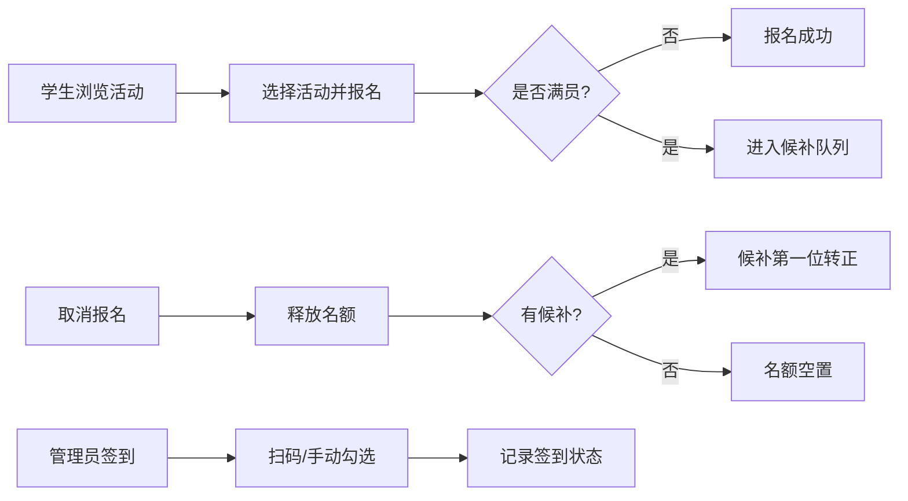

## 1. 产品概述

校园社团活动报名系统，解决社团活动报名效率低下、依赖表格来回传的问题，提供活动发布、在线报名、候补机制、签到管理和数据统计一体化解决方案。

- 目标用户：社团管理员（发布活动、管理签到）和在校学生（浏览活动、在线报名）
- 核心价值：替代传统表格报名方式，实现活动全流程数字化管理

## 2. 核心功能

### 2.1 用户角色

| 角色 | 登录方式 | 核心权限 |
|------|----------|----------|
| 社团管理员 | 账号登录 | 发布活动、管理报名、签到管理、查看统计 |
| 学生用户 | 无需登录/访客模式 | 浏览活动、在线报名、取消报名 |

### 2.2 功能模块

1. **首页**：活动分类展示（本周活动、快满员、免费活动、需要审核），活动搜索
2. **活动详情页**：活动信息展示、在线报名、我的报名状态
3. **发布活动页**：管理员发布新活动
4. **活动管理页**：管理员查看报名列表、管理签到
5. **签到页**：扫码签到 / 手动勾选签到
6. **统计页**：到场率统计、活动类型热度、候补转正统计

### 2.3 页面详情

| 页面名称 | 模块名称 | 功能描述 |
|---------|----------|----------|
| 首页 | 活动分类区 | 按本周活动、快满员、免费活动、需要审核四组展示活动卡片 |
| 首页 | 活动卡片 | 展示封面图、标题、时间、地点、报名人数、费用、类型标签 |
| 活动详情页 | 活动信息 | 封面图、主题、时间地点、人数上限、费用、需带物品、活动描述 |
| 活动详情页 | 报名表单 | 姓名、学院、手机号、是否第一次参加、备注 |
| 活动详情页 | 报名状态 | 已报名 / 候补 / 已取消状态展示，取消报名按钮 |
| 发布活动页 | 活动表单 | 主题、地点、时间、人数上限、费用、需带物品、封面图上传、活动类型 |
| 活动管理页 | 报名列表 | 报名人员信息、报名状态、签到状态 |
| 签到页 | 签到管理 | 扫码签到、手动勾选签到、缺席记录 |
| 统计页 | 数据看板 | 活动到场率、类型热度排行、候补转正人数 |

## 3. 核心流程

### 报名流程
学生浏览活动 → 选择活动 → 填写报名信息 → 提交报名 → 判断是否满员
- 未满员：报名成功
- 已满员：自动进入候补队列

### 取消报名流程
学生查看已报名活动 → 点击取消报名 → 取消成功 → 检查候补队列 → 候补第一位自动转正

### 签到流程
管理员进入签到页 → 扫码 / 手动勾选 → 记录签到状态 → 缺席标记

## 4. 用户界面设计

### 4.1 设计风格
- **主色调**：活力橙色 #FF6B35（青春、活力）
- **辅助色**：深青色 #1B998B（稳重、信任）
- **背景色**：暖米色 #FFF8F0（温馨、校园氛围）
- **按钮风格**：圆角矩形，悬停微放大+阴影加深
- **字体**：标题使用圆润现代字体，正文使用易读无衬线字体
- **布局风格**：卡片式布局，柔和阴影，圆角设计
- **图标风格**：线性图标，与主色调一致

### 4.2 页面设计概述

| 页面名称 | 模块名称 | UI 元素 |
|---------|----------|---------|
| 首页 | 分类标签区 | 横向滚动分类标签，选中态高亮，切换动画 |
| 首页 | 活动卡片网格 | 响应式网格布局，卡片悬停上浮效果 |
| 活动详情页 | 封面图区 | 大尺寸封面图，渐变遮罩，活动标题叠加 |
| 活动详情页 | 信息模块 | 图标+文字的信息条，清晰层次 |
| 活动详情页 | 报名表单 | 卡片式表单，输入框聚焦动画 |
| 发布活动页 | 表单分区 | 分组表单，步骤指示 |
| 签到页 | 签到列表 | 列表式人员名单，复选框+状态标签 |
| 统计页 | 数据卡片 | 大数字展示，图表可视化 |

### 4.3 响应式
- 桌面端优先，适配移动端
- 移动端单列布局，底部导航
- 触摸交互优化，按钮最小 44px

### 4.4 动效设计
- 页面切换：淡入 + 轻微上移
- 卡片悬停：上浮 4px + 阴影加深
- 按钮点击：缩放反馈
- 列表加载：渐次出现动画
- 状态变更：颜色过渡动画
