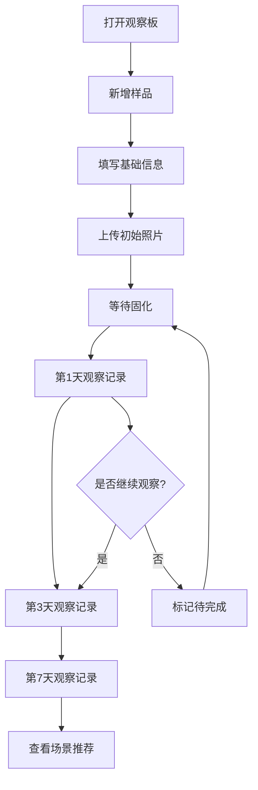

## 1. 产品概述

密封胶固化观察板是一款面向装修业主和施工人员的密封胶选型辅助工具。用户可以将不同品牌/型号的密封胶样品信息录入系统，在固化周期内（第1天、第3天、第7天）逐步上传照片并标记质量指标（收缩、气泡、发黄、霉点、附着力），最终根据观察数据获得厨房、卫生间、窗边等不同场景的推荐方案。

- 解决的核心问题：密封胶样品刚打出时外观相似，需数天固化后才能辨别质量差异，缺乏系统化的对比观察工具
- 目标用户：装修业主、施工人员、建材采购人员

## 2. 核心功能

### 2.1 用户角色

| 角色 | 说明 |
|------|------|
| 观察者 | 单用户模式，录入样品、上传照片、标记指标、查看推荐 |

### 2.2 功能模块

1. **观察板主页**：展示所有胶样卡片，按录入时间排列，快速预览各样品当前状态
2. **样品录入页**：录入品牌、颜色、基材、打胶厚度、环境温湿度等基础信息
3. **观察记录页**：按时间节点（第1天/第3天/第7天）上传照片，标记收缩、气泡、发黄、霉点、附着力指标
4. **场景推荐页**：根据全部观察数据，按厨房、卫生间、窗边等场景给出推荐排名

### 2.3 页面详情

| 页面名称 | 模块名称 | 功能描述 |
|----------|----------|----------|
| 观察板主页 | 胶样卡片列表 | 展示所有胶样缩略卡片，显示品牌、颜色、当前天数、关键指标标记 |
| 观察板主页 | 新增样品按钮 | 快速进入样品录入流程 |
| 观察板主页 | 筛选与排序 | 按品牌/基材/场景筛选，按录入时间/评分排序 |
| 样品录入页 | 基础信息表单 | 品牌名、型号、颜色选择、基材类型、打胶厚度、环境温度、环境湿度 |
| 样品录入页 | 初始照片上传 | 打胶当天（第0天）的初始状态照片 |
| 观察记录页 | 时间线导航 | 第1天/第3天/第7天三个节点横向时间线，标识已完成/待完成 |
| 观察记录页 | 照片上传区 | 每个节点可上传1-3张观察照片 |
| 观察记录页 | 指标标记面板 | 收缩（无/轻微/明显）、气泡（无/少量/大量）、发黄（无/轻微/严重）、霉点（无/少量/大量）、附着力（优/良/差）五项指标 |
| 观察记录页 | 文字备注 | 每个节点可添加文字观察备注 |
| 场景推荐页 | 场景分类卡片 | 厨房、卫生间、窗边、阳台、通用五大场景 |
| 场景推荐页 | 推荐排名列表 | 每个场景下按综合评分排列胶样，显示推荐理由 |
| 场景推荐页 | 评分雷达图 | 每个胶样的五项指标雷达图可视化对比 |

## 3. 核心流程

用户打开观察板 → 点击"新增样品" → 填写品牌、颜色、基材、厚度、温湿度 → 上传初始照片 → 等待固化 → 第1天点击样品卡片进入观察 → 上传照片+标记指标 → 第3天继续观察记录 → 第7天完成最终记录 → 查看场景推荐页获取选型建议

## 4. 用户界面设计

### 4.1 设计风格

- 主色调：深灰（#1a1a2e）+ 暖白（#fafafa），营造实验室/工业感
- 强调色：琥珀橙（#e8a838）作为CTA和关键指标标记色
- 次强调色：青灰（#6b8f9e）用于辅助信息和次要操作
- 按钮风格：圆角微阴影，主按钮琥珀橙填充，次按钮描边
- 字体：标题用 Noto Serif SC（衬线，稳重感），正文用 Noto Sans SC
- 布局：卡片式网格布局，顶部导航栏
- 图标：Lucide图标库，线性风格

### 4.2 页面设计概述

| 页面名称 | 模块名称 | UI元素 |
|----------|----------|--------|
| 观察板主页 | 胶样卡片列表 | 网格卡片，每卡片含缩略图+品牌+颜色标签+天数徽章+指标标签 |
| 观察板主页 | 新增样品按钮 | 右下角浮动按钮，琥珀橙圆形+加号图标 |
| 样品录入页 | 基础信息表单 | 分组表单，温湿度用滑块输入，其余用输入框/下拉框 |
| 观察记录页 | 时间线导航 | 横向三节点时间线，已完成节点实心圆+琥珀色，待完成空心圆 |
| 观察记录页 | 指标标记面板 | 五项指标横向排列，每项三档选择（绿/黄/红色彩标签） |
| 场景推荐页 | 场景分类卡片 | 五列场景卡片，每列顶部场景图标+名称，下方排名列表 |
| 场景推荐页 | 评分雷达图 | SVG雷达图，五角对应五项指标 |

### 4.3 响应式设计

- 桌面优先：4列卡片网格，横向时间线
- 平板：2列卡片网格，时间线保持横向
- 手机：1列卡片，时间线改为纵向

### 4.4 3D场景

不适用
