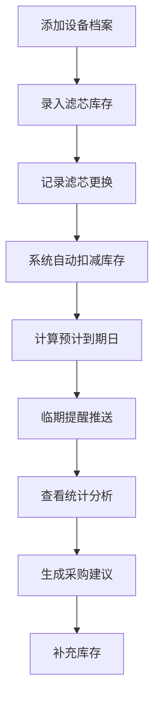

## 1. 产品概述

净水器滤芯更换管理系统，解决滤芯更换记录混乱、APP提醒与实际库存不符的问题。目标用户为家庭用户和小型商户，帮助用户可以管理多个净水器设备的滤芯更换、库存管理和临期提醒。

- 核心价值：确保滤芯按时更换，避免库存不足或浪费，提供清晰的费用统计。

## 2. 核心功能

### 2.1 用户角色

| 角色 | 注册方式 | 核心权限 |
|------|----------|----------|
| 普通用户 | 直接使用（本地存储） | 设备档案管理、更换记录管理、库存管理、查看统计 |

### 2.2 功能模块

1. **仪表盘**：临期提醒概览、快速操作、统计卡片
2. **设备档案**：设备列表、设备详情、新增/编辑设备
3. **更换记录**：记录列表、新增更换记录
4. **库存管理**：库存列表、库存调整
5. **统计分析**：剩余天数、年度花费、采购建议

### 2.3 页面详情

| 页面名称 | 模块名称 | 功能描述 |
|-----------|----------|----------|
| 仪表盘 | 临期提醒卡片 | 按滤芯类型分组展示即将到期的滤芯 |
| 仪表盘 | 快速统计 | 展示各滤芯剩余天数、今年花费、待采购型号 |
| 设备档案 | 设备列表 | 卡片式展示所有设备，包含设备照片 |
| 设备档案 | 设备表单 | 品牌、安装位置、滤芯型号、建议周期、购买渠道、设备照片 |
| 更换记录 | 记录列表 | 按时间倒序展示所有更换记录 |
| 更换记录 | 更换表单 | 滤芯批次、安装日期、预计到期日、安装人、自动扣减库存 |
| 库存管理 | 库存列表 | 展示各型号滤芯的当前库存 |
| 统计分析 | 剩余天数统计 | 各滤芯当前剩余使用天数可视化 |
| 统计分析 | 年度花费 | 今年各月份花费统计图表 |
| 统计分析 | 采购建议 | 基于库存和消耗预测下次需要采购的型号 |

## 3. 核心流程

用户添加设备档案 → 录入初始库存 → 执行更换记录（自动扣减库存）→ 系统自动计算到期日 → 临期提醒 → 查看统计和采购建议

## 4. 用户界面设计

### 4.1 设计风格

- 主色调：清新蓝绿色系（#0EA5E9 水蓝色，#10B981 翠绿色），代表清洁、健康
- 辅助色：#F59E0B 琥珀色（临期提醒），#EF4444 红色（紧急/库存为0）
- 按钮风格：圆角胶囊按钮，微渐变背景，悬停有轻微上浮效果
- 字体：标题使用 LXGW WenKai 或 Noto Serif SC，正文使用 Inter
- 布局：卡片式布局，顶部导航+侧边栏
- 图标：使用 Lucide 图标库，风格统一简洁

### 4.2 页面设计概述

| 页面名称 | 模块名称 | UI 元素 |
|----------|----------|----------|
| 仪表盘 | 临期提醒 | 分组卡片，不同紧急程度使用不同颜色边框 |
| 仪表盘 | 统计卡片 | 渐变背景卡片，大数字展示 |
| 设备档案 | 设备卡片 | 左图右文，悬停放大效果 |
| 更换记录 | 时间线 | 垂直时间线展示更换历史 |
| 统计分析 | 图表 | 柱状图+折线图组合 |

### 4.3 响应式

- 桌面端优先设计
- 移动端自适应，侧边栏收起为汉堡菜单
- 表格在移动端转为卡片列表
- 触摸优化：按钮最小高度 44px

