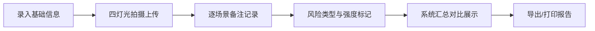

## 1. 产品概述

试妆灯色对比工具，帮助化妆师在拍摄前评估不同灯光环境下底妆的真实表现，避免因灯色差异导致的底妆偏色问题。
- 核心用户：专业化妆师、摄影工作室美妆团队
- 产品价值：标准化试妆流程，量化记录灯光对底妆的影响，降低拍摄返工率

## 2. 核心功能

### 2.1 用户角色
| 角色 | 注册方式 | 核心权限 |
|------|----------|----------|
| 化妆师 | 无需注册，本地使用 | 录入试妆数据、查看灯色对比、标记风险等级 |

### 2.2 功能模块
1. **基础信息录入区**：模特肤色、粉底色号、灯具色温、补光角度、相机白平衡
2. **四灯并排对比区**：自然光、暖光、冷光、混合光四种场景的照片与备注记录
3. **风险标记系统**：暗沉、泛红、反光、色差四类风险可视化标注

### 2.3 页面详情
| 页面名称 | 模块名称 | 功能描述 |
|----------|----------|----------|
| 试妆灯色对比页 | 基础信息录入 | 5组表单字段，支持肤色色卡选择、色温滑块、角度图示 |
| 试妆灯色对比页 | 四灯对比网格 | 2×2布局展示四种灯光场景，每格含照片上传、备注输入区 |
| 试妆灯色对比页 | 风险标记面板 | 四类风险可独立勾选，支持轻度/中度/重度三级强度，汇总显示整体风险评估 |
| 试妆灯色对比页 | 数据导出 | 一键生成对比报告，支持打印或保存为PDF |

## 3. 核心流程

化妆师录入模特与产品基础信息 → 依次在四种灯光下拍摄并上传照片 → 针对每种灯光记录底妆表现备注 → 标记观察到的风险类型与强度 → 系统汇总展示对比结果与风险提示 → 导出或打印报告存档。

## 4. 用户界面设计

### 4.1 设计风格
- 主色：暖米色 #F5EDE4 为基底，辅以玫瑰金 #C9A17B 和深咖 #4A3728，营造专业美妆沙龙氛围
- 按钮风格：微圆角、细腻阴影、悬停时有微妙光泽变化
- 字体：正文用 Source Serif Pro（优雅衬线），标题用 Cormorant Garamond（高品位时尚杂志感）
- 布局风格：左右分栏，左侧信息录入，右侧四宫格对比；卡片式容器，精细边框与柔和投影
- 图标风格：线性描边图标，配合美妆相关符号（粉底刷、灯泡、色卡等）

### 4.2 页面设计概述
| 页面名称 | 模块名称 | UI元素 |
|----------|----------|--------|
| 试妆灯色对比页 | 基础信息录入 | 分组建模卡片、肤色色卡网格、色温滑块带数值、角度选择圆盘 |
| 试妆灯色对比页 | 四灯对比网格 | 每张卡片顶部为灯光类型标签（带色温值和色点示意），中部照片区，底部备注文本域 |
| 试妆灯色对比页 | 风险标记面板 | 四色风险标签（暗沉灰、泛红橙、反光白、色差紫），三级强度切换按钮，风险汇总条形图 |
| 试妆灯色对比页 | 页脚操作区 | 重置按钮、保存草稿、导出报告主按钮 |

### 4.3 响应式
桌面端优先设计，宽度≥1280px时左右双栏布局；平板端（768-1279px）上下堆叠，四宫格保持2×2；移动端（<768px）四宫格改为单列纵向排列，触控区域放大至44px以上。
