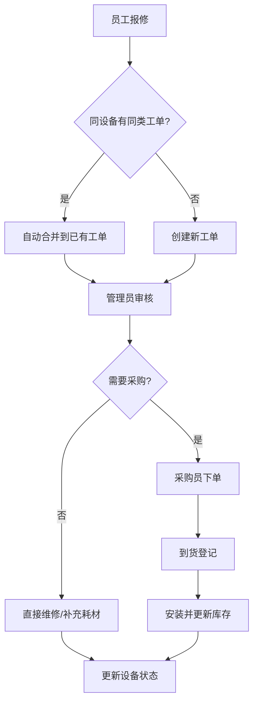

## 1. 产品概述

公司打印耗材看板系统，帮助行政和 IT 团队实时掌握打印机耗材状态、故障情况与采购进度，避免"纸没了才发现"的窘境。

- 面向中小型企业行政/IT 管理员与普通员工，解决打印机耗材管理混乱、故障响应慢、采购无追踪的问题
- 提升办公效率，降低因打印设备问题导致的工作中断，实现耗材管理从被动救火到主动预防的转变

## 2. 核心功能

### 2.1 用户角色

| 角色 | 注册方式 | 核心权限 |
|------|----------|----------|
| 管理员 | 系统分配 | 登记打印机、管理耗材库存、指派采购、合并工单 |
| 普通员工 | 自动分配 | 报修（缺纸/卡纸/缺墨/打印淡）、查看设备状态 |
| 采购员 | 系统分配 | 记录下单、到货、安装及费用、更新库存 |

### 2.2 功能模块

1. **首页看板**：按设备状态分组展示（正常 / 耗材快没 / 故障中 / 待采购），全局概览
2. **打印机管理**：登记打印机（位置、型号、耗材型号、负责人、供应商），编辑/停用
3. **故障报修**：选择故障类型、上传照片、选择影响程度，系统自动合并同设备重复工单
4. **耗材库存**：查看 A4 纸剩余箱数、硒鼓/墨盒剩余个数，低库存预警
5. **采购跟踪**：记录下单→到货→安装全流程，关联费用
6. **统计分析**：每月耗材花费趋势、最常报错设备排行、耗材消耗速率

### 2.3 页面详情

| 页面名称 | 模块名称 | 功能描述 |
|----------|----------|----------|
| 首页看板 | 状态分组卡片 | 按正常/耗材快没/故障中/待采购四组展示打印机卡片，点击可查看详情 |
| 首页看板 | 低库存预警栏 | 顶部横向滚动展示耗材库存不足的项目 |
| 首页看板 | 快捷报修入口 | 一键跳转报修表单 |
| 打印机管理 | 打印机列表 | 展示所有已登记打印机，支持搜索和筛选 |
| 打印机管理 | 登记/编辑表单 | 填写位置、型号、耗材型号、负责人、供应商 |
| 故障报修 | 报修表单 | 选择打印机、故障类型（缺纸/卡纸/缺墨/打印淡）、上传照片、影响程度 |
| 故障报修 | 工单列表 | 展示所有工单，已合并的工单标注合并数量，点击展开合并详情 |
| 耗材库存 | 库存总览 | 分类展示纸类/硒鼓/墨盒当前库存数量与预警线 |
| 耗材库存 | 入库/出库记录 | 记录每次库存变动 |
| 采购跟踪 | 采购订单列表 | 展示采购订单及状态（已下单→已到货→已安装） |
| 采购跟踪 | 新建采购单 | 关联耗材类型、数量、供应商、费用 |
| 统计分析 | 月度花费图表 | 柱状图展示每月打印耗材总花费 |
| 统计分析 | 设备报错排行 | 排名展示最常报错的打印机 |
| 统计分析 | 耗材消耗趋势 | 折线图展示各类耗材消耗速率 |

## 3. 核心流程

**报修流程**：员工发现打印问题 → 选择设备与故障类型 → 上传照片与影响程度 → 提交工单 → 系统检测同设备是否有同类未关闭工单 → 有则自动合并，无则新建 → 管理员/采购员收到通知 → 采购耗材或安排维修 → 更新设备状态与库存

**采购流程**：发现耗材不足（库存预警/工单触发）→ 采购员新建采购单 → 记录供应商与费用 → 耗材到货更新状态 → 安装后更新设备状态与库存

## 4. 用户界面设计

### 4.1 设计风格

- **主色调**：深灰底色 (#1a1a2e) + 琥珀色强调 (#f59e0b)，营造工业监控感
- **辅色**：状态色彩 — 正常(#22c55e 绿)、耗材快没(#eab308 黄)、故障(#ef4444 红)、待采购(#3b82f6 蓝)
- **按钮风格**：圆角微凸起，主按钮琥珀色，次要按钮深灰描边
- **字体**：标题用 DM Sans (粗体 700)，正文用 Noto Sans SC (400/500)
- **布局**：左侧导航栏 + 右侧内容区，卡片化布局
- **图标**：Lucide Icons 线性风格
- **整体风格**：工业仪表盘风，深色主题，数据高亮，信息密度适中

### 4.2 页面设计概览

| 页面名称 | 模块名称 | UI 元素 |
|----------|----------|---------|
| 首页看板 | 状态分组 | 四列卡片布局，每列一个状态，卡片含设备图标+名称+位置+关键指标，状态列可拖拽排序 |
| 首页看板 | 低库存预警 | 顶部横向标签条，琥珀色闪烁动画预警 |
| 首页看板 | 快捷操作 | 右下角浮动操作按钮组（报修/采购/入库） |
| 打印机管理 | 设备列表 | 表格+卡片视图切换，搜索栏+筛选器 |
| 打印机管理 | 登记表单 | 侧边抽屉弹出，分段表单 |
| 故障报修 | 报修表单 | 模态弹窗，图片上传区支持预览 |
| 故障报修 | 工单列表 | 时间线式展示，合并工单可折叠展开 |
| 耗材库存 | 库存总览 | 三栏卡片（纸类/硒鼓/墨盒），进度条显示余量 |
| 采购跟踪 | 订单列表 | 步骤条展示采购进度，费用统计卡片 |
| 统计分析 | 图表区 | 柱状图+排行榜+折线图三栏布局 |

### 4.3 响应式设计

- 桌面优先，最小宽度 1024px
- 平板端导航栏折叠为汉堡菜单，卡片从四列变两列
- 移动端单列布局，表格转为卡片列表

### 4.4 动效设计

- 页面切换：淡入淡出 + 轻微上移
- 状态变化：卡片边框颜色渐变过渡
- 合并工单提示：短暂琥珀色脉冲动画
- 低库存预警：数字闪烁 + 进度条渐变
