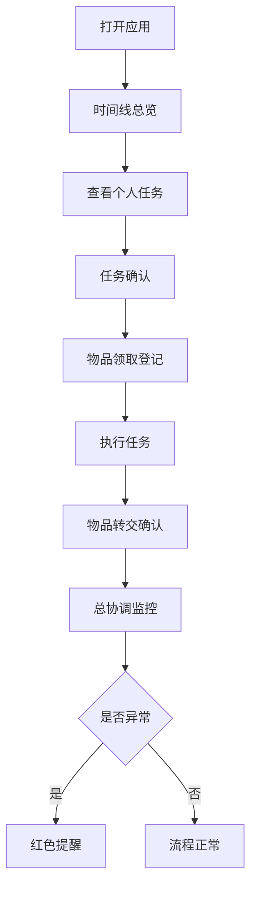

## 1. 产品概述
婚礼当天伴郎伴娘任务协调系统，解决婚礼当天人员调度混乱、任务靠群公告通知效率低、物品交接无记录等痛点。

- 主要用途：帮助总协调人管理婚礼当天所有环节的人员、任务、物品，确保流程顺畅
- 目标用户：婚礼总协调人、伴郎、伴娘、其他工作人员
- 核心价值：可视化时间线、明确责任分工、物品交接可追溯、异常情况实时提醒

## 2. 核心功能

### 2.1 用户角色
| 角色 | 登录方式 | 核心权限 |
|------|----------|----------|
| 总协调人 | 直接访问 | 所有功能权限，查看红色提醒，管理所有数据 |
| 工作人员 | 直接访问 | 查看自己的任务、确认任务、查看物品交接 |

### 2.2 功能模块
1. **时间线总览页**：按时间顺序展示接亲、外景、仪式、午宴、晚宴五大节点
2. **成员管理页**：管理所有伴郎伴娘及工作人员资料
3. **物品交接页**：戒指、红包、誓词卡、签到物料等关键物品交接记录
4. **协调监控页**：总协调人专用，查看迟到人员、未确认任务的红色提醒
5. **人员负载页**：按人查看任务负载和时间冲突

### 2.3 页面详情
| 页面名称 | 模块名称 | 功能描述 |
|----------|----------|----------|
| 时间线总览页 | 节点卡片 | 展示地点、负责人、备用人、提醒时间、需带物品，支持任务确认 |
| 时间线总览页 | 时间轴导航 | 左侧垂直时间轴，点击快速跳转至对应环节 |
| 成员管理页 | 成员列表 | 展示角色、电话、到场时间、是否会开车、能否保管贵重物 |
| 成员管理页 | 成员详情 | 查看该成员的所有任务分配 |
| 物品交接页 | 物品列表 | 展示关键物品当前状态和交接历史 |
| 物品交接页 | 交接确认 | 记录谁拿走、什么时候交给谁，双方确认 |
| 协调监控页 | 红色提醒区 | 高亮显示迟到人员和未确认任务 |
| 协调监控页 | 实时状态 | 展示各环节当前进度 |
| 人员负载页 | 负载统计 | 按人统计任务数量，展示时间冲突 |
| 人员负载页 | 冲突检测 | 自动检测同一人在重叠时间的任务分配 |

## 3. 核心流程

用户打开应用 → 查看时间线总览 → 找到自己负责的环节 → 确认任务 → 领取物品并登记 → 执行任务 → 转交物品给下一环节负责人 → 总协调人实时监控进度

## 4. 界面设计

### 4.1 设计风格
- 主色调：玫瑰金(#B76E79) + 香槟金(#D4AF37) + 米白(#FDF5F0)
- 辅助色：深红(#8B0000)用于异常提醒，墨绿(#2F4F4F)用于已确认状态
- 字体：Cormorant Garamond(标题) + Noto Serif SC(正文)，营造优雅婚礼氛围
- 按钮风格：圆角矩形，玫瑰金描边，悬停时有微妙的金色光晕效果
- 布局风格：卡片式布局，柔和阴影，香槟金渐变装饰边
- 图标风格：线性图标，玫瑰金色，搭配花环、戒指等婚礼元素

### 4.2 页面设计概述
| 页面名称 | 模块名称 | UI元素 |
|----------|----------|--------|
| 时间线总览页 | 时间轴 | 左侧玫瑰金渐变垂直线，节点用花环图标标记，已完成用对勾 |
| 时间线总览页 | 任务卡片 | 米白底，香槟金边框，负责人头像，备用人灰色显示 |
| 成员管理页 | 成员卡片 | 头像+角色标签，电话一键拨打，能力标签(开车/保管) |
| 物品交接页 | 物品卡 | 戒指/红包/誓词卡图标，交接记录时间线，状态徽章 |
| 协调监控页 | 提醒卡片 | 深红边框，脉冲动画，倒计时显示 |
| 人员负载页 | 负载图表 | 彩色进度条，冲突任务用红色连线标记 |

### 4.3 响应式设计
- Desktop-first，主内容区最大宽度1200px
- 平板端：侧边栏收起为图标菜单
- 移动端：底部Tab导航，卡片纵向堆叠
- 触摸优化：按钮最小高度48px，点击反馈清晰

### 4.4 交互动效
- 页面加载：卡片依次淡入(0.3s延迟间隔)
- 任务确认：勾选时金色粒子扩散效果
- 红色提醒：呼吸灯闪烁动画(1.5s周期)
- 时间冲突检测：冲突项红色边框抖动
- 物品交接：流转箭头滑动动画
