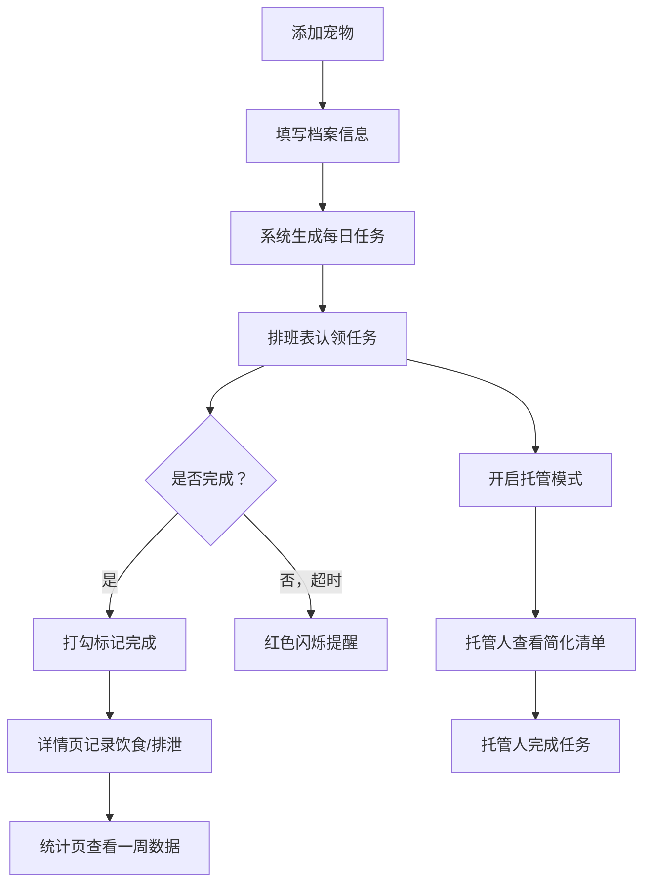

## 1. 产品概述

宠物喂养轮班表是一款面向多成员家庭/合住场景的宠物日常管理工具，解决"谁喂了、谁遛了、谁忘了"的核心痛点。通过可视化的排班表、任务认领与完成追踪、超时提醒和托管模式，确保每只宠物每天都被按时照料。

- 目标用户：养猫/养狗的多成员家庭、临时托管宠物的朋友
- 核心价值：消除喂养遗漏、责任清晰可追踪、临时托管无缝衔接

## 2. 核心功能

### 2.1 用户角色

| 角色 | 进入方式 | 核心权限 |
|------|----------|----------|
| 家庭成员 | 添加成员名称加入 | 查看全部功能、认领任务、记录详情、查看统计 |
| 临时托管人 | 扫码/链接进入托管模式 | 查看简化版任务清单、完成任务打勾 |

### 2.2 功能模块

1. **宠物管理页**：宠物列表、添加/编辑宠物档案
2. **日程排班页**：排班表视图、任务认领、完成打勾、超时提醒
3. **宠物详情页**：每日饮食饮水记录、便便状态、异常备注
4. **统计页**：一周漏喂统计、异常天数、药物按时率
5. **临时托管模式**：切换托管、简化视图、分享清单

### 2.3 页面详情

| 页面名称 | 模块名称 | 功能描述 |
|----------|----------|----------|
| 宠物管理页 | 宠物卡片列表 | 展示所有宠物卡片（头像、名字、种类），支持新增/编辑/删除 |
| 宠物管理页 | 宠物档案表单 | 填写名字、照片、种类（猫/狗）、每天喂几次、每次吃多少克、禁忌食物、药物、特殊习惯 |
| 日程排班页 | 排班表格 | 以时间为行、家庭成员为列的排班表，显示早饭/晚饭/清理猫砂/遛狗/吃药等任务 |
| 日程排班页 | 任务认领 | 家庭成员点击认领任务，认领后显示头像标识 |
| 日程排班页 | 完成打勾 | 认领人完成后打勾标记，记录完成时间 |
| 日程排班页 | 超时提醒 | 超过设定时间未完成，任务卡片变红闪烁提醒 |
| 宠物详情页 | 饮食记录 | 记录今日各餐实际吃了多少、饮水毫升数 |
| 宠物详情页 | 排泄记录 | 记录便便状态（正常/软便/拉稀/便秘）及次数 |
| 宠物详情页 | 异常备注 | 自由文本记录异常行为、精神状态等 |
| 统计页 | 喂养统计 | 最近7天是否漏喂、每日完成率折线图 |
| 统计页 | 异常统计 | 最近7天异常记录天数、异常类型分布 |
| 统计页 | 药物统计 | 药物按时服用率、漏服次数 |
| 临时托管模式 | 托管切换 | 主人开启托管模式，设定托管天数，选择分配给哪位托管人 |
| 临时托管模式 | 简化清单 | 托管人只看到任务清单（不含统计和详情历史），界面简洁明了 |

## 3. 核心流程

1. 家庭成员添加宠物 → 填写宠物档案 → 系统自动生成每日任务模板
2. 家庭成员在排班表上认领任务 → 按时完成打勾 → 超时自动提醒
3. 每次喂养/遛狗/清理后，进入详情页记录实际食量、饮水量、便便状态
4. 主人出差 → 开启托管模式 → 托管人收到简化清单 → 托管人按清单完成
5. 任何人可查看统计页，了解一周内是否有遗漏或异常

## 4. 用户界面设计

### 4.1 设计风格

- **主题**：温暖治愈风 — 以暖橙和柔绿为主色调，传达宠物照料的温馨感
- **主色**：暖橙 #F97316，辅色：柔绿 #22C55E，中性色：#78716C（暖灰）
- **按钮风格**：圆角大按钮（rounded-xl），带有柔和阴影，hover时轻微上浮
- **字体**：标题使用 Nunito（圆润可爱），正文使用 DM Sans（清晰易读）
- **布局**：左侧导航栏 + 右侧内容区，卡片式布局
- **图标风格**：使用 lucide-react 线性图标，配合圆形色块背景
- **动画**：卡片入场stagger动画、完成打勾弹跳效果、超时脉冲提醒

### 4.2 页面设计概览

| 页面名称 | 模块名称 | UI元素 |
|----------|----------|--------|
| 宠物管理页 | 宠物卡片列表 | 网格卡片布局，每张卡片含圆形头像、名字标签、种类图标，右上角编辑按钮 |
| 宠物管理页 | 宠物档案表单 | 侧边抽屉弹出，表单分区（基本信息/饮食/医疗/习惯），带图标标签 |
| 日程排班页 | 排班表格 | 表格布局，行=时间段（早晨/中午/傍晚/晚上），列=家庭成员，任务以小卡片形式嵌入 |
| 日程排班页 | 任务卡片 | 白底圆角卡片，左侧彩色竖条标识类型，认领头像，完成打勾动画 |
| 日程排班页 | 超时提醒 | 卡片边框变红，脉冲动画，图标变为警告色 |
| 宠物详情页 | 今日记录 | 顶部宠物信息卡，下方分为饮食/饮水/排泄三个记录区，快速输入组件 |
| 宠物详情页 | 异常备注 | 底部文本输入区，支持快速标签（不吃/呕吐/精神差等） |
| 统计页 | 周报概览 | 顶部三个统计大数字卡片（漏喂次数/异常天数/药物按时率），下方图表 |
| 统计页 | 每日详情 | 日历热力图，点击某天展开详情 |
| 临时托管模式 | 简化清单 | 全屏清单视图，只保留任务列表和打勾按钮，顶部显示托管倒计时 |

### 4.3 响应式设计

- 桌面端优先，左侧固定导航 + 右侧内容区
- 平板端：导航栏折叠为顶部标签栏
- 移动端：底部标签导航，卡片单列排布，排班表改为竖向时间轴
- 触控优化：打勾按钮最小44px点击区域，滑动操作

### 4.4 3D场景

不适用
