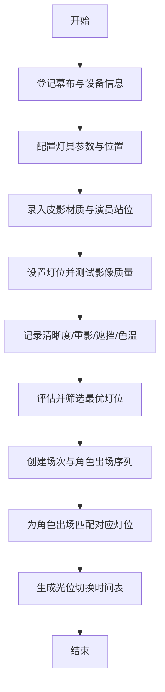

## 1. 产品概述

皮影戏光影校准系统是一款面向皮影戏剧组的专业校准工具，解决排练中灯光位置、幕布设置与影像质量的匹配问题。剧务人员可登记设备参数、记录不同灯位的影像表现，并编排角色出场的光位切换方案，确保演出时影像清晰、无重影、色温准确。

- 目标用户：皮影戏剧务、灯光师、导演
- 核心价值：标准化光影校准流程，提升排练效率和演出质量

## 2. 核心功能

### 2.1 用户角色
| 角色 | 说明 | 核心权限 |
|------|------|----------|
| 剧务人员 | 主要使用者 | 登记设备、录入校准数据、编排光位切换表 |

### 2.2 功能模块
1. **设备登记页**：幕布尺寸、灯具位置、灯具亮度、皮影材质、操纵杆长度、演员站位
2. **光学校准页**：不同灯位下的影像清晰度、重影程度、遮挡情况、色温偏差记录与评估
3. **光位切换表**：按场次编排角色出场顺序，匹配对应光位方案，形成切换时间表

### 2.3 页面详情
| 页面名称 | 模块名称 | 功能描述 |
|----------|----------|----------|
| 设备登记 | 幕布设置 | 录入幕布宽高尺寸、材质、离地高度 |
| 设备登记 | 灯具配置 | 登记灯具型号、数量、位置坐标（距幕布距离/水平角度/高度）、亮度档位 |
| 设备登记 | 皮影与人员 | 皮影材质（牛皮/驴皮/塑料等）、厚度、操纵杆长度、演员站位区域 |
| 光学校准 | 灯位列表 | 支持添加多个灯位方案，每个灯位记录完整参数 |
| 光学校准 | 质量评分 | 对每个灯位从清晰度(1-10)、重影(无/轻微/严重)、遮挡(无/局部/完全)、色温偏差(冷/正常/暖)四个维度评分 |
| 光学校准 | 可视化对比 | 雷达图/对比表展示不同灯位的四项指标表现 |
| 光位切换表 | 场次管理 | 创建场次，添加角色出场序列 |
| 光位切换表 | 角色与光位绑定 | 为每个角色出场时段匹配预设灯位方案 |
| 光位切换表 | 时间轴预览 | 甘特图式时间轴展示整场戏光位切换节奏 |

## 3. 核心流程

剧务首先录入幕布、灯具、皮影、演员等基础信息 → 针对不同灯位逐一测试并记录清晰度、重影、遮挡、色温数据 → 创建场次并按角色出场顺序匹配最优灯位 → 生成可打印/导出的光位切换表，供排练和演出使用。

## 4. 用户界面设计

### 4.1 设计风格
- **主色调**：深赭色 `#8B4513`（皮影传统色调）+ 暖米色 `#F5E6D3` 背景 + 暖金色 `#D4AF37` 点缀
- **次色调**：墨黑 `#1A1A1A` 文字 + 暗红 `#8B0000` 警示色
- **按钮风格**：圆角矩形，轻微阴影，hover时上浮效果，主按钮赭色填充金色描边
- **字体**：标题用衬线字体（Noto Serif SC），正文用无衬线字体（Noto Sans SC），体现传统与现代结合
- **布局**：左侧导航栏 + 右侧内容区，卡片式模块，带皮影风格暗纹装饰
- **图标风格**：线性图标，暖金色调，lucide-react 图标库

### 4.2 页面设计概览
| 页面名称 | 模块名称 | UI元素 |
|----------|----------|--------|
| 设备登记 | 幕布设置 | 表单输入框 + 幕布示意图（宽高标注） |
| 设备登记 | 灯具配置 | 坐标输入滑块 + 俯视平面图（灯具位置可视化） |
| 设备登记 | 皮影与人员 | 下拉选择 + 材质卡片预览 |
| 光学校准 | 灯位列表 | 可折叠卡片，每项显示四项评分徽标 |
| 光学校准 | 质量评分 | 滑块/星级评分组件 + 雷达图可视化 |
| 光位切换表 | 场次管理 | 场次卡片列表 + 角色标签 |
| 光位切换表 | 时间轴 | 横向甘特图，色块区分灯位，悬停显示详情 |

### 4.3 响应式
- 桌面端优先设计（1280px+），三栏布局
- 平板端（768px-1279px）：两栏布局，导航收起为图标
- 移动端（<768px）：单栏布局，底部Tab导航
