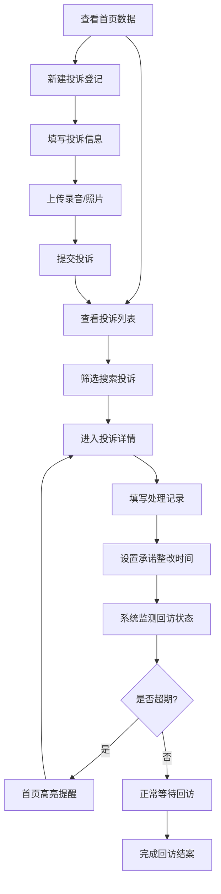

## 1. 产品概述

噪音投诉回访管理系统，专为物业管理人员设计，解决噪音投诉处理不透明、回访无记录、高频投诉点无法定位等问题。通过数字化管理实现投诉全流程可追溯，提升物业服务质量和居民满意度。

## 2. 核心功能

### 2.1 用户角色
| 角色 | 注册方式 | 核心权限 |
|------|----------|----------|
| 物业管理员 | 系统账号 | 投诉登记、处理回访、数据统计、系统配置 |

### 2.2 功能模块
1. **投诉管理首页**：数据概览统计、待办提醒、快捷操作
2. **投诉列表页**：投诉记录列表、筛选搜索、状态标签
3. **投诉详情/处理页**：投诉信息展示、处理记录填写、附件查看
4. **投诉登记页**：新建投诉表单、附件上传
5. **楼栋热力图**：高频投诉点可视化展示

### 2.3 页面详情
| 页面名称 | 模块名称 | 功能描述 |
|---------|---------|----------|
| 首页 | 数据统计卡片 | 本周投诉量、重复投诉住户、平均处理时长、待处理数 |
| 首页 | 待办提醒列表 | 超期未回访投诉高亮提醒 |
| 首页 | 快捷操作区 | 新建投诉、查看全部、导出报表 |
| 投诉列表 | 搜索筛选 | 按楼栋、状态、时间段、噪音类型筛选 |
| 投诉列表 | 投诉卡片 | 展示投诉概要、状态标签、处理进度 |
| 投诉详情 | 基本信息 | 楼栋、时间段、噪音类型、投诉人、联系方式 |
| 投诉详情 | 附件展示 | 录音播放、图片预览 |
| 投诉详情 | 处理表单 | 联系对象、劝阻结果、是否上门、承诺整改时间 |
| 投诉详情 | 处理记录 | 历史处理时间线 |
| 楼栋热力图 | 楼栋列表 | 标注各楼栋投诉数量，颜色区分频次 |
| 楼栋热力图 | 统计图表 | 各楼栋投诉量柱状图、噪音类型占比饼图 |

## 3. 核心流程

用户登录系统后，在首页查看待办提醒和数据概览。点击新建投诉进入登记页，填写楼栋、时间段、噪音类型、投诉人信息并上传附件。提交后进入投诉列表，可筛选查看所有投诉。点击单条投诉进入详情页，填写处理记录（联系对象、劝阻结果、是否上门、承诺整改时间）。系统自动监测承诺时间，超期未回访的投诉在首页高亮提醒。楼栋热力图页面以颜色深浅标注各楼栋投诉频次，帮助定位高频噪音源。

## 4. 用户界面设计

### 4.1 设计风格
- **主色调**：深邃蓝 `#1e3a5f`，代表专业和信任
- **辅助色**：警示橙 `#f59e0b` 用于超期提醒，成功绿 `#10b981` 用于已完成，危险红 `#ef4444` 用于紧急状态
- **中性色**：深灰背景 `#0f172a`，卡片背景 `#1e293b`，文字 `#f1f5f9`
- **按钮风格**：微圆角（6px），悬浮时轻微上移 + 阴影增强
- **字体**：展示字体使用 `Space Grotesk`，正文字体使用 `Inter`
- **布局风格**：侧边导航 + 内容区卡片式布局，采用深色模式
- **图标风格**：线性图标，使用 lucide-react 图标库

### 4.2 页面设计概述
| 页面名称 | 模块名称 | UI 元素 |
|---------|---------|---------|
| 首页 | 统计卡片 | 渐变背景、数字动画、趋势箭头 |
| 首页 | 待办列表 | 时间线布局、超期项红色闪烁边框 |
| 投诉列表 | 数据表格 | 斑马纹、行悬浮高亮、状态标签胶囊 |
| 投诉详情 | 信息展示 | 两栏布局，左侧基本信息，右侧处理记录 |
| 投诉详情 | 表单 | 浮动标签、输入焦点动画、验证提示 |
| 楼栋热力图 | 楼栋网格 | 颜色深浅表示投诉量，点击显示详情 |
| 楼栋热力图 | 统计图表 | 平滑动画、交互式悬浮提示 |

### 4.3 响应式
- 桌面端（1200px+）：完整侧边导航 + 多栏布局
- 平板端（768px-1199px）：折叠式侧边导航 + 双栏布局
- 移动端（<768px）：底部导航 + 单栏流式布局
- 所有交互元素最小触摸尺寸 44px

### 4.4 动效设计
- 页面加载：元素从下至上渐入，错开 50ms 延迟
- 数据更新：数字滚动动画
- 超期提醒：红色边框脉冲呼吸效果
- 表单提交：按钮 loading 旋转动画
- 模态框：背景模糊 + 缩放弹入
