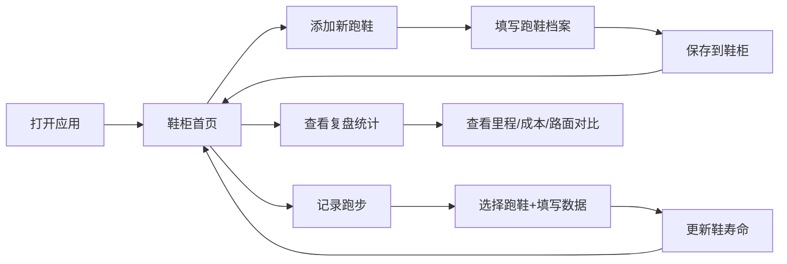

## 1. 产品概述
跑鞋里程管理系统，帮助跑步爱好者追踪每双跑鞋的使用情况、剩余寿命和性价比。避免穿报废鞋跑步导致受伤，同时提供数据驱动的购鞋决策参考。

- 核心目标：记录每双跑鞋的完整生命周期，智能提醒更换，优化跑步装备管理
- 目标用户：严肃跑者、马拉松爱好者、日常跑步健身人群

## 2. 核心功能

### 2.1 用户角色
| 角色 | 注册方式 | 核心权限 |
|------|----------|----------|
| 普通用户 | 无需注册，本地存储 | 跑鞋档案管理、跑步记录、复盘统计 |

### 2.2 功能模块
1. **鞋柜首页**：鞋卡列表展示、寿命进度条、快速排序、比赛鞋锁定状态
2. **跑鞋档案**：新增/编辑跑鞋、品牌型号、买入价、启用日期、适合路面、寿命上限、照片上传
3. **跑步记录**：记录跑步数据、选鞋、公里数、路面、天气、脚感、磨损备注
4. **复盘统计**：总里程、每公里成本、不同路面对比分析

### 2.3 页面详情
| 页面名称 | 模块名称 | 功能描述 |
|----------|----------|----------|
| 鞋柜首页 | 鞋卡列表 | 以卡片形式展示所有跑鞋，含进度条显示剩余寿命百分比 |
| 鞋柜首页 | 智能排序 | 剩余寿命最少的鞋自动排前，锁定的比赛鞋可置顶或单独区域 |
| 鞋柜首页 | 快速操作 | 添加跑步记录、查看详情、编辑/删除、锁定/解锁比赛鞋 |
| 跑鞋档案页 | 表单录入 | 品牌、型号、买入价、启用日期、适合路面（多选）、寿命上限（公里）、照片 |
| 跑鞋档案页 | 照片上传 | 支持本地图片上传预览，base64存储 |
| 跑步记录页 | 记录表单 | 选择跑鞋、日期、公里数、路面类型、天气、脚感评分、磨损备注 |
| 跑步记录页 | 历史记录 | 展示某双鞋的所有跑步记录时间线 |
| 复盘统计页 | 总览卡片 | 总里程、在役鞋数、累计花费、平均每公里成本 |
| 复盘统计页 | 路面对比 | 塑胶跑道 vs 水泥路的磨损效率对比图表 |
| 复盘统计页 | 单鞋分析 | 每双鞋的详细使用数据柱状图/饼图 |

## 3. 核心流程
用户打开应用 → 查看鞋柜（按剩余寿命排序的鞋卡）→ 选择操作：添加新鞋 / 记录跑步 / 查看统计
记录跑步流程：选择跑鞋 → 填写公里数和路面等信息 → 保存 → 自动更新鞋的剩余寿命

## 4. 用户界面设计

### 4.1 设计风格
- **主色调**：深炭黑 (#121212) 配活力橙 (#FF6B35) 作为强调色，辅助色为跑步绿 (#2EC4B6)
- **配色灵感**：夜跑氛围 + 运动能量感，深色背景减少炫目，亮色数据突出
- **按钮风格**：圆角胶囊形按钮，悬浮时有微缩放和发光效果
- **字体**：标题使用 "Space Grotesk" 粗体，正文使用 "DM Sans" 常规
- **布局风格**：卡片式网格布局，顶部导航栏，左侧标签切换
- **图标**：Lucide React 线性图标，橙色高亮

### 4.2 页面设计概览
| 页面名称 | 模块名称 | UI元素 |
|----------|----------|--------|
| 鞋柜首页 | 鞋卡网格 | 深色卡片、渐变进度条（绿→黄→红）、照片缩略图、锁定徽章 |
| 鞋柜首页 | 顶部工具栏 | 搜索框、排序切换、添加按钮（橙色悬浮） |
| 跑鞋档案页 | 表单 | 分组表单、照片预览框、日期选择器、路面多选标签 |
| 跑步记录页 | 表单 | 跑鞋下拉选择、数字输入框、路面/天气单选组、脚感滑块 |
| 复盘统计页 | 数据卡片 | 大号数字、趋势箭头、环形图、柱状图对比 |

### 4.3 响应式
- Desktop 优先，3列鞋卡网格
- Tablet：2列网格
- Mobile：单列，底部导航替代顶部标签
- 所有表单支持触摸操作，点击区域 ≥ 44px

