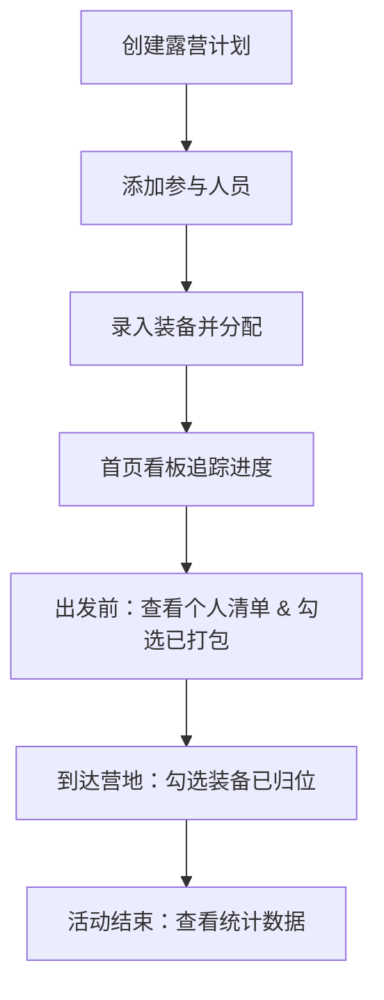

## 1. 产品概述

露营分包清单应用，解决露营活动中装备分配混乱、遗漏重要物品的痛点。帮助用户创建露营计划、分配装备责任人、生成分包清单、追踪打包进度，并提供数据统计分析。

- 主要目标用户：露营组织者、户外爱好者团体
- 核心价值：杜绝"以为别人带了"导致的装备遗漏，清晰追踪每个人的携带责任

## 2. 核心功能

### 2.1 用户角色
| 角色 | 注册方式 | 核心权限 |
|------|----------|----------|
| 普通用户 | 无需注册（本地存储） | 创建计划、管理装备、生成分包清单、查看统计 |

### 2.2 功能模块
1. **首页（装备看板）**：按未分配、已打包、车上、遗漏风险四组展示装备状态
2. **露营计划页**：创建/编辑露营计划（地点、人数、天数、天气、车辆、集合时间）
3. **装备管理页**：按六大分类管理装备（帐篷、睡眠、烹饪、照明、急救、娱乐），设置重量、体积、负责人、所属包
4. **分包清单页**：出发前生成每个人的携带清单，到营地后勾选归位确认
5. **统计页**：总重量、背负排行、最常忘装备统计

### 2.3 页面详情
| 页面名称 | 模块名称 | 功能描述 |
|---------|----------|----------|
| 首页 | 装备看板 | 四象限分组展示（未分配/已打包/已装车/遗漏风险），支持拖拽或点击切换状态，快速筛选 |
| 首页 | 计划概览 | 展示当前露营计划的关键信息（地点、天数、集合时间倒计时） |
| 露营计划页 | 计划表单 | 输入地点、人数、天数、天气、车辆信息、集合时间，支持编辑和新建 |
| 露营计划页 | 人员管理 | 添加/删除参与人员，设置人员昵称 |
| 装备管理页 | 分类标签 | 六大分类切换：帐篷⛺、睡眠🛏️、烹饪🍳、照明💡、急救🩹、娱乐🎮 |
| 装备管理页 | 装备列表 | 展示装备名称、重量、体积、负责人、所属包，支持增删改 |
| 装备管理页 | 装备表单 | 新增/编辑装备：名称、分类、重量(g)、体积(L)、负责人、所属包、备注 |
| 分包清单页 | 人员清单 | 按人员分组展示其负责携带的所有装备 |
| 分包清单页 | 打包勾选 | 出发前：勾选"已打包"；到营地后：勾选"已归位确认" |
| 分包清单页 | 包清单 | 按包分组展示装备，方便装车核对 |
| 统计页 | 总览卡片 | 总装备数、总重量、总体积、参与人数 |
| 统计页 | 背负排行 | 按人员统计背负重量排名，柱状图可视化 |
| 统计页 | 遗忘排行 | 统计历史最常被遗漏/标记为遗漏风险的装备 |

## 3. 核心流程

用户创建露营计划 → 添加参与人员 → 录入装备并分配负责人/包 → 首页看板追踪打包进度 → 出发前查看每人分包清单并逐一核对 → 到达营地后勾选装备归位 → 活动结束查看统计数据

## 4. 用户界面设计

### 4.1 设计风格
- **主色调**：森林绿 `#2D5A27`（自然、户外感），搭配暖橙 `#E67E22` 作为强调色
- **辅助色**：米白 `#F5F0E6` 背景，深棕 `#3E2723` 文字
- **按钮风格**：圆角 12px，柔和阴影，悬浮时有轻微上浮效果
- **字体**：标题使用具有手写感的装饰字体，正文使用清晰易读的无衬线字体
- **布局风格**：卡片式布局，自然留白，柔和阴影
- **图标风格**：使用 Lucide 图标，配合 Emoji 增加趣味性
- **整体氛围**：温暖、自然、轻松的露营感，带有轻微的纸张纹理和大地色系

### 4.2 页面设计概览
| 页面名称 | 模块名称 | UI 元素 |
|---------|----------|---------|
| 首页 | 装备看板 | 四列卡片布局，每列有独立背景色区分，装备卡片可拖拽移动，状态徽章颜色鲜明 |
| 首页 | 计划概览 | 顶部横幅展示，倒计时动画，关键信息用大字号突出 |
| 露营计划页 | 计划表单 | 分组表单，图标前置，输入框有柔和边框，日期选择器带日历图标 |
| 装备管理页 | 分类标签 | 标签栏带图标和 Emoji，选中时有底部指示条动画 |
| 装备管理页 | 装备卡片 | 展示装备图片占位、名称、重量体积标签、负责人头像、包名标签 |
| 分包清单页 | 人员清单 | 折叠面板，人员头像+名称作为标题，展开后显示装备列表带复选框 |
| 统计页 | 背负排行 | 横向柱状图，柱子用渐变色，排名前三带奖杯图标 |

### 4.3 响应式设计
- 桌面端优先设计（≥1024px）：首页四列并排展示
- 平板端（768-1023px）：首页改为两列布局
- 移动端（<768px）：首页单列滚动，底部 Tab 导航
- 所有交互元素确保触摸友好，最小点击区域 44px

### 4.4 交互动效
- 页面切换：淡入 + 轻微上移动画
- 装备卡片：悬浮时轻微上浮 + 阴影加深
- 状态变更：勾选时有缩放弹跳动画
- 分类切换：标签平滑过渡，内容区域淡入
- 数据加载：骨架屏 + 脉冲动画
