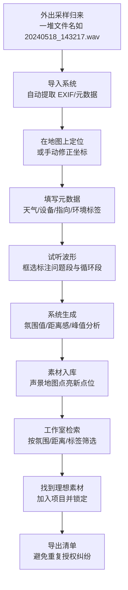

## 1. 产品概述

Soundscape Atlas（声景图集）是面向野外声音采集工作者的素材归档与管理系统，解决采样后文件名混乱、难以回溯录制场景的痛点。通过地图坐标可视化 + 多维元数据标签 + 波形标注，让每一段录音都可追溯、可筛选、可管理。

- 目标用户：田野录音师、影视声音设计师、环境音采集者、自然声景研究者
- 核心价值：将"一堆数字文件名"转化为"有声有色的声景地图"，大幅提升工作室后期检索效率

## 2. 核心功能

### 2.1 用户角色

| 角色 | 登录方式 | 核心权限 |
|------|---------|---------|
| 录音师（本地用户） | 本地应用，免登录 | 全功能：导入、标注、筛选、锁定、导出 |

### 2.2 功能模块

1. **采样地图页**：全球地图视图、点位标记集群、按区域框选、点位详情弹层
2. **录音详情面板**：波形可视化、播放控制、问题标注（风噪/车噪/人声/循环段）、元数据编辑
3. **素材库页**：多维筛选器（氛围/距离感/峰值/标签/设备/天气）、列表/卡片视图切换、批量操作
4. **项目管理页**：项目分组、素材锁定（已授权）、授权追踪、导出清单

### 2.3 页面详情

| 页面名称 | 模块名称 | 功能描述 |
|---------|---------|---------|
| 采样地图 | 全球地图底图 | Leaflet 渲染，支持缩放/拖拽/全屏，深色地形风格 |
| 采样地图 | 点位集群 | 近距离聚合为数字徽标，放大后拆分为独立点位，不同颜色代表环境类型 |
| 采样地图 | 筛选工具条 | 按日期范围、天气条件、设备类型过滤地图上显示的点位 |
| 采样地图 | 点位弹层 | 点击后显示缩略波形、标题、录制时间，"查看详情"进入面板 |
| 录音详情 | 波形播放器 | Canvas 绘制波形，绿色循环段/红色问题段/橙色可用段色块叠加 |
| 录音详情 | 标注工具栏 | 框选区域后添加标签：风噪、车辆干扰、人声穿帮、可用循环段、需要剪辑 |
| 录音详情 | 元数据区 | 坐标（经纬度+地图缩略）、时间戳、温湿度、天气图标、设备型号、麦克风指向（心形/全指向/8字）、增益设置、环境标签（森林/城市/海边/室内/山谷） |
| 录音详情 | 氛围评估 | 主观评分：氛围值 1-10、距离感（近/中/远/极远）、动态范围、峰值 dBFS |
| 素材库 | 多维筛选面板 | 左侧固定筛选：环境标签、氛围范围、距离感、峰值区间、设备、天气、指向方式、是否含问题段、是否已锁定 |
| 素材库 | 列表视图 | 表格：文件名、小波形、时长、地点、时间、环境标签、峰值、锁定状态，可排序 |
| 素材库 | 卡片视图 | 网格卡片：大图+彩色渐变、地点名、时长、标签徽章、锁定图标 |
| 素材库 | 批量操作 | 多选后批量添加标签、批量锁定、批量导出清单、批量加入项目 |
| 项目管理 | 项目列表 | 卡片式项目（"纪录片-西南秘境"、"游戏-荒野生存"等），显示已用素材数量与授权状态 |
| 项目管理 | 锁定机制 | 素材加入项目后状态变为"已锁定"，其他项目提示"已授权于X项目，需确认"，防止重复授权纠纷 |
| 项目管理 | 授权追踪 | 每个素材显示：首次授权日期、项目名、授权类型（独家/非独家）、授权截止日、备注 |

## 3. 核心流程

## 4. 用户界面设计

### 4.1 设计风格 —— 「深夜工作室 × 田野记录册」

- **主色调**：深森林绿 `#0f2a1f`（背景）+ 琥珀橙 `#d97706`（强调色/标记）+ 苔原绿 `#4ade80`（可用/循环）+ 锈红 `#ef4444`（问题段）
- **辅助色**：石板灰 `#1e293b`（面板）、雾蓝 `#38bdf8`（坐标/地图）、暖米白 `#fef3c7`（文字高亮）
- **字体组合**：
  - 标题：`"Space Grotesk"` —— 几何感强，有科技探索气质
  - 正文：`"Inter"` —— 高可读性
  - 数据/文件名：`"JetBrains Mono"` —— 等宽字体，文件列表专业感
- **按钮风格**：微立体圆角（rounded-lg），悬停时 2px 上移 + 琥珀橙发光阴影
- **图标**：Lucide 线性图标，状态用彩色实心徽章（如：🌧️ 雨、🎤 X/Y 制式、📍 坐标、🔒 锁定）
- **布局**：三栏式工作台 —— 左侧导航（窄）| 中央主视图（地图/列表）| 右侧详情面板（可折叠）
- **质感细节**：
  - 面板背景使用 8% 噪点纹理叠加，避免纯黑的呆板
  - 波形 Canvas 使用渐变色填充，不是单调单色
  - 地图点位使用带脉冲动画的发光圆点，像声呐信号扩散

### 4.2 页面设计概览

| 页面 | 模块 | UI 关键要素 |
|-----|-----|------------|
| 采样地图 | 顶栏 | Logo「Soundscape Atlas」+ 全局搜索框 + 视图切换（地图/库/项目）+ 用户头像 |
| 采样地图 | 地图区 | 全屏暗色地形底图，点位彩色发光，缩放控制右下，比例尺左下 |
| 采样地图 | 左筛选条 | 日期范围滑块、天气复选组、设备下拉、环境标签胶囊按钮 |
| 采样地图 | 点位弹层 | 毛玻璃面板（backdrop-blur-xl），小波形预览 + 地点名 + 时长 + "展开详情" |
| 录音详情 | 波形区 | 高约 200px Canvas，时间轴刻度，播放头竖线，标注色块覆盖在波形上 |
| 录音详情 | 标注工具 | 5 个色块按钮：🌿循环段(绿)、💨风噪(青灰)、🚗车噪(黄)、🗣人声(红)、✨待剪辑(橙) |
| 录音详情 | 元数据卡片 | 4×2 网格卡片：坐标（带小地图）、气象、设备、时间、环境标签、氛围评分 |
| 素材库 | 筛选面板 | 手风琴式折叠区，每个筛选器有独立头部，展开后选项可多选 |
| 素材库 | 列表行 | 悬停时行背景变为深绿 + 左侧出现 3px 琥珀色竖条 |
| 项目管理 | 项目卡 | 封面渐变 + 项目名 + 进度条（已用/总素材）+ 🔒 数徽章 + 悬停浮起效果 |

### 4.3 响应式设计

- **桌面优先（1440px+）**：三栏布局全开，详情面板 400px 宽
- **平板（1024px）**：右侧详情改为抽屉式，从右滑出
- **移动端（<768px）**：单栏瀑布流，地图可切换全屏模式，筛选器移入底部弹层

### 4.4 动效与微交互

- 页面加载：地图从中心缩放出现 + 点位逐个淡入（stagger 50ms）
- 点位悬停：圆点放大 1.5x + 脉冲圈扩散
- 波形播放：播放头以琥珀橙色光轨迹划过，已播放区域波形变为亮绿
- 标注完成：标注块从选区位置"弹入"，带轻微 bounce
- 锁定状态切换：锁图标从打开 → 扣合，伴随 🔒 轻微旋转 15° 动画
