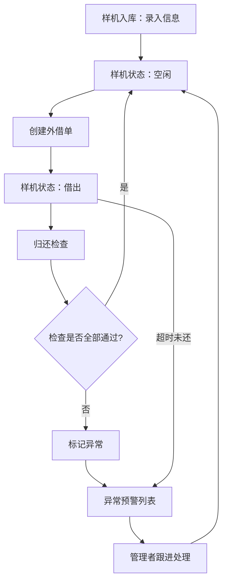

## 1. 产品概述

样机外借追踪系统——解决销售带样机去客户现场、研发临时调试时，设备归属不清、固件版本混乱、外借状态不透明的管理痛点。通过为每台样机建立唯一档案、规范外借归还流程、自动识别异常状态，实现样机全生命周期的可追溯管理。

- 目标用户：销售团队、研发团队、部门管理者
- 核心价值：样机去向一目了然，归还检查有据可依，异常状态自动预警

## 2. 核心功能

### 2.1 用户角色

| 角色 | 进入方式 | 核心权限 |
|------|----------|----------|
| 销售人员 | 默认进入 | 创建外借单、查看样机状态、归还登记 |
| 研发人员 | 默认进入 | 查看样机详情、固件版本、申请调试借用 |
| 管理者 | 默认进入 | 全部权限、查看异常预警、部门筛选统计 |

### 2.2 功能模块

1. **样机资产管理**：样机台账列表、新增/编辑样机、样机详情（含外观照片上传）
2. **外借管理**：创建外借单、归还检查登记、外借记录列表
3. **异常预警**：逾期未还、含客户敏感数据、固件非标准版的设备独立展示
4. **筛选与统计**：按客户项目、归属部门筛选样机列表和外借记录

### 2.3 页面详情

| 页面名称 | 模块名称 | 功能描述 |
|----------|----------|----------|
| 样机列表 | 搜索与筛选栏 | 按编号、型号、部门、客户项目筛选 |
| 样机列表 | 样机卡片/表格 | 展示编号、型号、固件版本、当前状态（空闲/借出/逾期）、归属部门 |
| 样机列表 | 快捷操作 | 新增样机、快速借出、查看详情 |
| 样机详情 | 基本信息区 | 编号、型号、序列号、固件版本、配件清单、账号状态、归属部门 |
| 样机详情 | 外观照片区 | 多张外观照片展示与上传 |
| 样机详情 | 外借历史 | 该设备所有外借记录时间线 |
| 新增/编辑样机 | 表单区 | 录入全部样机属性字段，照片上传 |
| 外借登记 | 外借单表单 | 选择样机、客户名称、借用人、预计归还日期、演示场景、是否含敏感数据 |
| 归还检查 | 检查清单 | 逐项确认：配件齐全、无新增划痕、电量百分比、客户数据已清空、固件已回滚至标准版 |
| 归还检查 | 异常标记 | 不通过项自动标记并归入异常预警 |
| 外借记录 | 记录列表 | 全部外借记录，支持按客户/部门/状态筛选 |
| 异常预警 | 预警列表 | 逾期设备、带敏感数据设备、非标准固件设备分标签页展示 |
| 异常预警 | 预警详情 | 点击可跳转至对应样机详情或外借记录 |

## 3. 核心流程

1. **样机入库**：管理员录入样机信息（编号、型号、序列号、固件版本、配件、账号状态、部门、外观照片），样机状态为"空闲"
2. **外借流程**：借用人选择空闲样机 → 填写外借单（客户、借用人、预计归还、演示场景、是否含敏感数据）→ 样机状态变为"借出"
3. **归还流程**：借用人归还样机 → 逐项检查（配件、划痕、电量、数据清空、固件回滚）→ 全部通过则样机恢复"空闲"；任一项不通过则标记异常
4. **异常处理**：逾期/带敏感数据/非标准固件的设备自动进入异常预警列表，管理者可筛选查看并跟进

## 4. 用户界面设计

### 4.1 设计风格

- 主色调：深蓝灰（#1e293b）+ 琥珀色强调（#f59e0b）
- 辅助色：翠绿（#10b981）表示正常/空闲，红色（#ef4444）表示异常/逾期
- 按钮风格：圆角 8px，主要操作用琥珀色实心按钮，次要操作用描边按钮
- 字体：标题使用 DM Sans（粗体），正文使用 Source Sans 3
- 布局风格：左侧固定导航栏 + 右侧内容区，表格与卡片混合布局
- 图标风格：线性图标（Lucide），搭配状态色圆点

### 4.2 页面设计概述

| 页面名称 | 模块名称 | UI 元素 |
|----------|----------|---------|
| 样机列表 | 搜索与筛选栏 | 输入框、下拉选择器、标签筛选，紧凑排列 |
| 样机列表 | 样机表格 | 数据表格，行末操作按钮，状态列带颜色标签 |
| 样机详情 | 基本信息区 | 双列信息卡片，字段标签+值 |
| 样机详情 | 外观照片区 | 横向滚动的照片缩略图，点击放大 |
| 样机详情 | 外借历史 | 垂直时间线组件 |
| 外借登记 | 外借单表单 | 分组表单，选择器+日期选择+文本域 |
| 归还检查 | 检查清单 | 逐项勾选清单，每项可展开备注 |
| 外借记录 | 记录列表 | 数据表格，支持筛选和分页 |
| 异常预警 | 预警列表 | 三标签页切换，表格+严重程度标签 |

### 4.3 响应式设计

- 桌面优先设计，最小适配 1280px 宽度
- 导航栏在平板以下收起为底部导航
- 表格在移动端转为卡片列表

### 4.4 3D 场景

不适用
