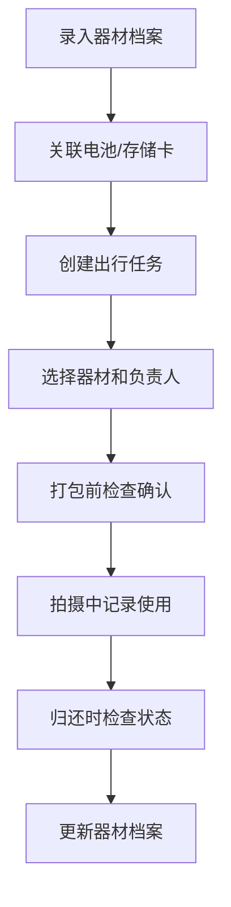
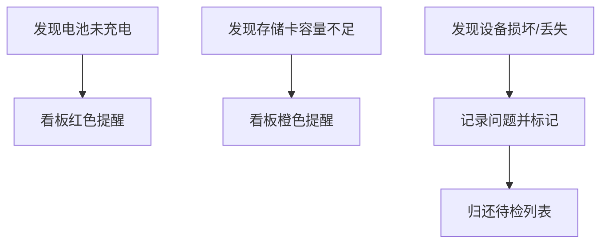

## 1. 产品概述

摄影器材电池管理系统，解决多人合作拍摄（婚礼、旅行等）时器材管理混乱的问题。通过器材档案、任务管理、状态追踪和看板提醒，实现电池电量、存储卡、设备归属的全流程管理。

- **主要目的**：系统化管理摄影器材的电池、存储卡和设备状态，避免拍摄前遗漏充电、缺卡、设备丢失等问题
- **目标用户**：摄影团队、摄影爱好者团体、婚礼跟拍团队、旅拍团队
- **产品价值**：减少拍摄事故，提高团队协作效率，建立器材管理标准化流程

## 2. 核心功能

### 2.1 用户角色

| 角色 | 注册方式 | 核心权限 |
|------|----------|----------|
| 管理员 | 本地创建 | 器材管理、任务创建、所有操作权限 |
| 普通成员 | 本地创建 | 查看任务、记录使用情况、归还检查 |

### 2.2 功能模块

1. **看板首页**：未充电提醒、缺卡提醒、超容量风险、归还待检、常用套装
2. **器材档案**：相机、镜头、闪光灯、稳定器、存储卡、电池的信息管理
3. **出行任务**：拍摄任务创建、器材分配、负责人指定
4. **打包确认**：电量检查、卡容量检查、固件版本、充电器和备用线确认
5. **拍摄记录**：电池更换记录、存储卡满卡记录
6. **归还检查**：设备损坏检查、丢失确认、数量核对

### 2.3 页面详情

| 页面名称 | 模块名称 | 功能描述 |
|----------|----------|----------|
| 看板首页 | 状态卡片 | 展示未充电电池、缺卡设备、超容量风险、归还待检设备数量和详情 |
| 看板首页 | 常用套装 | 快速查看和选择常用器材组合 |
| 器材档案 | 器材列表 | 分类展示所有器材，支持搜索和筛选 |
| 器材档案 | 器材详情 | 展示器材型号、拥有者、照片、使用记录、电池/卡关联 |
| 器材档案 | 器材编辑 | 新增/编辑器材信息，上传照片 |
| 出行任务 | 任务列表 | 展示所有任务，按时间排序 |
| 出行任务 | 任务详情 | 任务信息、所需器材清单、负责人 |
| 出行任务 | 任务创建 | 新建任务，选择器材，指定负责人 |
| 打包确认 | 检查清单 | 逐件确认电量、卡容量、固件、配件 |
| 打包确认 | 状态标记 | 标记每项检查结果，生成检查报告 |
| 拍摄记录 | 记录列表 | 电池更换、卡满情况记录 |
| 拍摄记录 | 新增记录 | 快速记录电池更换或卡满事件 |
| 归还检查 | 检查列表 | 归还时逐一核对设备状态 |
| 归还检查 | 问题记录 | 记录损坏、丢失情况 |

## 3. 核心流程

**器材管理流程**：
1. 用户录入器材档案（相机、镜头、闪光灯等），填写型号、拥有者、照片等信息
2. 关联电池和存储卡到对应器材
3. 创建出行任务，选择所需器材，指定负责人
4. 打包前逐项检查电量、卡容量、固件、充电器等
5. 拍摄中记录电池更换和卡满情况
6. 归还时检查设备损坏或丢失，更新器材状态

**异常处理流程**：

## 4. 用户界面设计

### 4.1 设计风格

**整体方向**：专业摄影工作室风格，采用深色主题配合橙色点缀，传达专业、可靠的视觉感受。

- **主色调**：深炭灰 `#1A1A2E` 作为背景，营造专业感
- **辅助色**：橙色 `#FF6B35` 作为强调色，用于提醒和操作按钮
- **成功色**：森林绿 `#2EC4B6` 表示正常/已完成
- **警告色**：琥珀黄 `#FFB703` 表示警告
- **危险色**：珊瑚红 `#E71D36` 表示危险/未充电
- **中性色**：不同深度的灰色用于层级区分

- **字体选择**：
  - 标题字体：`Space Grotesk` - 现代感强，适合专业工具
  - 正文字体：`Inter` - 清晰易读，数据展示友好

- **按钮风格**：方形微圆角（4px），实心填充主色，悬停时有轻微上浮和阴影变化
- **布局风格**：卡片式布局，每个模块独立卡片，清晰的视觉层次
- **图标风格**：线性图标，粗细 1.5px，简洁专业

### 4.2 页面设计概述

| 页面名称 | 模块名称 | UI 元素 |
|----------|----------|---------|
| 看板首页 | 状态卡片 | 5个醒目的统计卡片，不同颜色代表不同状态，悬停时显示详情列表 |
| 看板首页 | 快捷操作 | 大号图标按钮，快速进入常用功能 |
| 器材档案 | 器材列表 | 网格布局卡片，显示器材缩略图、型号、状态标签 |
| 器材档案 | 器材详情 | 左右分栏，左侧照片，右侧详细信息和使用记录时间线 |
| 出行任务 | 任务列表 | 时间线布局，显示任务地点、时间、负责人、状态 |
| 打包确认 | 检查清单 | 列表式逐项检查，复选框+状态标签，支持批量操作 |
| 拍摄记录 | 记录列表 | 时间线记录，显示更换时间、设备、操作人员 |
| 归还检查 | 检查列表 | 表格形式，显示设备、预期数量、实到数量、状态备注 |

### 4.3 响应式设计

- **桌面优先**：主视图为 1280px 以上桌面端，侧边导航 + 主内容区布局
- **平板适配**：1024px 时侧边栏收起为图标模式
- **移动适配**：768px 以下底部导航栏，卡片堆叠布局，针对触摸优化点击区域

### 4.4 交互与动效

- 页面加载：卡片依次淡入， stagger 延迟 100ms
- 状态切换：颜色渐变过渡 300ms
- 悬停效果：卡片轻微上浮（translateY -2px），阴影加深
- 确认操作：按钮点击后缩放 95% 再回弹
- 提醒动画：重要提醒卡片有微弱呼吸灯效果
