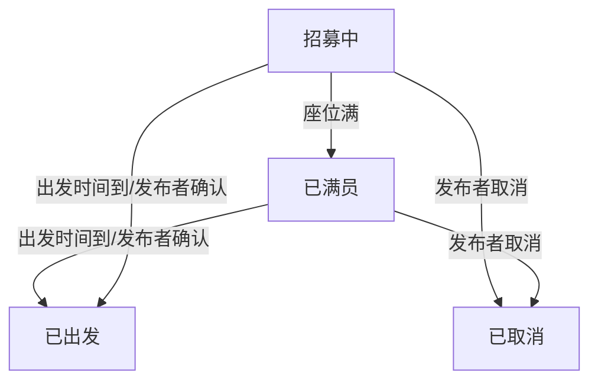

## 1. 产品概述

社区拼车时间板 — 一款面向小区邻居的拼车信息发布与协作平台，帮助居民轻松找到同路拼车伙伴去机场、学校、商场等目的地，降低出行成本、减少碳足迹。

- 目标用户：小区居民（日常通勤、周末出行、接送孩子等场景）
- 核心价值：让邻居拼车像看公告栏一样简单直观，时间轴排列清晰，一键发布、一键加入

## 2. 核心功能

### 2.1 用户角色

| 角色 | 注册方式 | 核心权限 |
|------|----------|----------|
| 邻居用户 | 昵称即可使用 | 发布拼车、加入拼车、留言、查看历史 |
| 访客 | 无需注册 | 仅浏览拼车列表 |

### 2.2 功能模块

1. **拼车首页**：时间轴展示、筛选器、快捷发布入口
2. **发布拼车页**：表单填写拼车详情
3. **拼车详情页**：申请加入/取消、留言、费用计算
4. **历史记录页**：已完成拼车、常用路线一键再发
5. **费用计算器**：独立工具页，根据人数自动分摊费用

### 2.3 页面详情

| 页面名称 | 模块名称 | 功能描述 |
|----------|----------|----------|
| 拼车首页 | 时间轴区域 | 按"今天""明天""本周"分区展示拼车信息，每个分区内按出发时间升序排列 |
| 拼车首页 | 拼车卡片 | 展示目的地、出发时间、剩余座位、状态标签、出发地、费用、行李标识 |
| 拼车首页 | 筛选栏 | 按目的地关键词、时间段选择、最少座位数筛选 |
| 拼车首页 | 快捷发布按钮 | 浮动按钮，点击打开发布表单 |
| 发布拼车页 | 表单区域 | 填写出发地、目的地、出发时间、总座位数、总费用、是否允许带行李、联系方式 |
| 发布拼车页 | 预览卡片 | 实时预览发布的拼车卡片样式 |
| 拼车详情页 | 拼车信息 | 完整展示拼车所有信息、当前乘客列表 |
| 拼车详情页 | 操作区 | 申请加入/取消加入按钮，已满员/已出发/已取消状态禁用操作 |
| 拼车详情页 | 留言区 | 乘客间留言确认细节（如集合地点、行李数量等） |
| 拼车详情页 | 费用计算器 | 根据当前人数自动计算每人分摊金额 |
| 拼车详情页 | 状态流转 | 发布者可将拼车状态改为"已出发"或"已取消" |
| 历史记录页 | 已完成拼车 | 展示状态为"已出发"的拼车记录 |
| 历史记录页 | 常用路线 | 基于历史记录提取常用出发地-目的地组合，支持一键再发 |
| 费用计算器页 | 计算表单 | 输入总费用和人数，实时计算每人费用，支持多种分摊方式 |

## 3. 核心流程

### 3.1 发布拼车流程

用户点击发布按钮 → 填写拼车信息（出发地、目的地、出发时间、座位数、费用、行李、联系方式） → 预览确认 → 发布成功，状态为"招募中" → 首页时间轴显示新拼车

### 3.2 加入拼车流程

用户浏览首页时间轴 → 点击感兴趣的拼车卡片 → 进入详情页 → 点击"申请加入" → 座位数减一 → 乘客列表更新 → 座位满则状态变为"已满员"

### 3.3 状态流转流程

### 3.4 费用计算流程

输入总费用 → 输入参与人数 → 自动计算每人分摊金额（总费用 ÷ 人数）→ 显示每人费用

## 4. 界面设计

### 4.1 设计风格

- **主色调**：温暖橙色 (#F97316) 代表出行活力，搭配深灰 (#1E293B) 文字和奶白 (#FFFBF5) 背景
- **辅助色**：绿色 (#22C55E) 表示招募中/有座位，灰色 (#94A3B8) 表示已满/已出发，红色 (#EF4444) 表示已取消
- **按钮风格**：圆角 (12px) 大按钮，带轻微阴影和 hover 缩放效果
- **字体**：标题用 "Noto Sans SC" 粗体，正文用 "Noto Sans SC" 常规
- **布局**：卡片式布局，左侧时间轴线条连接，响应式适配
- **图标**：使用 Lucide 图标库，线条风格

### 4.2 页面设计概述

| 页面名称 | 模块名称 | UI 元素 |
|----------|----------|---------|
| 拼车首页 | 时间轴 | 左侧竖线 + 时间标签（今天/明天/本周），右侧卡片列表，卡片入场动画 stagger |
| 拼车首页 | 筛选栏 | 顶部粘性筛选栏，目的地搜索框 + 时间段下拉 + 座位数滑块 |
| 拼车首页 | 拼车卡片 | 圆角卡片，左侧色条标识状态，右上角状态徽章，底部座位进度条 |
| 发布拼车页 | 表单 | 分组表单，图标标注每个字段，实时预览区 |
| 拼车详情页 | 信息区 | 大卡片展示完整信息，乘客头像列表，操作按钮区 |
| 拼车详情页 | 留言区 | 底部留言输入框，消息气泡样式 |
| 历史记录页 | 路线卡片 | 横向滑动常用路线，纵向历史记录列表 |
| 费用计算器页 | 计算器 | 中央大卡片，滑块+数字输入，实时计算结果展示 |

### 4.3 响应式设计

- 桌面优先设计，最大宽度 1200px 居中
- 平板：卡片两列排列
- 手机：单列卡片，筛选栏折叠为图标点击展开

## 5. 数据模型

### 5.1 拼车记录

| 字段 | 类型 | 说明 |
|------|------|------|
| id | string | 唯一标识 |
| departure | string | 出发地 |
| destination | string | 目的地 |
| departureTime | string | 出发时间 (ISO) |
| totalSeats | number | 总座位数 |
| passengers | Passenger[] | 乘客列表 |
| totalCost | number | 总费用 |
| costPerPerson | number | 每人费用（自动计算） |
| allowLuggage | boolean | 是否允许带行李 |
| contact | string | 联系方式 |
| status | enum | 招募中/已满员/已出发/已取消 |
| messages | Message[] | 留言列表 |
| createdAt | string | 创建时间 |
| publisherId | string | 发布者ID |

### 5.2 乘客

| 字段 | 类型 | 说明 |
|------|------|------|
| id | string | 乘客ID |
| name | string | 昵称 |
| joinedAt | string | 加入时间 |

### 5.2 留言

| 字段 | 类型 | 说明 |
|------|------|------|
| id | string | 留言ID |
| authorId | string | 作者ID |
| authorName | string | 作者昵称 |
| content | string | 留言内容 |
| createdAt | string | 留言时间 |
