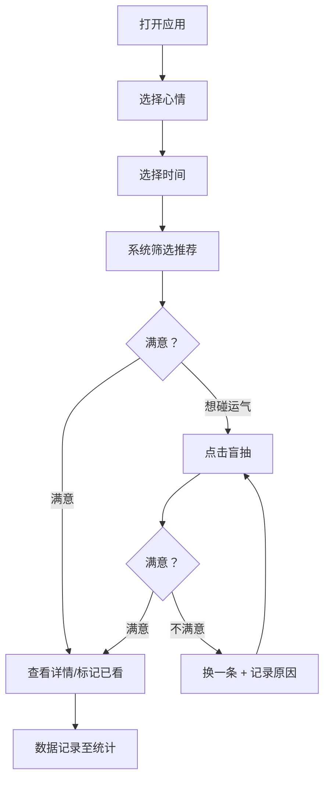

## 1. 产品概述

书影音心情匹配器 — 一个基于当前心情和可用时间，为你智能推荐书、电影、剧、音乐的私人陪伴型应用。解决「想看点什么但不知道看什么」的选择焦虑，像一位懂你的朋友一样给出贴心建议。

- 目标用户：经常陷入「选择困难」的文艺爱好者、书影音消费者
- 核心价值：将个人媒体库与心情状态打通，让每一次消费都精准匹配当下状态，减少无效刷选时间

## 2. 核心功能

### 2.1 用户角色
无角色区分，单用户本地应用。

### 2.2 功能模块
1. **心情推荐页（首页）**：心情选择盘 + 时间选择 + 推荐结果 + 盲抽
2. **我的清单页**：书/电影/剧/音乐的 CRUD 管理
3. **统计页**：心情消费画像、近期观看趋势

### 2.3 页面详情

| 页面名称 | 模块名称 | 功能描述 |
|---------|---------|---------|
| 心情推荐页 | 心情选择盘 | 圆盘式心情选择，支持：累、烦、开心、失眠、想哭、想学习、想放空，点击选中高亮 |
| 心情推荐页 | 时间选择 | 快捷时间档位：20分钟、1小时、一个晚上，可切换 |
| 心情推荐页 | 推荐结果 | 根据心情+时间筛选 3 条以内推荐，每条显示标题、类型、时长、评分，配一句「朋友式」推荐理由 |
| 心情推荐页 | 随机盲抽 | 一个醒目的盲抽按钮，点击随机抽取一条；不想要可换一条并记录换掉原因 |
| 我的清单页 | 添加条目 | 填写标题、类型（书/电影/剧/音乐）、时长、适合心情（多选）、强度（1-5）、是否已看、评分（1-5）、私人备注 |
| 我的清单页 | 清单列表 | 按类型 Tab 筛选，支持搜索，卡片式展示 |
| 我的清单页 | 编辑/删除 | 对已有条目进行编辑或删除 |
| 统计页 | 心情消费画像 | 展示最近各心情下消费的数量和类型分布 |
| 统计页 | 近期动态 | 时间线展示最近的观看/阅读记录，含当时心情 |
| 统计页 | 盲抽历史 | 展示被换掉的盲抽记录及换掉原因 |

## 3. 核心流程

用户打开应用 → 在心情选择盘上点选当前心情 → 选择可用时间 → 系统从个人清单中匹配适合的内容 → 展示 2-3 条推荐，每条附带理由 → 用户可直接选择，或点击盲抽按钮碰运气 → 盲抽不满意可换一条并填写原因 → 选择后自动记录为「已看」并关联心情 → 统计页可回顾消费画像

## 4. 用户界面设计

### 4.1 设计风格
- 主色调：暖色系 — 琥珀色/焦糖色 (#D97706) 作为主色，深墨绿 (#1B4332) 作为辅助色
- 背景：深色沉浸感背景 (#0F172A)，配微光粒子效果，营造夜晚独处选片的氛围
- 按钮风格：圆角柔和，略带微光描边，hover 时柔和放大
- 字体：标题使用 Noto Serif SC（衬线，文艺感），正文使用 Noto Sans SC
- 布局：居中卡片式，留白充足，不拥挤
- 图标：使用 Lucide 图标，搭配部分手绘风 Emoji 辅助情绪表达

### 4.2 页面设计概览

| 页面名称 | 模块名称 | UI 元素 |
|---------|---------|---------|
| 心情推荐页 | 心情选择盘 | 圆形排列的情绪按钮，每个按钮含 Emoji + 文字，选中时发光放大；中心有当前状态文字 |
| 心情推荐页 | 时间选择 | 三个圆角药丸按钮，横向排列，选中态填充色 |
| 心情推荐页 | 推荐结果 | 卡片列表，每张卡片左侧色条标识类型，右侧显示标题/时长/评分，底部一句斜体推荐理由 |
| 心情推荐页 | 盲抽按钮 | 大圆按钮居中，带旋转动画，点击后翻转揭示结果 |
| 我的清单页 | 类型 Tab | 横向滚动 Tab：全部/书/电影/剧/音乐 |
| 我的清单页 | 添加表单 | 侧滑抽屉式表单，分步骤填写 |
| 我的清单页 | 条目卡片 | 紧凑卡片，显示标题、类型标签、时长、心情标签、评分星星 |
| 统计页 | 心情分布图 | 环形图展示各心情下的消费比例 |
| 统计页 | 近期动态 | 纵向时间线，每条含心情 Emoji + 标题 + 日期 |
| 统计页 | 盲抽历史 | 卡片列表，换掉原因用浅色背景标注 |

### 4.3 响应式
桌面优先设计，移动端自适应：卡片由横排变纵排，心情选择盘缩小但保持圆形排列，表单改为全屏模态。

### 4.4 3D 场景
不适用。
