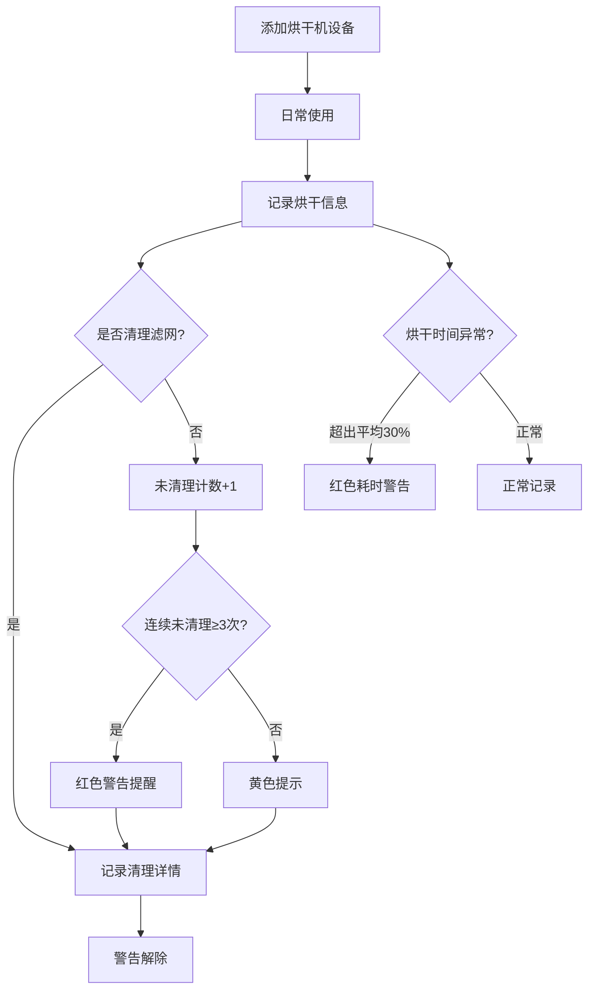

## 1. 产品概述

烘干机绒毛清理提醒应用——帮助用户管理烘干机设备信息、追踪每次烘干与清理记录，并在滤网长期未清理或烘干时间异常时发出红色安全警告，降低火灾隐患、提升烘干效率。

- 目标用户：家庭用户、洗衣房管理员
- 核心价值：预防安全隐患、延长设备寿命、节省能源

## 2. 核心功能

### 2.1 用户角色
| 角色 | 注册方式 | 核心权限 |
|------|----------|----------|
| 普通用户 | 无需注册，本地使用 | 管理设备、记录烘干与清理、查看提醒 |

### 2.2 功能模块
1. **首页**：今日待清理、最近烘干批次、异常耗时警告、下次深度清洁日期
2. **设备档案页**：烘干机型号、容量、安装位置、排风方式、购买日期、设备照片
3. **烘干记录页**：衣物类型、重量、烘干程序、耗时、是否清理滤网
4. **清理记录页**：绒毛量、排风口检查、异味、噪音、冷凝水盒状态
5. **警告系统**：连续多次未清理红色提醒、烘干时间异常变长红色提醒

### 2.3 页面详情
| 页面名称 | 模块名称 | 功能描述 |
|----------|----------|----------|
| 首页 | 今日待清理卡片 | 显示今日需清理的设备列表，点击可跳转清理记录 |
| 首页 | 最近烘干批次 | 展示最近5条烘干记录摘要（时间、衣物类型、耗时、是否清理） |
| 首页 | 异常耗时警告 | 烘干时间超出正常范围时红色高亮显示 |
| 首页 | 下次深度清洁 | 倒计时显示距下次深度清洁天数 |
| 设备档案 | 设备信息表单 | 填写/编辑型号、容量、安装位置、排风方式、购买日期 |
| 设备档案 | 设备照片 | 上传/展示烘干机照片 |
| 烘干记录 | 记录表单 | 填写衣物类型（多选）、重量、程序、耗时、是否清理滤网 |
| 烘干记录 | 记录列表 | 按时间倒序展示所有烘干记录 |
| 清理记录 | 清理表单 | 填写绒毛量、排风口检查结果、异味、噪音、冷凝水盒状态 |
| 清理记录 | 清理列表 | 按时间倒序展示所有清理记录 |
| 警告系统 | 未清理警告 | 连续3次以上烘干未清理滤网时红色提醒 |
| 警告系统 | 异常耗时警告 | 烘干时间比历史平均长30%以上时红色提醒 |

## 3. 核心流程

用户添加烘干机设备 → 每次使用后记录烘干信息 → 标记是否清理滤网 → 若未清理累计计数 → 达到阈值触发红色警告 → 用户执行清理并记录清理详情 → 警告解除

## 4. 用户界面设计

### 4.1 设计风格
- **主色调**：暖橙色(#E8722A)作为安全警示主色，搭配深灰(#1A1A2E)背景营造工业感
- **辅助色**：警告红(#DC2626)、安全绿(#22C55E)、提示黄(#F59E0B)
- **按钮风格**：圆角(8px)、带微妙阴影、hover时轻微上浮
- **字体**：标题使用 Noto Sans SC Bold，正文使用 Noto Sans SC Regular
- **布局风格**：左侧导航 + 右侧内容区，卡片式布局
- **图标风格**：线性图标(Lucide)，2px描边
- **整体美学**：工业实用风格——深色背景、高对比度警示色、仪表盘式数据展示，模拟工业监控面板质感

### 4.2 页面设计概览
| 页面名称 | 模块名称 | UI元素 |
|----------|----------|--------|
| 首页 | 今日待清理 | 卡片、红色脉冲动画警告、设备图标 |
| 首页 | 最近烘干批次 | 横向滚动卡片、时间轴指示 |
| 首页 | 异常耗时警告 | 红色高亮条幅、三角感叹号图标 |
| 首页 | 下次深度清洁 | 圆形倒计时指示器、天数数字 |
| 设备档案 | 设备信息 | 表单输入框、下拉选择、日期选择器 |
| 设备档案 | 设备照片 | 圆角图片框、上传按钮、拖拽区域 |
| 烘干记录 | 记录表单 | 多选标签(衣物类型)、滑块(重量)、下拉(程序)、时间输入 |
| 烘干记录 | 记录列表 | 条纹表格行、清理状态标签(红/绿) |
| 清理记录 | 清理表单 | 滑块(绒毛量)、开关(排风口/异味/噪音)、状态选择(冷凝水盒) |
| 清理记录 | 清理列表 | 清理评分卡片、状态徽章 |

### 4.3 响应式设计
- 桌面端优先，左侧固定导航栏(240px)
- 平板端：导航栏收缩为图标模式(64px)
- 移动端：底部Tab导航，内容区全宽，卡片堆叠

### 4.4 3D场景指引
- 不适用
