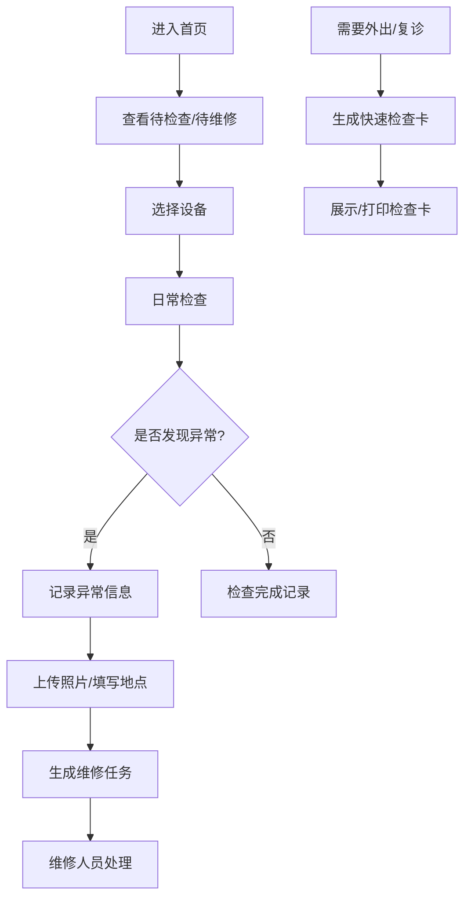

## 1. 产品概述

助行器维护管理系统，用于帮助老年人及其照护人员管理助行器设备的日常维护和安全检查。通过系统化的检查流程和异常记录，确保助行器始终处于安全可用状态，预防因设备故障导致的安全隐患。

- 解决助行器日常检查被忽视的问题，确保脚垫磨损、刹车松动等安全隐患得以及时发现
- 为老年人、照护人员、维修人员提供统一的设备管理平台
- 目标市场：家庭养老、社区养老机构、康复中心等使用助行器的场景

## 2. 核心功能

### 2.1 用户角色

| 角色 | 注册方式 | 核心权限 |
|------|----------|----------|
| 照护人员 | 直接使用 | 设备档案管理、日常检查、异常记录、查看快速检查卡 |
| 维修人员 | 直接使用 | 查看维修任务、处理维修任务 |

### 2.2 功能模块

1. **首页**：待检查提醒、待维修任务、脚垫更换提醒、最近异常趋势图表
2. **设备档案**：设备基本信息录入与管理（类型、编号、使用人、身高适配、购买日期、折叠方式、照片）
3. **日常检查**：逐项勾选检查（脚垫、防滑套、刹车线、扶手海绵、折叠卡扣、车轮转动）
4. **异常记录**：记录外出摔倒、刹不住、异响、推行偏斜等异常，记录地点和照片，生成维修任务
5. **快速检查卡**：复诊或出门前生成可打印/展示的快速检查清单

### 2.3 页面详情

| 页面名称 | 模块名称 | 功能描述 |
|-----------|----------|------------|
| 首页 | 统计概览 | 显示待检查数量、待维修数量、脚垫更换提醒、异常趋势折线图 |
| 首页 | 快捷操作 | 快速进入日常检查、异常记录、快速检查卡生成 |
| 设备档案 | 设备列表 | 卡片式展示所有助行器设备，支持新增、编辑、删除 |
| 设备档案 | 设备详情 | 完整展示设备档案信息，支持照片上传与预览 |
| 日常检查 | 检查清单 | 6项检查项勾选，自动记录检查时间和检查人 |
| 日常检查 | 检查历史 | 查看历史检查记录 |
| 异常记录 | 异常上报 | 选择异常类型，填写发生地点，上传照片，自动生成维修任务 |
| 异常记录 | 异常列表 | 查看历史异常记录及处理状态 |
| 快速检查卡 | 检查卡生成 | 根据设备生成可打印的快速检查清单，包含二维码 |
| 快速检查卡 | 检查卡展示 | 大字体、高对比度的检查卡界面，便于外出携带查看 |

## 3. 核心流程

用户进入首页查看待办事项 → 选择设备进行日常检查 → 如发现异常则记录异常并生成维修任务 → 维修人员处理维修任务 → 定期生成快速检查卡供外出使用。

## 4. 用户界面设计

### 4.1 设计风格

- **主色调**：温暖的橙色系（#FF7A45），代表关怀与温暖
- **辅助色**：医疗蓝（#2563EB）代表专业与信任，警示红（#EF4444）用于异常提醒
- **中性色**：暖灰色系，营造舒适安心的氛围
- **按钮风格**：大圆角、柔和阴影，易于老年人点击
- **字体**：大号字体，清晰易读，行间距适中
- **布局风格**：卡片式布局，留白充足，避免信息拥挤
- **图标**：圆润的线性图标，搭配emoji增强可识别性
- **整体风格**：温暖关怀、简洁清晰、易于操作

### 4.2 页面设计概述

| 页面名称 | 模块名称 | UI元素 |
|-----------|----------|--------|
| 首页 | 统计概览 | 大号数字卡片、渐变色背景、趋势图表、柔和阴影 |
| 设备档案 | 设备卡片 | 圆角卡片、设备照片、关键信息标签、操作按钮 |
| 日常检查 | 检查清单 | 大尺寸复选框、清晰的检查项描述、进度指示器 |
| 异常记录 | 异常表单 | 图标化异常类型选择、地点输入、照片上传区域 |
| 快速检查卡 | 检查卡展示 | 大字体、高对比度、二维码、可打印布局 |

### 4.3 响应性

- 采用桌面优先设计，同时适配移动端
- 移动端优化触控区域，确保大按钮易于点击
- 字体大小响应式调整，确保移动端也清晰可读
- 快速检查卡页面针对打印优化，支持A4纸张打印

### 4.4 交互与动画

- 页面加载采用渐入动画，卡片依次出现
- 按钮悬停有轻微放大和阴影加深效果
- 检查项勾选时有确认动画
- 表单提交有成功反馈动画
- 异常提醒有脉冲动画引起注意
