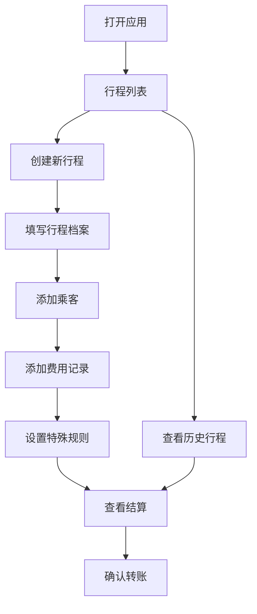

## 1. 产品概述

拼车油费结算工具是一款面向周末朋友拼车出行的费用分摊计算应用，解决多人拼车时油费、过路费、停车费等混合费用算错、算不清的痛点。用户可创建行程档案，记录各项费用，设置特殊分摊规则（司机补贴、儿童免摊、半程上车等），系统自动计算每个人应付金额，清晰展示结算明细。

- 目标用户：周末拼车出游的朋友群体
- 核心价值：快速准确计算拼车费用，避免算账尴尬
- 使用场景：自驾游、周末出游、拼车回家等多人拼车场景

## 2. 核心功能

### 2.1 用户角色

| 角色 | 登录方式 | 核心权限 |
|------|----------|----------|
| 普通用户 | 无需登录，本地存储 | 创建/编辑行程、记录费用、查看结算 |

### 2.2 功能模块

1. **行程列表页**：行程卡片列表、新建行程入口、行程搜索筛选
2. **行程详情页**：行程档案信息展示、费用记录列表、乘客管理
3. **费用记录**：新增/编辑费用、费用类型分类、付款人选择、均摊设置、票据照片
4. **特殊设置**：司机补贴、儿童免摊、半程上车分摊比例设置
5. **结算页**：个人应付/已付/差额、总成本统计、人均成本、垫付排行

### 2.3 页面详情

| 页面名称 | 模块名称 | 功能描述 |
|----------|----------|----------|
| 行程列表页 | 顶部导航 | 应用标题、新建行程按钮 |
| 行程列表页 | 行程卡片 | 目的地、日期、司机、人数、总成本预览 |
| 行程列表页 | 空状态 | 无行程时的引导提示 |
| 行程编辑页 | 行程档案 | 目的地、出发时间、司机、车辆、公里数、合照上传 |
| 行程编辑页 | 乘客管理 | 添加/删除乘客、设置儿童/半程属性 |
| 行程编辑页 | 司机补贴 | 设置司机补贴金额或比例 |
| 费用列表页 | 费用分类标签 | 油费、过路费、停车费、洗车、临时用品 |
| 费用列表页 | 费用卡片 | 金额、付款人、均摊标识、票据缩略图 |
| 费用编辑页 | 费用表单 | 类型、金额、付款人、是否均摊、票据照片、备注 |
| 结算页 | 个人明细卡片 | 头像、姓名、应付、已付、差额 |
| 结算页 | 统计面板 | 总成本、人均成本、垫付最多的人 |
| 结算页 | 费用明细 | 按类型分类的费用汇总 |

## 3. 核心流程

用户打开应用 → 查看行程列表 → 创建新行程（填写目的地、时间、司机、车辆、乘客） → 添加费用记录（选择类型、金额、付款人、是否均摊） → 设置特殊规则（司机补贴、儿童免摊、半程上车） → 查看结算结果 → 确认转账

## 4. 用户界面设计

### 4.1 设计风格

- **主色调**：深青色（#0D9488）作为主色，代表公路旅行的清新感
- **辅助色**：暖橙色（#F97316）作为强调色，用于突出金额和操作按钮
- **背景色**：浅米色（#FFFBEB）背景，营造温馨的出行氛围
- **卡片风格**：圆角卡片（16px），柔和阴影，分层设计
- **按钮风格**：圆润胶囊形按钮，带有微交互动画
- **字体**：标题使用粗体衬线字体增添质感，正文使用现代无衬线字体
- **图标风格**：线性图标，统一2px描边
- **整体氛围**：旅行日志手账风格，温暖、亲切、有质感

### 4.2 页面设计概览

| 页面名称 | 模块名称 | UI元素 |
|----------|----------|--------|
| 行程列表页 | 顶部区域 | 大标题、副标题、渐变背景装饰 |
| 行程列表页 | 行程卡片 | 目的地大字、日期标签、司机头像、人数徽章、金额标签 |
| 行程编辑页 | 表单区域 | 分组输入框、图标前缀、照片上传区域 |
| 行程编辑页 | 乘客列表 | 头像+姓名行、儿童/半程标签、删除按钮 |
| 费用列表页 | 分类标签 | 横向滚动标签、选中态高亮 |
| 费用列表页 | 费用项 | 左图标+类型、中金额、右付款人头像 |
| 结算页 | 顶部汇总 | 总成本大字展示、人均成本小字 |
| 结算页 | 人员列表 | 姓名、应付/已付/差额、颜色区分正负 |
| 结算页 | 垫付排行 | 前三名高亮展示、奖牌图标 |

### 4.3 响应式

- 桌面优先设计，最大宽度限制在1024px居中展示
- 移动端自适应，卡片堆叠显示
- 触控区域不小于48x48px
- 底部悬浮操作按钮，便于移动端操作

### 4.4 动效设计

- 页面切换：淡入+轻微上移动画
- 卡片悬停：轻微上浮+阴影加深
- 按钮点击：缩放反馈
- 金额变化：数字滚动动画
- 新增项：从下往上滑入
