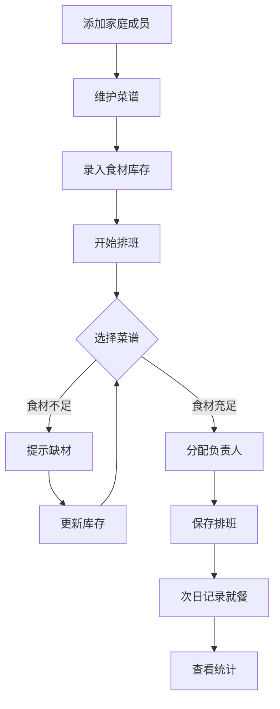

## 1. 产品概述

家庭早餐备餐排班系统，解决家庭每天早上"吃什么、谁来做"的混乱局面。通过智能排班、食材提醒和就餐记录，让家庭早餐有序、高效、不浪费。

- 目标用户：有学龄儿童或上班族的普通家庭，希望早餐安排有条理
- 核心价值：消除每日早餐决策疲劳，减少食材浪费，提升家庭协作效率

## 2. 核心功能

### 2.1 用户角色
| 角色 | 说明 | 核心权限 |
|------|------|----------|
| 家庭管理员 | 默认创建者 | 管理成员、菜谱、排班、查看统计 |
| 家庭成员 | 被添加的成员 | 查看排班、记录就餐情况 |

### 2.2 功能模块
1. **首页（排班日历）**：一周早餐排班总览，谁买菜、谁做饭、谁收拾一目了然
2. **家庭成员管理页**：添加/编辑成员信息，口味偏好、忌口、作息时间、早餐预算
3. **菜谱管理页**：维护早餐菜谱，准备时长、所需食材、适合人群
4. **食材库存页**：管理现有食材，缺材时自动提醒无法排入对应菜谱
5. **就餐记录页**：记录实际吃没吃、剩了多少、有没有迟到
6. **统计分析页**：哪种早餐最常被吃完、谁经常没时间吃、每周早餐花费

### 2.3 页面详情
| 页面名称 | 模块名称 | 功能描述 |
|----------|----------|----------|
| 首页（排班日历） | 周日历视图 | 以周一至周日横向排列，每日显示早餐菜单、负责人安排（买菜/做饭/收拾） |
| 首页（排班日历） | 快速排班 | 点击空白时段弹出菜谱选择器和成员分配，支持拖拽调整 |
| 首页（排班日历） | 缺材预警 | 缺少食材的菜谱在日历上标红提醒，提示需补购食材 |
| 首页（排班日历） | 本周概览 | 顶部显示本周早餐预算、已花费、剩余预算 |
| 家庭成员管理页 | 成员列表 | 卡片式展示所有成员，显示头像、姓名、角色 |
| 家庭成员管理页 | 成员编辑 | 编辑口味偏好（咸/甜/辣等）、忌口（过敏/不吃什么）、上学/上班时间、早餐预算 |
| 菜谱管理页 | 菜谱列表 | 卡片展示菜谱，含图片、名称、准备时长、适合人数 |
| 菜谱管理页 | 菜谱编辑 | 编辑菜名、准备时长（分钟）、食材清单（含数量）、适合人群标签 |
| 食材库存页 | 库存列表 | 分类展示食材，显示当前存量，低于阈值的标红 |
| 食材库存页 | 补货清单 | 自动生成缺货清单，一键标记已购买 |
| 就餐记录页 | 日历选择 | 选择日期查看当日早餐就餐情况 |
| 就餐记录页 | 记录表单 | 每人标记：吃了/没吃/迟到，剩余量评估（光盘/剩一点/剩很多） |
| 统计分析页 | 早餐完成度排行 | 柱状图展示哪些早餐被吃完的次数最多 |
| 统计分析页 | 成员就餐率 | 每位成员按时吃完早餐的比例 |
| 统计分析页 | 每周花费趋势 | 折线图展示每周早餐总花费变化 |
| 统计分析页 | 浪费排行 | 哪些早餐经常剩很多，建议调整 |

## 3. 核心流程

1. **初始化流程**：添加家庭成员 → 维护菜谱 → 录入食材库存 → 开始排班
2. **排班流程**：选择日期 → 选择菜谱（系统自动校验食材）→ 分配负责人（买菜/做饭/收拾）→ 保存排班
3. **就餐记录流程**：选择日期 → 逐人标记就餐状态 → 记录剩余量 → 提交记录
4. **补货流程**：系统检测食材不足 → 生成补货清单 → 购买后更新库存

## 4. 用户界面设计

### 4.1 设计风格
- 主色调：暖橙色 `#F97316`（早餐的温暖感），辅色：奶油白 `#FFF7ED`、深棕 `#78350F`
- 按钮风格：圆润柔和，带轻微阴影，hover 时微微上浮
- 字体：中文使用系统默认圆体，数字/英文使用 DM Sans
- 布局风格：卡片式布局，左侧导航栏，温暖柔和的背景纹理
- 图标风格：使用 lucide-react 图标，线条圆润风格
- 整体氛围：温馨、家庭感、清晨阳光感

### 4.2 页面设计概览
| 页面名称 | 模块名称 | UI元素 |
|----------|----------|--------|
| 首页 | 周日历视图 | 7列网格，每列一天，卡片内显示菜名+负责人标签，缺材卡片红框描边+警示图标 |
| 首页 | 本周概览 | 顶部横条，3个数据卡片（预算/已花/剩余），进度条动画 |
| 成员管理 | 成员列表 | 2列卡片网格，卡片含头像圈+姓名+偏好标签组 |
| 成员管理 | 成员编辑 | 右侧滑出抽屉，表单含多选标签（口味/忌口）、时间选择器、数字输入 |
| 菜谱管理 | 菜谱列表 | 3列卡片网格，卡片含菜品图标+名称+时长标签+适合人群标签 |
| 菜谱管理 | 菜谱编辑 | 右侧滑出抽屉，食材清单可动态增删行 |
| 食材库存 | 库存列表 | 表格布局，存量低时行背景变浅红，编辑按钮 |
| 食材库存 | 补货清单 | 独立面板，复选框列表，一键勾选已购买 |
| 就餐记录 | 记录表单 | 成员行列表，每人3个状态按钮（吃了/没吃/迟到），剩余量滑块 |
| 统计分析 | 图表区域 | 4个图表卡片，2x2布局，柱状图+环形图+折线图+排行列表 |

### 4.3 响应式设计
- 桌面优先设计，最小宽度 1024px
- 平板适配：卡片网格从3列缩至2列
- 移动端适配：单列布局，底部导航替代侧边栏
