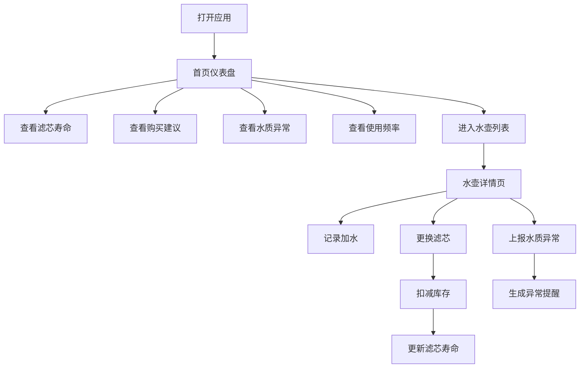

## 1. 产品概述

净水壶滤芯更换管理系统是一款帮助家庭管理净水壶滤芯使用状态的工具应用。解决用户经常忘记滤芯更换时间、无法判断水质状况、滤芯库存管理混乱的问题。

- 核心目标：让滤芯管理变得简单直观，确保饮水安全
- 目标用户：使用净水壶的家庭用户
- 产品价值：延长滤芯使用寿命、及时更换滤芯、避免库存不足

## 2. 核心功能

### 2.1 用户角色

| 角色 | 注册方式 | 核心权限 |
|------|----------|----------|
| 家庭用户 | 本地存储，无需注册 | 管理水壶档案、记录换芯、查看提醒、管理库存 |

### 2.2 功能模块

1. **首页仪表盘**：滤芯寿命总览、下次购买建议、水质异常提醒、水壶使用频率统计
2. **水壶档案管理**：新增/编辑/删除水壶，记录品牌、容量、滤芯型号、使用人数、放置位置、照片
3. **滤芯更换记录**：安装日期、滤芯批次、预计寿命、冲洗次数、剩余库存
4. **加水记录**：手动点击记录加水次数
5. **水质异常提醒**：水流变慢、异味、余氯测试异常记录与提醒
6. **库存管理**：滤芯库存追踪，库存为零且滤芯到期时标红警示

### 2.3 页面详情

| 页面名称 | 模块名称 | 功能描述 |
|----------|----------|----------|
| 首页仪表盘 | 滤芯寿命卡片 | 显示各水壶当前滤芯剩余寿命百分比和天数 |
| 首页仪表盘 | 购买建议 | 基于库存和消耗速度给出下次购买建议 |
| 首页仪表盘 | 水质异常 | 最近水质异常记录列表 |
| 首页仪表盘 | 使用频率 | 各水壶加水次数统计柱状图 |
| 水壶列表 | 水壶卡片 | 展示水壶基本信息和当前滤芯状态 |
| 水壶详情 | 档案信息 | 品牌、容量、滤芯型号、使用人数、放置位置、照片 |
| 水壶详情 | 换芯历史 | 历次滤芯更换记录时间线 |
| 水壶详情 | 加水记录 | 加水次数和日期记录 |
| 水壶详情 | 异常记录 | 水质异常事件记录 |
| 新增/编辑水壶 | 表单 | 水壶信息录入表单 |
| 换芯弹窗 | 表单 | 记录新滤芯信息并扣减库存 |
| 异常上报 | 表单 | 记录水质异常情况 |

## 3. 核心流程

### 主要用户流程

用户打开应用 → 首页查看各水壶滤芯状态 → 点击某个水壶查看详情 → 记录加水/更换滤芯/上报异常 → 库存不足时收到提醒

## 4. 用户界面设计

### 4.1 设计风格

- 主色调：清新水蓝色系 (#0EA5E9 为主色)，传达纯净、健康的感觉
- 辅助色：绿色表示健康/正常，橙色表示警告，红色表示危险/紧急
- 中性色：白色背景，浅灰卡片，深灰文字
- 整体风格：简约清新、卡片式布局、圆角设计、柔和阴影
- 按钮风格：圆角胶囊形按钮，悬停有微缩放和阴影变化
- 字体：现代无衬线字体，清晰易读
- 图标风格：线性图标，统一线条粗细

### 4.2 页面设计概览

| 页面名称 | 模块名称 | UI 元素 |
|----------|----------|---------|
| 首页仪表盘 | 顶部标题 | 应用名称 + 当前日期 |
| 首页仪表盘 | 状态卡片网格 | 4个关键指标卡片（滤芯寿命、库存预警、异常数量、水壶总数） |
| 首页仪表盘 | 滤芯寿命列表 | 每个水壶一行，带进度条和状态标签 |
| 首页仪表盘 | 购买建议卡片 | 展示下次购买时间和建议数量 |
| 首页仪表盘 | 水质异常时间线 | 最近异常事件列表 |
| 首页仪表盘 | 使用频率图表 | 柱状图展示各水壶加水次数 |
| 水壶列表 | 水壶卡片网格 | 卡片展示水壶照片、名称、滤芯状态 |
| 水壶详情 | 顶部信息区 | 水壶照片、名称、品牌、状态标签 |
| 水壶详情 | Tab 切换 | 档案信息 / 换芯历史 / 加水记录 / 异常记录 |
| 水壶详情 | 操作按钮区 | 加水按钮、换芯按钮、上报异常按钮 |

### 4.3 响应式

- 桌面端优先设计
- 移动端自适应布局，卡片从多列变单列
- 触摸友好的按钮尺寸（最小 44px）
- 底部导航栏在移动端显示

### 4.4 动效设计

- 页面切换：淡入淡出 + 轻微位移
- 卡片悬停：轻微上浮 + 阴影加深
- 进度条动画：数值变化时有平滑过渡
- 按钮点击：缩放反馈
- 状态变化：颜色渐变过渡
