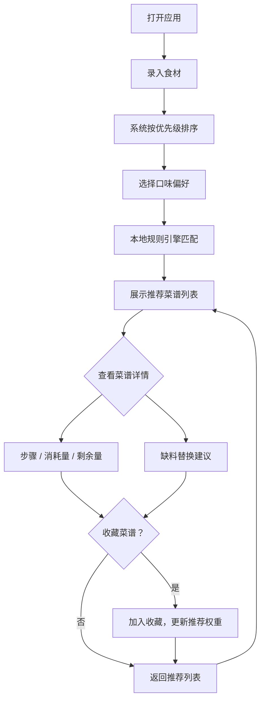

## 1. 产品概述

菜谱剩料救场助手 — 专治冰箱里那些"只剩一点点"的食材。用户录入手头剩余食材及数量，选择今日口味偏好，系统基于本地规则引擎推荐最合适的菜谱，清晰展示缺什么、能替换什么、预计用时和难度，帮用户把临期食材优先消耗掉，减少浪费。

- 目标用户：独居青年、合租室友、家庭主厨等经常面对"冰箱剩料怎么处理"的人群
- 核心价值：减少食材浪费、降低决策成本、让每一份剩料都有归处

## 2. 核心功能

### 2.1 用户角色
无角色区分，所有用户使用相同功能。

### 2.2 功能模块
1. **食材录入页**：录入食材名称、数量、单位、过期日期、体积标签；自动按剩料优先级排序
2. **偏好选择与推荐页**：选择口味偏好（清淡/重口/快手/省钱/高蛋白），展示推荐菜谱列表
3. **菜谱详情页**：步骤、食材消耗量、烹饪后剩余量、缺料提示与替换建议、预计用时和难度
4. **我的收藏页**：收藏成功救场的菜谱，下次类似食材自动优先推荐

### 2.3 页面详情

| 页面名称 | 模块名称 | 功能描述 |
|---------|---------|---------|
| 食材录入页 | 食材输入区 | 输入食材名称、数量、单位，选择过期日期和体积标签（小/中/大） |
| 食材录入页 | 剩料优先级排序 | 按快过期 > 数量少 > 占地方自动排序，支持拖拽微调 |
| 食材录入页 | 排除食材 | 标记不想吃的食材，推荐时自动跳过 |
| 食材录入页 | 食材标签列表 | 已添加食材以标签形式展示，可删除/编辑/排除 |
| 偏好选择与推荐页 | 偏好选择器 | 五选一：清淡、重口、快手、省钱、高蛋白 |
| 偏好选择与推荐页 | 推荐菜谱列表 | 基于本地规则匹配，显示匹配度、缺料数、用时、难度 |
| 偏好选择与推荐页 | 缺料与替换提示 | 每道菜标注缺什么、可替换什么 |
| 菜谱详情页 | 步骤区 | 分步烹饪步骤，带时间提示 |
| 菜谱详情页 | 食材消耗表 | 每种食材本菜用量、消耗后剩余量 |
| 菜谱详情页 | 缺料替换建议 | 缺少的食材及推荐替代品 |
| 菜谱详情页 | 收藏按钮 | 一键收藏，下次类似食材自动优先推荐 |
| 我的收藏页 | 收藏列表 | 已收藏菜谱，显示上次使用的食材组合 |
| 我的收藏页 | 智能推荐 | 当当前食材与收藏菜谱高度匹配时，自动置顶推荐 |

## 3. 核心流程

用户打开应用 → 添加冰箱中剩余食材（名称、数量、过期日期等） → 系统自动按优先级排序 → 选择今日口味偏好 → 系统基于本地规则推荐菜谱 → 查看推荐列表（匹配度、缺料、用时、难度） → 点击菜谱查看详情（步骤、消耗量、剩余量） → 确认做这道菜 → 可选收藏 → 返回继续选择

## 4. 用户界面设计

### 4.1 设计风格
- **主色调**：暖橙色（#F97316）象征厨房温度 + 深灰底色（#1C1917）沉稳质感
- **辅助色**：柔绿（#22C55E）表示"够用"、柔红（#EF4444）表示"缺料"、奶白（#FAFAF9）文字
- **按钮风格**：圆角胶囊形，主按钮填充暖橙，次按钮描边
- **字体**：标题用 Noto Serif SC 带手写温度感，正文用 Noto Sans SC 清晰易读
- **布局**：卡片式布局，左侧食材面板 + 右侧推荐结果，单页应用无刷新切换
- **图标风格**：lucide-react 线性图标，搭配食材 emoji 增加趣味

### 4.2 页面设计概览

| 页面名称 | 模块名称 | UI 元素 |
|---------|---------|---------|
| 食材录入页 | 食材输入区 | 输入框 + 数量选择器 + 单位下拉 + 日期选择器 + 体积标签按钮组，暖橙强调色 |
| 食材录入页 | 食材标签列表 | 圆角标签卡片，显示名称/数量/过期倒计时，排除按钮带删除线效果 |
| 食材录入页 | 优先级指示 | 标签左侧色条：红=快过期、黄=量少、蓝=占地方 |
| 偏好选择与推荐页 | 偏好选择器 | 五个胶囊按钮横排，选中态暖橙填充 + 放大动画 |
| 偏好选择与推荐页 | 推荐卡片 | 竖向卡片流，显示菜名/匹配度环形图/缺料数/用时/难度星级 |
| 菜谱详情页 | 步骤区 | 左侧竖向时间线，每步带序号圆点 + 描述 + 时间 |
| 菜谱详情页 | 食材消耗表 | 表格式，"食材 → 用量 → 剩余" 三列，剩余量变色提示 |
| 菜谱详情页 | 收藏按钮 | 右下角悬浮心形按钮，点击填充动画 |
| 我的收藏页 | 收藏卡片 | 网格卡片，显示菜名/上次食材/匹配标签 |

### 4.3 响应式
- 桌面优先设计，左右分栏布局
- 平板自适应为上下布局
- 移动端单列堆叠，底部固定偏好选择栏

### 4.4 3D 场景
不适用
