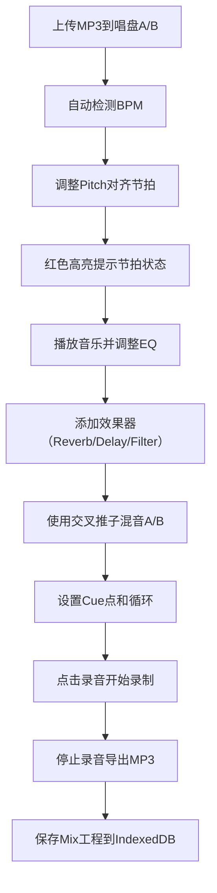

## 1. 产品概述

网页DJ混音台 - 一个功能完整的浏览器端DJ混音应用，让用户在家即可进行专业级的音乐混音创作。

- 主要用途：音乐混音、节拍对齐、音效处理、现场录音
- 目标用户：音乐爱好者、DJ初学者、派对组织者
- 核心价值：无需专业硬件，浏览器即可完成DJ混音全流程

## 2. 核心功能

### 2.1 功能模块

1. **双唱盘系统**: 两个独立的虚拟唱盘A/B，支持MP3上传和播放
2. **混音控制台**: 音量推子、交叉推子、三段EQ（高/中/低）
3. **音效处理**: Reverb（混响）、Delay（延迟）、Filter（滤波）三种实时效果
4. **BPM检测与对齐**: 自动检测BPM，节拍对不齐时红色高亮提示，Pitch滑块调速
5. **循环与Cue点**: 1/2/4/8拍循环，每首歌8个Cue点快速跳转
6. **录音导出**: 录制整套混音并导出为MP3文件
7. **工程存储**: 使用IndexedDB保存和加载Mix工程

### 2.2 页面详情

| 页面名称 | 模块名称 | 功能描述 |
|-----------|-------------|---------------------|
| 主混音台 | 唱盘A区域 | MP3上传、播放控制、波形显示、BPM检测、Pitch滑块、Cue点 |
| 主混音台 | 唱盘B区域 | 同上，独立控制 |
| 主混音台 | 混音台中心 | 交叉推子、主音量、录音控制、工程保存/加载 |
| 主混音台 | EQ控制区 | 每唱盘独立三段EQ调节（高/中/低） |
| 主混音台 | 效果器区 | 每唱盘独立Reverb/Delay/Filter效果控制 |
| 主混音台 | 循环工具 | 1/2/4/8拍循环选择 |

## 3. 核心流程

## 4. 用户界面设计

### 4.1 设计风格

- **设计主题**: 专业DJ设备风格 - 深色主题、霓虹发光效果、金属质感
- **主色调**: 深灰/黑色背景 (#121212)，配合霓虹色高亮（青色 #00f5ff、品红 #ff00ff）
- **辅色调**: 红色 (#ff3333) 用于警告和节拍不对齐提示
- **按钮风格**: 圆形旋钮、推子滑块，带有发光效果
- **字体**: 现代无衬线字体，数字使用等宽字体显示BPM和时间
- **布局风格**: 对称布局，左右两个唱盘，中间混音控制台
- **图标风格**: 简洁的线条图标，带有发光效果

### 4.2 页面设计概述

| 页面名称 | 模块名称 | UI元素 |
|-----------|-------------|-------------|
| 主混音台 | 唱盘区域 | 圆形虚拟唱盘动画、波形显示条、BPM数字显示、播放/暂停按钮 |
| 主混音台 | 推子区域 | 垂直音量推子、水平交叉推子、LED电平指示器 |
| 主混音台 | EQ区域 | 三个旋转旋钮（高/中/低）、频率刻度 |
| 主混音台 | 效果器 | 旋钮控制效果量、开关按钮、效果类型选择 |
| 主混音台 | 循环/Cue | 数字按钮1/2/4/8拍、8个Cue点按钮带编号 |

### 4.3 响应式

- 桌面端优先设计，横屏布局
- 平板设备自适应缩放
- 移动端简化布局，核心功能可用

### 4.4 交互与动效

- 唱盘旋转动画，播放时转动，暂停时停止
- 推子和旋钮拖动时有平滑过渡
- 节拍对齐时绿色同步脉冲动画
- 节拍不对齐时红色闪烁警告
- 按钮点击有按压反馈和发光效果
