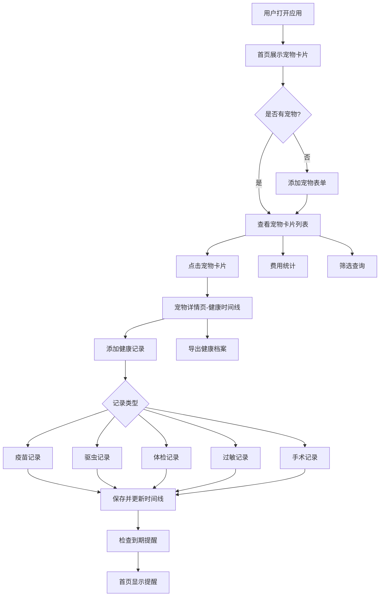

## 1. 产品概述

宠物疫苗档案本 —— 一款面向养猫养狗人群的宠物健康管理工具，帮助用户系统记录疫苗、体检、驱虫等医疗事件，到期智能提醒，费用一目了然，支持导出完整健康档案就医时随身携带。

- 解决核心问题：宠物医疗记录分散、疫苗到期易遗忘、费用无统计、就医时信息不全
- 目标用户：养猫/养狗的城市宠物主，多宠物家庭优先

## 2. 核心功能

### 2.1 用户角色

| 角色 | 注册方式 | 核心权限 |
|------|----------|----------|
| 宠物主人 | 本地使用，无需注册 | 管理宠物档案、记录健康事件、查看统计、导出档案 |

### 2.2 功能模块

1. **首页**：宠物卡片列表、到期提醒区、快速操作入口
2. **宠物详情页**：健康时间线、基本信息编辑
3. **健康记录页**：添加/编辑疫苗、驱虫、体检、过敏、手术记录
4. **费用统计页**：年度/月度费用概览、分类统计、趋势图表
5. **筛选查询页**：多宠物筛选、按医院查历史记录
6. **档案导出页**：生成并导出宠物健康档案

### 2.3 页面详情

| 页面名称 | 模块名称 | 功能描述 |
|----------|----------|----------|
| 首页 | 宠物卡片列表 | 按宠物分卡片展示，显示头像、名称、品种、最近疫苗状态 |
| 首页 | 到期提醒区 | 醒目展示即将到期（7天内/30天内）的疫苗和体检，用红色/橙色标记紧急程度 |
| 首页 | 快速操作栏 | 添加宠物、添加疫苗记录、添加体检记录快捷入口 |
| 宠物详情页 | 基本信息卡 | 显示/编辑名字、品种、生日、体重、芯片号、照片、常去医院 |
| 宠物详情页 | 健康时间线 | 按时间倒序串联疫苗、驱虫、体检、过敏、手术事件，不同类型用不同图标和颜色区分 |
| 宠物详情页 | 记录添加 | 支持添加各类健康记录，疫苗需填名称/接种日期/下次时间/医院/医生/费用/凭证照片 |
| 费用统计页 | 年度总览 | 显示本年度医疗总花费，按分类（疫苗/驱虫/体检/手术/其他）饼图展示 |
| 费用统计页 | 月度趋势 | 按月展示费用柱状图，点击可查看当月明细 |
| 费用统计页 | 宠物对比 | 多宠物时按宠物拆分费用对比 |
| 筛选查询页 | 宠物筛选 | 按宠物名称筛选所有记录 |
| 筛选查询页 | 医院查询 | 选择常去医院查看所有历史记录 |
| 档案导出页 | 档案生成 | 汇总宠物基本信息+所有健康记录+费用汇总，生成可打印/分享的HTML页面 |

## 3. 核心流程

用户首次使用 → 添加宠物（填写基本信息+上传照片）→ 为宠物添加健康记录（疫苗/驱虫/体检等）→ 首页自动展示到期提醒 → 查看健康时间线回顾完整病史 → 费用统计了解花费 → 就医前导出健康档案携带

## 4. 用户界面设计

### 4.1 设计风格

- **主色调**：温暖橙棕色系（#E8A87C 暖橙 + #D4A574 驼棕），传达宠物温暖陪伴感
- **辅助色**：柔和绿色（#85B8A0）用于健康状态，珊瑚红（#E85D5D）用于到期警告
- **按钮风格**：圆角胶囊按钮，主按钮实心暖橙，次按钮描边
- **字体**：标题使用 Noto Serif SC（衬线体，温暖优雅），正文使用 Noto Sans SC
- **布局风格**：卡片式布局，左侧导航栏 + 右侧内容区，顶部全局提醒条
- **图标风格**：圆润线性图标，配合小型爪印装饰元素
- **背景**：米白色底（#FAF6F1），卡片白色带柔和阴影，微妙爪印纹理水印

### 4.2 页面设计概览

| 页面名称 | 模块名称 | UI元素 |
|----------|----------|--------|
| 首页 | 宠物卡片列表 | 圆角卡片，左侧宠物头像，右侧名称/品种/状态标签，渐变顶部边框 |
| 首页 | 到期提醒区 | 红色/橙色渐变背景卡片，倒计时数字醒目，脉冲动画提示紧急 |
| 首页 | 快速操作栏 | 圆形图标按钮横排，悬浮微动效 |
| 宠物详情页 | 基本信息卡 | 大圆头像，信息网格布局，编辑按钮右上角 |
| 宠物详情页 | 健康时间线 | 垂直时间线，左侧时间节点+图标，右侧内容卡片，不同类型不同颜色边框 |
| 费用统计页 | 年度总览 | 大数字总花费，环形饼图，分类色块标签 |
| 费用统计页 | 月度趋势 | 柱状图，悬浮显示明细 |
| 筛选查询页 | 筛选条件 | 顶部标签选择器（宠物/医院），下方结果列表 |
| 档案导出页 | 档案预览 | A4纸样式的打印预览，导出按钮底部固定 |

### 4.3 响应式设计

- 桌面优先设计，侧边导航栏在桌面端常驻
- 平板端侧边栏折叠为图标
- 移动端底部Tab导航，卡片单列排列

### 4.4 动效设计

- 页面切换：淡入淡出
- 卡片悬浮：微妙上浮 + 阴影加深
- 提醒卡片：到期项脉冲呼吸动画
- 时间线节点：滚动渐入
- 添加记录：成功后纸屑庆祝微动效
